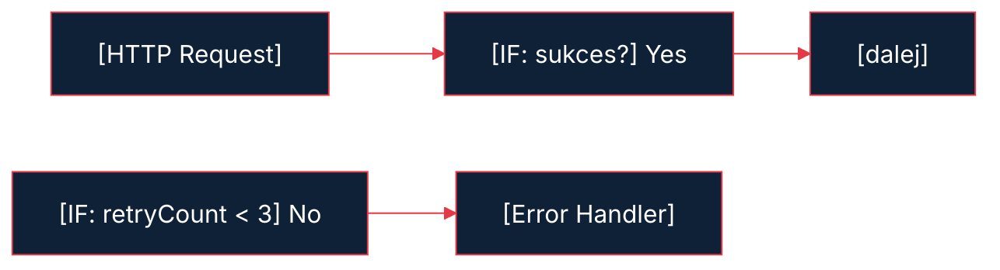

---
transition: fade
layout: cover
---


<div class="cover-tag">MODUŁ 03 — SKALOWALNOSC</div>

# ## Prezentacja — 38 slajdów


<p style="color:#E63946;font-weight:600">Kacper Sieradziński</p>
<p style="color:#8096AA;font-size:0.8rem;margin-top:0.2rem">dokodu.it</p>


---
---

# Tytuł

## Tydzień 3: Skalowalność, Odporność i Disaster Prevention
*n8n + AI dla Agencji i Firm — Kacper Sieradzinski*

<!--
"Witajcie w trzecim tygodniu kursu. Jeśli doszliście do tego miejsca — gratulacje, macie już działające workflow. Teraz nauczę was jak je utwardzić tak, żeby działały w produkcji bez patrzenia na nie przez tygodnie."
-->


---
---

# Problem (emocjonalny hook)

## Twój workflow działa pięknie w piątek.
## W poniedziałek rano klient dzwoni z pretensjami.

- API zewnętrzne zwróciło błąd o 3 w nocy
- Webhook dostał to samo zamówienie dwa razy → 2 faktury
- 1000 rekordów → n8n się zawiesiło po 200
- Nikt nie wiedział, że coś padło przez 8 godzin

<!--
"Każda z tych sytuacji to coś, co widziałem u klientów Dokodu. To nie są edge cases. To norma na produkcji. Dzisiaj nauczymy się jak temu zapobiegać — i jak reagować gdy już się stanie."
-->


---
---

# Analogia — budowanie mostu

## Inżynierowie mostów nie zakładają, że most będzie stał.
## Zakładają, że coś się stanie — i projektują na to.

- Nadmiarowe liny (redundancja)
- Dylatacje termiczne (elastyczność)
- Inspekcje co 6 miesięcy (monitoring)
- Plany ewakuacyjne (disaster recovery)

## Twoje workflow to most. Zaprojektuj je tak samo.

<!--
"Ta analogia zmienia sposób myślenia. Zamiast pytać 'czy mój workflow padnie?' — pytaj 'kiedy padnie i co się wtedy stanie?'. To jest disaster recovery mindset."
-->


---
---

# Plan na dziś (roadmap)

## Czego się nauczysz w Tygodniu 3


<v-clicks>

1. Batching — przetwarzaj tysiące rekordów bez crashu
2. Idempotency — workflow bezpieczne do wielokrotnego uruchomienia
3. Error Trigger — globalny handler błędów
4. Retry + Backoff — automatyczne ponowne próby
5. Wait Node — pauzy i scheduled retries
6. Monitoring — wiesz że coś padło, zanim klient zadzwoni
7. Logging — pełna historia wykonań
8. Testing — testuj bez produkcyjnych danych
9. **Projekt:** Armored Invoicing System

</v-clicks>


<!--
"Dużo materiału. Ale każdy element zbudujemy razem, krok po kroku. Na końcu złożysz to w jeden system fakturowania, który będzie produkcyjnie odporny."
-->


---
transition: fade
layout: two-cols-header
---

# Batching — dlaczego to ważne

<div class="col-header col-neg">Co się dzieje gdy workflow nie ma batching</div>

- 1000 rekordów → n8n ładuje wszystko do pamięci RAM
- Przy 500 rekordach: timeout (domyślnie 1h w n8n)
- Przy 1000 rekordach: crash procesu lub timeout API
- Efekt: żadne dane nie zostają przetworzone

::right::

<div class="col-header col-pos">Z batchingiem</div>

- Przetwarzaj 50 rekordów → zapisz → przetwarzaj kolejne 50
- Jeśli błąd w batchu 7 → batch 1-6 już zapisane
- Możesz wznawiać od miejsca awarii

<!--
"Kluczowe słowo to 'checkpoint'. Batching to nie tylko kwestia pamięci — to kwestia możliwości wznowienia po błędzie."
-->


---
---

# SplitInBatches — anatomia node'a

## Parametry SplitInBatches

| Parametr | Wartość | Opis |
|----------|---------|------|
| Batch Size | 50–200 | Ile rekordów na raz |
| Options → Reset | true/false | Resetuj przy każdym uruchomieniu |

## Jak działa pętla
```
Input: 1000 rekordów
↓
SplitInBatches (size: 100)
↓
[Batch 1: 0-99] → procesuj → [Batch 2: 100-199] → ...
↓
Po ostatnim batchu: context.$batchIndex === last
```

<!--
"Pokażę to zaraz w demie. Ważne: SplitInBatches tworzy pętlę wewnątrz workflow — nie musisz robić osobnego workflow per rekord."
-->


---
---

# Optimal batch size — tabela

## Jak dobrać rozmiar batcha

| Scenariusz | Rekomendowany rozmiar | Dlaczego |
|------------|----------------------|----------|
| Proste transformacje danych | 200–500 | Szybko, mało API calls |
| HTTP Request do zewnętrznego API | 20–50 | Rate limiting API |
| Generowanie AI (GPT, Claude) | 5–10 | Koszt + timeout modelu |
| Zapis do bazy danych | 100–200 | Bulk insert efektywny |
| Email wysyłka | 10–20 | Anti-spam limits |

<!--
"Nie ma jednej magicznej liczby. Testuj. Zacznij od 50 i sprawdź logi n8n — czas wykonania, error rate."
-->


---
transition: fade
---

# DIAGRAM — co się dzieje bez vs z batchingiem

<N8nBranch
  :source="{icon: 'mdi:database-outline', label: '1000 rekordów', desc: 'do przetworzenia'}"
  :branches="[
    {icon: 'mdi:alert-circle', label: 'BEZ batching', result: 'Timeout / Crash → 0 zapisane', variant: 'error'},
    {icon: 'mdi:checkbox-multiple-marked', label: 'Z batchingiem', result: 'Batch 1-6 ✅ — Batch 7 ❌ retry', variant: 'output'},
  ]"
/>

<div style="margin-top:0.8rem;background:#1E2D40;border-radius:8px;padding:0.8rem 1rem;border-left:3px solid #22C55E;font-size:0.8rem">
  <strong style="color:#22C55E">Checkpoint:</strong>
  <span style="color:#A8D8EA"> Z batchingiem błąd to problem lokalny, nie katastrofa globalna</span>
</div>


<!--
"To jest fundamentalna różnica. Z batchingiem błąd to problem lokalny, nie katastrofa globalna."
-->


---
transition: fade
layout: two-cols-header
---

# Idempotency — co to jest

<div class="col-header col-pos">Idempotency = operacja którą można wykonać wiele razy z tym samym efektem</div>

- Ustaw pole X na wartość Y (zawsze ten sam efekt)
- Wstaw rekord JEŚLI NIE ISTNIEJE (duplicate safe)
- Dodaj 10 PLN do salda (za każdym razem inny efekt)
- Wystaw fakturę (2 wywołania = 2 faktury)
- Wyślij email (2 wywołania = 2 emaile)

::right::

<div class="col-header col-neg">Dlaczego webhook może przyjść 2 razy</div>

- Shopify/WooCommerce ma retry przy braku odpowiedzi 200
- Twoje n8n odpowie 200, ale potem crashnie w środku
- Shopify nie wie, że n8n coś zrobił — wyśle ponownie

<!--
"To jest pułapka na którą wpada 95% ludzi. Twoje API klienta nie jest głupie — ono zakłada że możesz nie odpowiedzieć i ponawia próbę. I ma rację."
-->


---
transition: fade
---

# DIAGRAM — idempotency flow

<N8nFlow
  :nodes="[
    {icon: 'mdi:webhook', label: 'Webhook', desc: 'order_id: ORD-12345', variant: 'trigger'},
    {icon: 'mdi:magnify', label: 'Sprawdź', desc: 'czy już przetworzone?', variant: 'default'},
    {icon: 'mdi:source-branch', label: 'IF', desc: 'istnieje?', variant: 'default'},
  ]"
/>

<div style="margin-top:0.6rem;display:flex;gap:0.8rem">
  <div style="background:#1E2D40;border-left:3px solid #22C55E;padding:0.5rem 0.8rem;border-radius:0 6px 6px 0;flex:1">
    <div style="color:#22C55E;font-weight:700;font-size:0.75rem">NIE ISTNIEJE</div>
    <div style="color:#A8D8EA;font-size:0.72rem;margin-top:2px">Wykonaj → Oznacz → Zwróć 200</div>
  </div>
  <div style="background:#1E2D40;border-left:3px solid #F97316;padding:0.5rem 0.8rem;border-radius:0 6px 6px 0;flex:1">
    <div style="color:#F97316;font-weight:700;font-size:0.75rem">JUŻ ISTNIEJE</div>
    <div style="color:#A8D8EA;font-size:0.72rem;margin-top:2px">Pomiń → Zwróć 200 (bez działania)</div>
  </div>
</div>


<!--
"Trzy kroki: Sprawdź. Wykonaj. Oznacz. W tej kolejności zawsze. Jeśli crashniesz między Wykonaj a Oznacz — następna próba ponowi operację. Więc operacja musi być idempotentna z natury LUB musisz to jakoś obsłużyć."
-->


---
---

# Idempotency — klucze deduplication

## Jak wybrać klucz deduplication

| Źródło | Klucz | Przykład |
|--------|-------|---------|
| WooCommerce | order_id | "wc_12345" |
| Shopify | order.id | "shopify_4291847" |
| Email webhook | message_id | "msg_abc123" |
| Form submission | submission_id + timestamp | "form_2026-03-27T10:00:00Z" |
| Własny system | UUID v4 generowany po stronie klienta | "550e8400-e29b..." |

## Gdzie przechowywać processed keys
- Google Sheets (proste, wolne przy >10K rekordów)
- Airtable (wygodne, API limits)
- Redis (najszybsze, wymaga serwera)
- Postgres/MySQL (production grade)

<!--
"Na start Google Sheets wystarczy. Przy dużym ruchu przejdź na Redis — n8n ma natywny node Redis."
-->


---
transition: fade
---

# Error trigger — architektura

<N8nBranch
  :source="{icon: 'mdi:alert-octagon', label: 'Error Trigger', desc: 'jeden globalny handler'}"
  :branches="[
    {icon: 'logos:google-sheets', label: 'Log do Sheets', result: 'pełna historia błędów', variant: 'action'},
    {icon: 'logos:slack-icon', label: 'Alert Slack', result: '#n8n-alerts', variant: 'output'},
    {icon: 'mdi:ticket-outline', label: 'Ticket', result: 'Jira / Asana', variant: 'action'},
  ]"
/>

<div style="margin-top:0.8rem;background:#1E2D40;border-radius:8px;padding:0.8rem 1rem;border-left:3px solid #E63946;font-size:0.8rem">
  <strong style="color:#E63946">Zasada:</strong>
  <span style="color:#A8D8EA"> Jeden Error Workflow obsługuje WSZYSTKIE workflow produkcyjne</span>
</div>


<!--
"To jest mega wygodne. Zamiast budować error handling w każdym workflow osobno — masz jeden centralny punkt. Jak CRM dla błędów."
-->


---
---

# Error trigger — co wiesz o błędzie

## Dane dostępne w Error Trigger node

```javascript
// $json zawiera:
{
  "execution": {
    "id": "1234",
    "url": "https://twoj-n8n.com/workflow/5/executions/1234",
    "error": {
      "message": "Connection timeout",
      "stack": "Error: ..."
    },
    "mode": "trigger",        // jak było uruchomione
    "retryOf": null           // jeśli to retry
  },
  "workflow": {
    "id": "5",
    "name": "Armored Invoicing"
  }
}
```

<!--
"Masz URL do konkretnego wykonania! Możesz go kliknąć z Slacka i od razu zobaczyć co się stało. Bezcenne przy debuggowaniu."
-->


---
---

# Error trigger — konfiguracja krok po kroku

## Jak skonfigurować globalny Error Handler


<v-clicks>

1. Stwórz nowy workflow: "🚨 Global Error Handler"
2. Dodaj node: **Error Trigger** (jako trigger)
3. Dodaj logikę:
   - `Set` node — sformatuj wiadomość alertu
   - `Slack` node — wyślij do kanału #n8n-alerts
   - `Google Sheets` node — dopisz do error log
4. Wejdź w **Settings** każdego workflow produkcyjnego
5. W polu **"Error Workflow"** wybierz "🚨 Global Error Handler"

</v-clicks>


<!--
"Krok 4 i 5 jest często pomijany. Pamiętajcie: Error Workflow musi być explicite podpięty w ustawieniach każdego workflow. To nie jest automatyczne dla wszystkich."
-->


---
---

# Retry logic — kiedy co robić

## Tabela decyzyjna: Retry vs Fail Fast vs Dead Letter Queue

| Sytuacja | Strategia | Dlaczego |
|----------|-----------|---------|
| API timeout (503, 504) | Retry z backoffem | Tymczasowy problem serwera |
| Rate limit (429) | Retry z dłuższym czekaniem | Poczekaj i spróbuj znów |
| Błąd autentykacji (401, 403) | Fail fast | Retry nic nie zmieni |
| Zły format danych (400) | Fail fast + alert | Bug w danych źródłowych |
| Błąd sieciowy (ECONNRESET) | Retry 3x | Chwilowa niestabilność |
| Baza danych niedostępna | Dead Letter Queue | Długa awaria, przetwórz później |
| Błąd logiki biznesowej | Fail fast + manual review | Wymaga człowieka |

<!--
"Zasada kciuka: jeśli retry jest bezsensowny — nie rób retry. Retry przy błędzie 401 to tylko marnowanie zasobów."
-->


---
---

# Exponential backoff — teoria

## Dlaczego nie retry co sekundę

Problem: 10 serwisów retryuje co sekundę po awarii → 10x więcej ruchu → serwer nie wstaje

## Exponential Backoff z Jitter
```
Próba 1: czekaj 1s + losowe 0-1s
Próba 2: czekaj 2s + losowe 0-2s
Próba 3: czekaj 4s + losowe 0-4s
Próba 4: czekaj 8s + losowe 0-8s
MAX: 32s (cap)
```

**Jitter** = losowy składnik, żeby serwisy nie retryowały jednocześnie

<!--
"AWS, Google, Stripe — wszyscy używają exponential backoff z jitter. To jest przemysłowy standard, nie rocket science."
-->


---
---

# Retry w n8n — dwa podejścia

## Podejście 1: Natywny retry w node settings
- Prawy klik na node → "Settings" → "Retry on fail"
- Prosto, ale brak kontroli nad backoffem
- Dobre dla szybkich, prostych przypadków

## Podejście 2: Custom retry loop


<!--
"Custom loop daje pełną kontrolę. Możesz zmieniać strategię backoffu, logować każdą próbę, reagować różnie na różne kody HTTP."
-->


---
---

# Wait Node — typy

## Wait node w n8n — trzy tryby

| Tryb | Kiedy używać | Przykład |
|------|-------------|---------|
| **Fixed amount** | Poczekaj X sekund/minut | Poczekaj 30s przed retry |
| **At specified time** | Poczekaj do konkretnej daty/godziny | Wyślij o 9:00 rano |
| **Until webhook call** | Poczekaj na zewnętrzne zdarzenie | Czekaj na zatwierdzenie przez człowieka |

**Uwaga na timeout:** n8n domyślnie kończy wykonanie po 1h. Dla długich Wait — sprawdź ustawienia `executions.timeout` w config.

<!--
"Wait node to klucz do 'human in the loop'. Workflow może czekać godzinami na zatwierdzenie i wznowić się automatycznie po kliknięciu linku."
-->


---
---

# Monitoring — disaster recovery mindset

## Zmień pytanie
~~"Czy moje workflow padnie?"~~
## "Kiedy padnie i skąd będę wiedział?"

## Trzy poziomy alertów

| Poziom | Przykład | Kanał |
|--------|---------|-------|
| 🔴 Krytyczny | Faktura nie wystawiona | Slack + SMS |
| 🟡 Ostrzeżenie | API wolniejsze niż zwykle | Slack |
| 🔵 Info | Dzienny raport | Email |

**Zasada:** Dowiesz się o problemie przed klientem, nie po jego telefonie.

<!--
"To jest definicja dojrzałości operacyjnej. Nie budzić się od telefonu klienta — budzić się od własnego alertu."
-->


---
transition: fade
layout: two-cols-header
---

# Monitoring — co monitorować

<div class="col-header col-pos">Kluczowe metryki dla workflow produkcyjnych</div>

- **Success Rate:** % wykonań zakończonych sukcesem (cel: >99%)
- **Error Rate:** liczba błędów / dzień / workflow
- **Execution Time:** czas wykonania (jeśli nagle rośnie — coś jest nie tak)
- **Queue Depth:** ile executions czeka (jeśli rośnie — bottleneck)
- **Last Successful Run:** kiedy ostatnio sukces (idealny dla cron-workflow)

::right::

<div class="col-header col-neg">Gdzie to zbierać</div>

- n8n API: `GET /executions` z filterami
- External DB (Postgres, Airtable)
- Gotowe narzędzia: Grafana + n8n, Datadog, UptimeRobot

<!--
"Na start wystarczy Google Sheets i cron job co noc. Nie musisz od razu Grafany."
-->


---
---

# Logging standard — struktura logu

## Każde wykonanie powinno logować

```json
{
  "timestamp": "2026-03-27T10:15:33Z",
  "workflow_name": "Armored Invoicing",
  "execution_id": "n8n_exec_1234",
  "status": "success",            // success | error | partial
  "order_id": "ORD-12345",        // klucz biznesowy
  "duration_ms": 3420,
  "error_message": null,
  "error_node": null,
  "retry_count": 0,
  "environment": "production"     // staging | production
}
```

<!--
"Ten format to standard Dokodu. Każdy log musi mieć klucz biznesowy — tu order_id. Bez tego nie możesz odpowiedzieć na pytanie 'co się stało z zamówieniem klienta X?'"
-->


---
---

# Logging — sub-workflow pattern

## Nie duplikuj kodu logowania — stwórz sub-workflow

```
Workflow A → [Execute Workflow: Log Entry] → kontynuuj
Workflow B → [Execute Workflow: Log Entry] → kontynuuj
Workflow C → [Execute Workflow: Log Entry] → kontynuuj

[Log Entry Sub-workflow]:
  Input → Validate → Format → Write to Sheets/DB → Return
```

## Zalety
- Jeden punkt zmiany (dodasz Postgres jutro — zmienisz w jednym miejscu)
- Consistent format we wszystkich workflow
- Łatwe testowanie

<!--
"To jest DRY principle w n8n — Don't Repeat Yourself. Logowanie to infrastruktura, nie feature."
-->


---
---

# Testing — środowisko staging vs produkcja

**Problem:** Nie możesz testować na produkcji.

## Rozwiązanie: Oddzielne środowiska w n8n

| Aspekt | Staging | Produkcja |
|--------|---------|-----------|
| URL | n8n-staging.twojadomena.com | n8n.twojadomena.com |
| Credentials | Testowe API keys | Prawdziwe API keys |
| Webhooks | Oddzielne URL | Oddzielne URL |
| Dane | Syntetyczne/testowe | Realne dane klientów |
| Error alerts | Do #n8n-staging w Slack | Do #n8n-alerts |

**Minimum viable staging:** Osobny folder workflow + testowe credentials w tym samym n8n

<!--
"Na początku nie musisz mieć osobnego serwera. Wystarczy osobne credentials i naming convention: 'DEV_' prefix na workflow testowych."
-->


---
---

# Testing — techniki testowania w n8n

## 4 techniki testowania workflow

1. **Manual Trigger + Static JSON** — symuluj webhook bez prawdziwego ruchu
2. **Pinned Data** — przypnij przykładowe dane do node'a (prawy klik → "Pin Data")
3. **Test webhook** — n8n ma tryb "Test" dla webhook triggerów
4. **Partial execution** — uruchom od wybranego node'a (Ctrl+klik)

## Scenariusze do przetestowania
- Happy path: wszystko działa
- API timeout: serwer nie odpowiada
- Bad data: null, puste stringi, nieprawidłowy format
- Duplicate: ten sam payload 2x
- Large volume: 1000 rekordów

<!--
"Pinned Data to mój ulubiony feature. Możesz 'zamrozić' dane z jednego uruchomienia i testować resztę workflow wielokrotnie bez wywoływania API."
-->


---
---

# Projekt — armored invoicing system

## Co zbudujesz

```
[Webhook: Nowe Zamówienie]
         ↓
[Idempotency Check: czy już przetworzono?]
         ↓
[Pobierz dane: klient + zamówienie]
         ↓
[Generuj Fakturę: API iFaktury/Fakturownia]  ←── 3x retry + backoff
         ↓
[Wyślij Email do Klienta]
         ↓
[Zaktualizuj CRM/Sheets]
         ↓
[Oznacz jako Przetworzone: idempotency]
         ↓
[Log: zapis do error/success log]
```

**+ Error Handler Workflow** (globalny)
**+ Batch Mode** dla importu historycznych zamówień

<!--
"To jest workflow klasy produkcyjnej. Nie skrypt który działa na demo — system który możesz wdrożyć u klienta i spać spokojnie."
-->


---
---

# Armored invoicing — moduły

## Architektura modułowa systemu

| Moduł | Opis | Typ |
|-------|------|-----|
| Main Invoicing Workflow | Główna logika | Webhook trigger |
| Error Handler | Globalny handler błędów | Error trigger |
| Log Entry | Sub-workflow logowania | Execute Workflow |
| Idempotency Check | Sprawdź/oznacz przetworzone | Execute Workflow |
| Invoice Generator | Wrapper na API fakturowe | Execute Workflow |
| Batch Processor | Tryb wsadowy dla >100 zamówień | Schedule trigger |

<!--
"Modułowość to temat Tygodnia 4, ale tu już ją stosujemy. Każdy sub-workflow możesz testować osobno i wielokrotnie używać."
-->


---
---

# Error handling matrix

## Co się dzieje przy każdym typie błędu

| Błąd | Akcja natychmiastowa | Po 3 próbach | Alert |
|------|---------------------|-------------|-------|
| API fakturowe timeout | Retry backoff | Slack + Ticket | 🔴 Krytyczny |
| Email SMTP fail | Retry 2x | Log + manual | 🟡 Ostrzeżenie |
| CRM niedostępne | Retry 3x | Pomiń, log | 🔵 Info |
| Zły format danych | Fail fast | Log szczegóły | 🟡 Ostrzeżenie |
| Duplikat zamówienia | Pomiń (idempotency) | — | 🔵 Info |
| Autentykacja fail | Fail fast | Alert natychmiast | 🔴 Krytyczny |

<!--
"Ta macierz to dokument dla klienta. Kiedy wdrażasz system — dajesz im tę tabelę i mówią 'rozumiem co się dzieje'. To buduje zaufanie."
-->


---
---

# 5 zasad armored workflow

## Checklista przed wdrożeniem produkcyjnym


<v-clicks>

1. **Idempotency** — workflow bezpieczny na wielokrotne uruchomienie
2. **Error Handler** — podpięty Error Workflow z alertem
3. **Retry Logic** — automatyczne ponowne próby dla tymczasowych błędów
4. **Logging** — każde wykonanie pozostawia ślad
5. **Monitoring Alert** — wiesz o problemie przed klientem

</v-clicks>


Jeśli brakuje któregoś z tych 5 — workflow nie jest gotowy na produkcję.

<!--
"Zapamiętajcie tę listę. Przed każdym wdrożeniem u klienta przejdź przez te 5 punktów. Jeśli coś brakuje — nie wdrażaj."
-->


---
---

# Przypadek użycia — agencja e-commerce

## Przykład z życia: Agencja obsługująca sklep 200 zamówień/dzień

## Przed
- Ręczne wystawianie faktur: 2h/dzień
- 3x w miesiącu duplikat faktury (ręczna korekta)
- Klient dzwonił bo nie dostał faktury → 30 min debugowania

## Po wdrożeniu Armored Invoicing
- 0h/dzień na faktury
- 0 duplikatów (idempotency)
- Alert na Slack zanim klient zadzwoni
- ROI: 40h/miesiąc zaoszczędzone = ~4000 PLN wartości

<!--
"To jest szablon case study który możecie pokazać swoim klientom. Zamień liczby na ich specyfikę i masz gotowy argument sprzedażowy."
-->


---
---

# Code — idempotency check (JS)

## Kod do sprawdzenia duplikatu

```javascript
// W Function node lub Code node
const orderId = $input.item.json.order_id;
const processedOrders = $('Google Sheets').all();

const alreadyProcessed = processedOrders.some(
  row => row.json.order_id === orderId
);

if (alreadyProcessed) {
  // Zwróć specjalny flag zamiast rzucać błąd
  return [{ json: { skip: true, order_id: orderId, reason: 'duplicate' } }];
}

return [{ json: { skip: false, order_id: orderId } }];
```

<!--
"Zwracamy skip:true zamiast rzucać błąd. Duplikat to nie błąd — to oczekiwana sytuacja. W następnym IF node filtrujemy po skip."
-->


---
---

# Code — exponential backoff (JS)

## Kod do obliczenia czasu czekania

```javascript
// W Code node przed Wait node
const retryCount = $input.item.json.retryCount || 0;
const baseDelay = 1000; // 1 sekunda
const maxDelay = 32000; // max 32 sekundy

// Exponential: 1s, 2s, 4s, 8s, 16s, 32s
const exponential = Math.pow(2, retryCount) * baseDelay;

// Jitter: losowe 0-25% dodatkowego czasu
const jitter = Math.random() * exponential * 0.25;

const waitMs = Math.min(exponential + jitter, maxDelay);

return [{
  json: {
    ...($input.item.json),
    retryCount: retryCount + 1,
    waitSeconds: Math.round(waitMs / 1000)
  }
}];
```

<!--
"Ten kod kopiujcie 1:1. Jest przetestowany w produkcji u kilku klientów Dokodu. Jitter zapobiega 'thundering herd' — sytuacji gdy wszystkie retry uderzają jednocześnie."
-->


---
---

# Monitoring — dzienny raport (template)

## Szablon raportu emailowego

```
🔄 n8n Daily Report — 2026-03-27

📊 Statystyki:
- Executions: 847
- ✅ Sukces: 834 (98.5%)
- ❌ Błędy: 13 (1.5%)
- ⏱️ Avg execution time: 2.3s

🚨 Top błędy:
1. "Armored Invoicing" — API timeout (8x)
2. "CRM Sync" — Auth error (3x)
3. "Email Notifier" — SMTP limit (2x)

📈 Trend: sukces rate wzrósł o 0.3% vs wczoraj

[Link do n8n dashboard]
```

<!--
"Ten raport wysyłacie sobie i klientowi. Klient widzi że macie system pod kontrolą. To jest feature, nie obowiązek."
-->


---
---

# Staging vs produkcja — naming convention

## Prosta konwencja bez osobnego serwera

| Typ | Prefix | Przykład |
|-----|--------|---------|
| Workflow produkcyjny | brak | "Armored Invoicing" |
| Workflow staging/dev | [DEV] | "[DEV] Armored Invoicing" |
| Sub-workflow | brak + jasna nazwa | "Sub: Log Entry" |
| Error handler | 🚨 | "🚨 Global Error Handler" |
| Cron/monitoring | 📊 | "📊 Daily Report" |

**Credentials:** Dwa zestawy — "Fakturownia PROD" i "Fakturownia TEST"

<!--
"Prosty system ale ratuje życie. Nigdy nie uruchomisz przypadkowo [DEV] workflow na produkcji bo natychmiast widzisz prefix."
-->


---
---

# Anti-patterns — czego nie robić

## Top 5 błędów które widzę u klientów


<v-clicks>

1. ❌ **Catch-all error handler bez logowania** — wiesz że był błąd, nie wiesz jaki
2. ❌ **Retry bez limitu** — nieskończona pętla blokuje kolejkę
3. ❌ **Batch size 1000** — traktuj to jak brak batchingu
4. ❌ **Idempotency key w RAM** — restarty n8n kasują pamięć
5. ❌ **Alerts na email który nikt nie czyta** — alert na Slack do kanału z people

</v-clicks>


<!--
"Każdy z tych błędów widziałem co najmniej 3 razy u różnych klientów. Nie musisz ich popełniać — uczcie się na cudzych błędach."
-->


---
---

# Checklist — przed wdrożeniem

## Production Readiness Checklist


<v-clicks>

- [ ] Idempotency check zaimplementowany
- [ ] Error Workflow podpięty w Settings
- [ ] Retry logic z limitem prób (max 3-5)
- [ ] Logging sub-workflow wywołany na sukces i błąd
- [ ] Alert Slack skonfigurowany (test: wyślij ręcznie)
- [ ] Staging przetestowany (happy path + error path)
- [ ] Batch size dobrany do typu operacji
- [ ] Timeout n8n sprawdzony vs oczekiwany czas wykonania
- [ ] Credentials oznaczone PROD vs TEST
- [ ] Dzienny raport skonfigurowany

</v-clicks>


<!--
"Skopiujcie tę checklistę. Używajcie przed każdym wdrożeniem. Klienci pytają 'czy to jest bezpieczne?' — wy macie checklistę z podpisami."
-->


---
class: layout-exercise
---

# Zadanie domowe

## Tydzień 3 — Zadanie

## Część obowiązkowa (Armored Invoicing)
- Zbuduj workflow z idempotency check (Google Sheets jako lock table)
- Podłącz globalny Error Handler z alertem Slack
- Dodaj retry 3x dla API fakturowego (możesz używać mock HTTP endpoint)

## Część dodatkowa (+bonus)
- Dodaj dzienny raport email z liczbą sukcesów/błędów
- Przetestuj duplikat webhooka — czy system go poprawnie odrzuca?
- Uruchom batch mode dla 50 testowych rekordów

**Termin:** Wrzuć do Community przed następną lekcją

<!--
"Część obowiązkowa zajmie ~60-90 minut. Część dodatkowa — kolejne 30 minut. Razem 2 godziny pracy i macie system klasy produkcyjnej."
-->


---
---

# Zasoby i linki

## Materiały dodatkowe


<v-clicks>

- **n8n docs:** Error Workflow configuration → docs.n8n.io/error-handling
- **AWS whitepaper:** Exponential Backoff and Jitter (darmowy)
- **Blueprint:** Armored Invoicing — plik `05_Workflow_Blueprint.md` w materiałach kursu
- **Template:** Logging Standard Dokodu — `Logging_Standard.md`
- **Community n8n:** forum.n8n.io (template do pobrania: "Error Handler Starter")

</v-clicks>


<!--
"Wszystkie linki są w materiałach kursu. Nie musicie teraz nic zapisywać."
-->


---
---

# Tydzień 4 — zapowiedź

## Następny tydzień: Architektura Modularna


<v-clicks>

- Sub-workflows jako biblioteka wielokrotnego użytku
- Jak organizować duże projekty automatyzacyjne
- Execute Workflow node — synchroniczne vs asynchroniczne
- Wersjonowanie workflow
- **Projekt:** Modular CRM Automation (Pipedrive/HubSpot + 5 sub-workflow)

</v-clicks>


**Wymaganie wstępne:** Ukończony Armored Invoicing z Tygodnia 3

<!--
"Tydzień 4 to poziom zaawansowany — ale po tym co zrobiliście dzisiaj, będziecie gotowi. Do zobaczenia za tydzień."
-->


---
class: layout-exercise
---

# Ćwiczenia praktyczne

Czas na praktykę! Otwórz n8n i zrób ćwiczenia samodzielnie.


---
class: layout-exercise
---

# Ćwiczenie 1 — crash test (20 min)


Celowo zepsuj workflow i obserwuj, jak Error Trigger wychwytuje błąd w czasie rzeczywistym.


---
class: layout-exercise
---

# Ćwiczenie 2 — armored invoicing lite (60 min)


Zbuduj uproszczony, odporny system fakturowania z retry logic, idempotency check i logiem w Sheets.


---
class: layout-exercise
---

# Ćwiczenie 3 — batch processing (25 min)


Przetwórz listę 50 rekordów z Google Sheets partiami po 10, obserwując różnicę w execution log.


---
class: layout-exercise
---

# Zadanie domowe — dzienny raport monitoringowy


Rozszerz Armored Invoicing Lite o automatyczny dzienny raport emailowy.


---
class: layout-exercise
---

# Checklist po tygodniu 3


## Checkpointy

<v-clicks>

- Ćwiczenie 1: Error Trigger działa i wysyła alerty na Slack
- Ćwiczenie 2: Armored Invoicing Lite odrzuca duplikaty (idempotency)
- Ćwiczenie 2: Retry 3x działa przy błędzie emaila
- Ćwiczenie 2: Każde wykonanie jest logowane w Sheets
- Ćwiczenie 3: Zidentyfikowałeś różnicę w execution log między wersją z i bez SplitInBatches
- Zadanie domowe: Dzienny raport wysyła się automatycznie z poprawnymi statystykami

</v-clicks>

