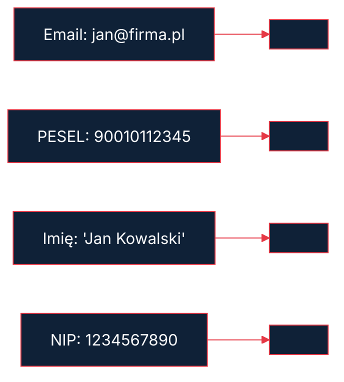

---
transition: fade
layout: cover
---


<div class="cover-tag">MODUŁ BONUS — BEZPIECZENSTWO</div>

# > Styl: Ciemne tło (dark mode), akcenty pomarańczowe Dokodu, font: Inter


<p style="color:#E63946;font-weight:600">Kacper Sieradziński</p>
<p style="color:#8096AA;font-size:0.8rem;margin-top:0.2rem">dokodu.it</p>


---
---

# DLACZEGO TEN MODUŁ JEST INNY

## Nikt w Polsce tego nie robi


<v-clicks>

- Inne kursy n8n: tylko "jak działa" — zero bezpieczeństwa
- My: Tech (Kacper) + Legal (Alina) = pełny obraz
- AI Act wchodzi w pełni 08.2026 — masz 5 miesięcy
- Po tym module: wiesz co zrobić zanim klient zapyta o compliance

</v-clicks>


<!--
Kacper mówi to z energią — to jest przewaga konkurencyjna kursu. Podkreśl "5 miesięcy" — jest konkretna data.
-->


---
---

# CO OMÓWIMY — MAPA MODUŁU

## 6 obszarów bezpieczeństwa


<v-clicks>

1. Credential Vault — gdzie trzymasz sekrety
2. RODO w automatyzacjach — dane osobowe w workflow
3. AI Act — które automatyzacje są high-risk
4. Bezpieczeństwo sieci — webhook, proxy, rate limiting
5. Logowanie i audit trail — co zapisywać
6. Server-side tracking — dlaczego to ważne

</v-clicks>


<!--
Pokaż tę mapę i wróć do niej na początku każdego segmentu — uczący wiedzą gdzie są.
-->


---
---

# CREDENTIAL VAULT — ARCHITEKTURA WYBORU

**n8n built-in vault** | HashiCorp Vault
---|---
Startup, 1-2 środowiska | Enterprise, wiele środowisk
Szyfrowanie AES (klucz w env) | Dynamiczne sekrety, rotacja
Wystarczy do ~10 integracji | Wymagany przy audytach ISO 27001
Łatwa konfiguracja | Wymaga dedykowanego serwera

**Reguła Dokodu:** n8n Credentials + silny `N8N_ENCRYPTION_KEY` = OK dla 90% projektów.
Vault → gdy klient pyta o certyfikaty bezpieczeństwa.

<!--
Pokaż tabelę, powiedz że pokażemy demo obu podejść. Nie strasz Vaultem na starcie.
-->


---
transition: fade
layout: two-cols-header
---

# N8N ENCRYPTION KEY — KRYTYCZNA KONFIGURACJA

<div class="col-header col-pos">Złe praktyki (realne z audytów)</div>

- `N8N_ENCRYPTION_KEY=changeme` — widziane na produkcji!
- Klucz w repozytorium git (historia nie kłamie)
- Ten sam klucz na dev i prod

::right::

<div class="col-header col-neg">Dobre praktyki</div>

- Klucz w `.env` → `.env` w `.gitignore`
- Różne klucze per środowisko
- Backup klucza w bezpiecznym miejscu (1Password / Bitwarden)

<!--
Kacper — pokaż realny przykład z terminala jak wygenerować klucz. "changeme na produkcji" — mówisz to z lekkim niedowierzaniem, bo naprawdę to widziałeś.
-->


---
---

# LEAST PRIVILEGE — ZASADA MINIMALNYCH UPRAWNIEŃ

## Jeden klucz API do wszystkiego = jedna awaria do katastrofy

```
ZLE:
OpenAI API Key: sk-... (jeden klucz, wszystkie workflowy)
  ↓
Workflow A (email summary) — ma dostęp do billing API
Workflow B (HR screening) — ma dostęp do wszystkiego
Workflow C (chatbot) — ma dostęp do wszystkiego

DOBRZE:
OpenAI Project API Key dla Workflow A: tylko model gpt-4o-mini, bez fine-tuning
OpenAI Project API Key dla Workflow B: osobny projekt, osobny monitoring
OpenAI Project API Key dla Workflow C: rate limit 100 req/min
```

<!--
Diagram "złe vs dobre" — narysuj strzałki. Powiedz o OpenAI Projects jako narzędziu do izolacji kluczy.
-->


---
---

# RODO w n8n — CO TO JEST DANA OSOBOWA

## Dane osobowe w workflow n8n — częstsze niż myślisz

| Co widzisz | Czy to dana osobowa? |
|---|---|
| jan.kowalski@firma.pl | TAK — bezpośrednia |
| 192.168.1.45 (IP) | TAK — gdy można powiązać z osobą |
| "Kowalski zamówił X" | TAK — imię + działanie |
| ID klienta #12345 | MOŻE — jeśli można przypisać do osoby |
| Wartość zamówienia: 5000 PLN | NIE — samo w sobie |
| Timestamp + IP + User-Agent | TAK — profilowanie |

**Pułapka:** "anonimizowałem dane" — ale zostawiłem timestamp + IP + kategoria produktu = wciąż identyfikowalny.

<!--
Alina mówi ten slajd. Tabela jest konkretna — uczący często nie wiedzą że IP to dana osobowa. Zatrzymaj się przy pułapce na dole.
-->


---
---

# PODSTAWY PRAWNE PRZETWARZANIA (art. 6 RODO)

## Które podstawy prawne stosujesz w automatyzacjach?

| Podstawa | Kiedy stosować | Przykład w n8n |
|---|---|---|
| **Zgoda** (6a) | Marketing, newsletter | Lead form → CRM workflow |
| **Umowa** (6b) | Obsługa klienta | Invoice parser, order processing |
| **Uzasadniony interes** (6f) | B2B, fraud detection | Email classifier dla supportu |
| **Obowiązek prawny** (6c) | Księgowość, podatki | Archiwizacja faktur 5 lat |

**Uwaga:** Uzasadniony interes wymaga "testu balansu" — nie stosuj go automatycznie.

<!--
Alina tłumaczy tabele. Podkreśl że "zgoda" jest najsłabszą podstawą — można ją wycofać. Uzasadniony interes jest mocniejszy ale wymaga dokumentacji.
-->


---
---

# PSEUDONIMIZACJA VS ANONIMIZACJA

```
PSEUDONIMIZACJA (odwracalna):
jan.kowalski@firma.pl → sha256("jan.kowalski@firma.pl") = "a3f2b1..."
Klucz mapowania: { "a3f2b1..." : "jan.kowalski@firma.pl" }
→ Można odwrócić mając klucz mapowania
→ RODO nadal stosuje się do pseudonimizowanych danych!

ANONIMIZACJA (nieodwracalna):
jan.kowalski@firma.pl → "[EMAIL_REDACTED]"
Lub: 192.168.1.45 → "192.168.x.x" (obcięcie ostatniego oktetu)
→ Nie można odwrócić
→ RODO nie stosuje się (brak możliwości identyfikacji)
```

**Reguła:** Pseudonimizacja redukuje ryzyko przy naruszeniu. Anonimizacja wyklucza cię z zakresu RODO dla tych danych.

<!--
Kacper — pokaż kod SHA-256 w n8n. Alina dodaje komentarz prawny: "pseudonimizacja nie = anonimizacja, RODO nadal obowiązuje".
-->


---
---

# PSEUDONIMIZACJA w CODE NODE — KOD GOTOWY

```javascript
// Pseudonimizacja e-maila (SHA-256)
const crypto = require('crypto');

const pseudonymize = (value, salt = process.env.PSEUDONYM_SALT) => {
  if (!value) return null;
  return crypto
    .createHash('sha256')
    .update(salt + value.toLowerCase().trim())
    .digest('hex')
    .substring(0, 16); // skróć do 16 znaków — wystarczy
};

// Użycie:
const items = $input.all();
return items.map(item => ({
  json: {
    ...item.json,
    email: pseudonymize(item.json.email),     // "a3f2b1c4d5e6f7g8"
    phone: pseudonymize(item.json.phone),     // pseudonimy
    name: '[REDACTED]',                        // anonimizacja imienia
    order_value: item.json.order_value,        // nie jest PII — zostaw
    order_id: item.json.order_id,              // wewnętrzny ID — OK
  }
}));
```

<!--
Kacper pokazuje ten kod w n8n. Ważne: PSEUDONYM_SALT musi być w zmiennych środowiskowych — nie hardcoded. Zatrzymaj się przy "skróć do 16 znaków" — wyjaśnij że pełny SHA-256 = 64 znaki, to za dużo dla DB.
-->


---
---

# RODO CHECKLIST DLA WORKFLOW n8n

## Przed deploymentem produkcyjnym — sprawdź każdy punkt

## Dane
- [ ] Zidentyfikowane wszystkie pola z PII (email, IP, imię, PESEL, telefon)
- [ ] Zdefiniowana podstawa prawna (Art. 6 RODO) — zapisana w dokumentacji
- [ ] Dane minimalne: czy zbierasz TYLKO to co potrzebujesz?
- [ ] Czas retencji zdefiniowany i skonfigurowany technicznie

## Techniczne
- [ ] PII nie trafia do logów n8n (wyłącz "Save Execution Data" dla wrażliwych węzłów)
- [ ] Pseudonimizacja/anonimizacja przed wysyłką do zewnętrznych API (OpenAI, Google)
- [ ] Szyfrowanie in-transit: TLS 1.3 na wszystkich połączeniach
- [ ] Sekrety w Vault / env variables — nie w workflow JSON

## Umowy
- [ ] Umowa powierzenia przetwarzania (Art. 28) z klientem
- [ ] DPA podpisane z dostawcami API (OpenAI, Google Cloud, Anthropic)

## Prawo do usunięcia
- [ ] Workflow do obsługi wniosków RTBF (Right to be Forgotten)
- [ ] Zidentyfikowane wszystkie systemy gdzie dane są przechowywane (n8n, CRM, Google Sheets, baza)
- [ ] Termin odpowiedzi: 30 dni — monitoring aktywny

<!--
Ten slajd to materiał do pobrania — PDF dla uczestników. Przejdź przez każdy punkt powoli. Alina komentuje sekcję "Umowy" — to najczęściej pomijane.
-->


---
---

# PRAWO DO USUNIĘCIA DANYCH — AUTOMATYZACJA WNIOSKU

<div class="diagram-block">

```
WORKFLOW: RTBF (Right to be Forgotten) Handler

[Webhook: wniosek RTBF]
    → [Weryfikacja tożsamości: token email]
    → [Wyszukanie we WSZYSTKICH systemach]:
        ├── CRM (HubSpot / Pipedrive)
        ├── Google Sheets (dane leadów)
        ├── Baza n8n (execution history)
        └── Newsletter (MailerLite / ActiveCampaign)
    → [Usunięcie lub pseudonimizacja]
    → [Log do audytu: "data_deleted" event]
    → [Email potwierdzający do osoby]
    → [Zapis do rejestru RTBF (Art. 30 RODO)]
```

</div>

**Termin:** 30 dni od złożenia wniosku (RODO)
**Uwaga:** Niektórych danych nie możesz usunąć — faktury przechowujesz 5 lat (prawo podatkowe). Masz obowiązek poinformować osobę o tym wyjątku.

<!--
Kacper rysuje diagram na żywo w n8n lub pokazuje gotowy blueprint. Alina komentuje "5 lat faktur" — wyjątek który zawsze ludzi zaskakuje.
-->


---
---

# AI ACT — MAPA RYZYKA (2024/1689)

## 4 poziomy ryzyka — gdzie jesteś?

<div class="diagram-block">

```
UNACCEPTABLE (ZAKAZANE od 02.2025)
├── Social scoring
├── Biometryka real-time w przestrzeni publicznej
└── Manipulacyjne AI

HIGH RISK (pełne wymagania od 08.2026)
├── HR: screening CV, ocena pracowników        ← UWAGA dla agencji!
├── Edukacja: ocenianie uczniów
├── Kredyty: scoring zdolności kredytowej
└── Infrastruktura krytyczna

LIMITED RISK (obowiązki transparency — TERAZ)
├── Chatboty: muszą poinformować że to AI      ← Większość projektów!
├── Deep-fake: obowiązek oznaczenia
└── AI-generated content: oznaczenie

MINIMAL RISK (bez specjalnych wymogów)
└── Filtry antyspam, rekomendacje, gry
```

</div>

<!--
Alina prowadzi ten slajd. Podkreśl "08.2026 = 5 miesięcy". Zapytaj uczestników: "kto wdraża coś do HR? Sprawdź czy to high-risk."
-->


---
---

# AI ACT — KTÓRE AUTOMATYZACJE SĄ high-risk?

## Sprawdź swoje projekty

| Typ automatyzacji | Klasyfikacja AI Act | Co to oznacza |
|---|---|---|
| Chatbot obsługi klienta | Limited risk | Disclosure w pierwszej wiadomości |
| Email classifier (support) | Minimal risk | Nic specjalnego |
| CV screening / ranking kandydatów | **HIGH RISK** | Pełna dokumentacja, rejestracja EU AI DB |
| Scoring kredytowy / zdolność płatnicza | **HIGH RISK** | Wymagany human-in-the-loop |
| Predykcja churnu klientów | Zależy od kontekstu | Konsultacja z prawnikiem |
| Invoice parser (OCR + AI) | Minimal risk | Nic specjalnego |
| AI-generated marketing content | Limited risk | Oznaczenie "wygenerowane przez AI" |
| Monitoring pracowników przez AI | **HIGH RISK** | Pełna dokumentacja |

**Reguła kciuka:** Jeśli AI podejmuje decyzje które istotnie wpływają na ludzi (praca, kredyt, zdrowie) → prawdopodobnie HIGH RISK.

<!--
Alina + Kacper wspólnie. Kacper dopowiada o konkretnych workflow n8n które mogą wpaść w high-risk. Podkreślcie: "Nie wiemy wszystkiego — w razie wątpliwości: prawnik."
-->


---
---

# AI ACT — TRANSPARENCY REQUIREMENT (art. 50)

## Chatboty i AI agenci: obowiązek TERAZ (od 08.2025)

```javascript
// System prompt z wymaganym disclosure:
const SYSTEM_PROMPT = `
Jesteś asystentem AI firmy [NAZWA].
WAŻNE: Informuj użytkownika na początku każdej rozmowy:
"Witaj! Jestem asystentem AI, nie człowiekiem.
Mogę pomóc w [zakres]. W każdej chwili możesz
poprosić o kontakt z konsultantem."

Nigdy nie zaprzeczaj że jesteś AI, nawet jeśli użytkownik pyta.
`;
```

## Co jest wymagane
- Wyraźna informacja na POCZĄTKU interakcji (nie w regulaminie)
- Możliwość przejścia do człowieka na żądanie
- Nie udawaj człowieka nawet pod presją

**Kara za brak:** do 15 mln EUR lub 3% globalnego obrotu

<!--
Alina mówi o karach. Kacper pokazuje implementację w n8n chatbocie. "15 milionów euro" — to nie abstrakcja, to kwota.
-->


---
---

# BEZPIECZEŃSTWO SIECI — ARCHITEKTURA

```
INTERNET
    ↓
[Cloudflare / CDN] — DDoS protection, WAF
    ↓
[Nginx / Caddy] — Reverse proxy, TLS termination, rate limiting
    ↓
[Docker network: internal] — izolacja
    ↓
[n8n container: port 5678] — NIGDY bezpośrednio na zewnątrz
    ↓
[PostgreSQL container] — tylko wewnętrzna sieć
```

**Reguła:** n8n nigdy nie powinien być dostępny na surowym porcie 5678 w internecie.

<!--
Kacper rysuje diagram lub pokazuje gotowy. Podkreśl: "jeśli teraz otwierasz przeglądarkę na IP:5678 — to problem."
-->


---
---

# NGINX KONFIGURACJA DLA n8n

```nginx
server {
    listen 443 ssl http2;
    server_name n8n.twojafirma.pl;

    ssl_certificate     /etc/letsencrypt/live/.../fullchain.pem;
    ssl_certificate_key /etc/letsencrypt/live/.../privkey.pem;
    ssl_protocols TLSv1.3;  # Tylko TLS 1.3!

    # Rate limiting — max 10 req/s per IP
    limit_req zone=n8n_limit burst=20 nodelay;

    # Security headers
    add_header X-Frame-Options "DENY";
    add_header X-Content-Type-Options "nosniff";
    add_header Strict-Transport-Security "max-age=31536000";

    location / {
        proxy_pass http://localhost:5678;
        proxy_set_header Host $host;
        proxy_set_header X-Real-IP $remote_addr;
        proxy_set_header X-Forwarded-For $proxy_add_x_forwarded_for;
    }
}

limit_req_zone $binary_remote_addr zone=n8n_limit:10m rate=10r/s;
```

<!--
Kacper pokazuje ten plik i tłumaczy każdą linię. Zatrzymaj się przy `ssl_protocols TLSv1.3` — wyjaśnij czemu tylko 1.3. Przy headers — wyjaśnij X-Frame-Options (clickjacking).
-->


---
---

# WEBHOOK SECURITY — PROBLEM

## Publiczny webhook bez zabezpieczenia

```
Twój webhook URL (publiczny):
https://n8n.firma.pl/webhook/abc123-xyz

Każdy kto zna URL może wywołać:
curl -X POST https://n8n.firma.pl/webhook/abc123-xyz \
  -H "Content-Type: application/json" \
  -d '{"action": "delete_all_leads"}'

↓
Workflow się uruchomi!
↓
Możliwe skutki:
- Spam do CRM (fałszywe leady)
- Uruchomienie kosztownych AI calls (kradną Twoje API credits)
- Wstrzyknięcie złośliwych danych do systemu
```

<!--
Kacper demonstruje atak na demo środowisku. Uczniowie muszą zobaczyć że to działa. Dopiero potem pokaż zabezpieczenie.
-->


---
---

# WEBHOOK SECURITY — HMAC SIGNATURE VERIFICATION

## Jak działa HMAC (diagram)

```
NADAWCA (np. GitHub, Stripe, Twój system):
1. Weź body requestu (raw bytes)
2. Oblicz: HMAC-SHA256(secret_key, body) = "abc123xyz"
3. Dodaj nagłówek: X-Signature: sha256=abc123xyz
4. Wyślij request

ODBIORCA (n8n webhook):
1. Odbierz request
2. Weź ten sam secret_key (znasz go tylko Ty i nadawca)
3. Oblicz: HMAC-SHA256(secret_key, received_body) = "abc123xyz"
4. Porównaj: oczekiwany == otrzymany?
   ✅ TAK → request jest autentyczny → przetworz
   ❌ NIE → ktoś sfałszował request → odrzuć z 401
```

**Klucz:** Atakujący nie zna `secret_key` → nie może sfałszować podpisu.

<!--
Narysuj ten diagram powoli. To jeden z ważniejszych konceptów w module. Potem przejdź do kodu.
-->


---
---

# HMAC VERIFICATION — KOD w n8n CODE NODE

```javascript
// Webhook HMAC Verification — Dokodu Standard
const crypto = require('crypto');

// Pobierz dane z requestu
const payload = $input.first().json;
const headers = $input.first().json.headers || {};
const rawBody = JSON.stringify(payload.body || payload);

// Pobierz podpis z nagłówka (np. GitHub style: "sha256=abc123")
const receivedSignature = headers['x-hub-signature-256'] ||
                          headers['x-signature'] || '';

// Pobierz sekret z env variable (NIE hardcode!)
const secret = process.env.WEBHOOK_SECRET;
if (!secret) throw new Error('WEBHOOK_SECRET not configured');

// Oblicz oczekiwany podpis
const expectedSignature = 'sha256=' + crypto
  .createHmac('sha256', secret)
  .update(rawBody)
  .digest('hex');

// Porównaj (timing-safe comparison!)
const isValid = crypto.timingSafeEqual(
  Buffer.from(receivedSignature),
  Buffer.from(expectedSignature)
);

if (!isValid) {
  // Log próbę i odrzuć
  console.log(JSON.stringify({
    level: 'WARN',
    event: 'webhook.signature.invalid',
    message: 'Odrzucony request — nieprawidłowy podpis HMAC',
    timestamp: new Date().toISOString()
  }));
  throw new Error('Invalid signature — request rejected');
}

// Podpis prawidłowy — kontynuuj
return [{ json: { verified: true, ...payload } }];
```

<!--
Kacper kopiuje ten kod do n8n live. Wyjaśnij `timingSafeEqual` — dlaczego zwykłe `===` jest podatne na timing attacks.
-->


---
---

# IP WHITELISTING — DODATKOWA WARSTWA

## Kiedy stosować IP whitelisting

<v-clicks>

- Webhook od zewnętrznego systemu z fałym IP (Stripe: znane zakresy IP)
- Wewnętrzne webhook między serwerami
- Admin webhooks (nigdy nie powinny być publiczne)

</v-clicks>


```nginx
location /webhook/admin/ {
    allow 192.168.1.0/24;     # Twoja sieć wewnętrzna
    allow 185.143.172.0/24;   # Znane IP partnera
    deny all;                  # Reszta blokowana

    proxy_pass http://localhost:5678;
}
```

```javascript
// Alternatywnie — sprawdzenie IP w n8n Code Node
const allowedIPs = ['185.143.172.1', '10.0.0.0/8'];
const clientIP = $input.first().json.headers['x-real-ip'];

if (!allowedIPs.includes(clientIP)) {
  throw new Error(`IP ${clientIP} not whitelisted`);
}
```

<!--
Kacper pokazuje konfigurację. Powiedz że IP whitelisting to bonus, nie substytut HMAC — atakujący mogą spoofować IP.
-->


---
---

# CO LOGOWAĆ — DYLEMAT RODO VS BEZPIECZEŃSTWO

## Napięcie

```
BEZPIECZEŃSTWO mówi: "Loguj wszystko — potrzebujesz historii do forensics"
RODO mówi: "Minimalizuj dane — nie zbieraj więcej niż potrzebujesz"

ROZWIĄZANIE: Loguj zdarzenia, nie dane osobowe
```

| Co logować | Co NIE logować |
|---|---|
| Timestamp, event type, workflow ID | Email użytkownika |
| Status (sukces/błąd) | Treść wiadomości |
| Pseudonim ID (hash) | Hasła, tokeny, API keys |
| Czas trwania operacji | Dane biometryczne |
| IP (uwaga: to PII!) | Pełne body requestu |

**IP w logach:** Jeśli logujesz IP — masz do czynienia z danymi osobowymi. Zastosuj czas retencji.

<!--
Kacper i Alina razem. To ważny punkt — uczący często logują za dużo. "Dobry log opisuje zdarzenie, nie człowieka."
-->


---
---

# DOKODU LOGGING STANDARD — FORMAT

```javascript
// Każdy log w tym formacie — kopiuj bez modyfikacji
{
  "level": "INFO",                          // INFO | WARN | ERROR
  "timestamp": "2026-03-27T10:30:00.123Z", // ISO 8601, UTC
  "workflow_name": "CLIENT_Usecase_v1",
  "execution_id": $execution.id,
  "event": "lead.captured",                // encja.akcja.status
  "message": "Nowy lead z formularza web", // czytelny opis
  "data": {
    "source": "landing_page_webinar",
    "lead_id": "lead_abc123",              // pseudonim, nie email!
    "score": 85
  },
  "duration_ms": 245
}
```

## Centralizacja logów

<v-clicks>

- Self-hosted: Grafana Loki (bezpłatny, kompatybilny z Prometheus)
- SaaS: Papertrail, Logtail (prostsze, płatne)
- Minimum: Google Sheets (dla małych projektów)

</v-clicks>


<!--
Kacper pokazuje ten format. Wspomnij że pełny standard jest w materiałach do pobrania (Logging_Standard.md).
-->


---
---

# SERVER-SIDE TRACKING — DLACZEGO i JAK

## Problem z client-side tracking (GA4, Facebook Pixel)
- Blokowany przez ad-blockery (30-60% użytkowników w B2B!)
- Wymaga zgody cookies (RODO — baner cookies)
- Dane trafiają bezpośrednio do Google / Meta

## Server-side tracking
```
Użytkownik klika "Kup" na stronie
    ↓
Twój serwer: rejestruje zdarzenie (purchase)
    ↓
n8n webhook: odbiera event
    ↓
Przetwarzasz, anonimi zujesz IP
    ↓
Wysyłasz do GA4 Measurement Protocol (server → Google)
    ↓
Wynik: 100% event capture, RODO-compliant
```

**Korzyści:** Pełne dane, mniejsza zależność od cookies, lepsza jakość ML w GA4.

<!--
Kacper. To temat techniczny — pokaż diagram i powiedz że jest blueprint w materiałach kursu. Nie zanurzaj się za głęboko — osobny moduł mógłby być z tego.
-->


---
---

# MICROSOFT PRESIDIO — TARCZA PII

**Problem:** Wysyłasz do OpenAI dane klientów → dane trafiają poza EU (bez DPA = naruszenie RODO)

## Rozwiązanie — Presidio w architekturze



**Instalacja:** Docker container, REST API, integracja przez HTTP Request w n8n

<!--
Kacper. Presidio to element Zero-Trust AI Architecture Dokodu. Pokaż diagram. Powiedz że gotowy blueprint jest w materiałach.
-->


---
class: layout-takeaway
---

# PODSUMOWANIE — TWOJA TARCZA BEZPIECZEŃSTWA

## 6 warstw = kompletna ochrona

<div class="diagram-block">

```
WARSTWA 1: Credential Vault
└── N8N_ENCRYPTION_KEY + Least Privilege

WARSTWA 2: RODO Compliance
└── Data Flow Audit + Pseudonimizacja + RTBF Workflow

WARSTWA 3: AI Act Compliance
└── Klasyfikacja ryzyka + Transparency disclosure

WARSTWA 4: Bezpieczeństwo sieci
└── Nginx + HMAC webhooks + IP whitelist

WARSTWA 5: Logowanie bez PII
└── Dokodu Logging Standard + Loki/ELK

WARSTWA 6: PII Redaction przed AI
└── Microsoft Presidio w architekturze
```

</div>

<!--
Kacper + Alina razem. "Każda warstwa samodzielnie nie wystarczy. Wszystkie razem = bezpieczna automatyzacja którą możesz pokazać klientowi enterprise."
-->


---
---

# NASTĘPNE KROKI — CO ROBISZ PO TYM MODULE

## Dziś (30 minut)
- [ ] Sprawdź swój `N8N_ENCRYPTION_KEY` — czy jest silny?
- [ ] Narysuj Data Flow Diagram jednego swojego workflow
- [ ] Sprawdź czy n8n jest za reverse proxy (nie na porcie 5678)

## Ten tydzień
- [ ] Przeprowadź RODO Audit swojego największego workflow (Ćwiczenie 1)
- [ ] Dodaj HMAC do przynajmniej jednego webhooka produkcyjnego (Ćwiczenie 2)

## Ten miesiąc
- [ ] Zidentyfikuj czy masz jakiekolwiek HIGH RISK automatyzacje (AI Act)
- [ ] Wdróż Presidio jeśli wysyłasz dane klientów do zewnętrznych LLM

**Termin nie do zignorowania:** AI Act pełne stosowanie — 2 sierpnia 2026

<!--
Alina kończy moduł. "Compliance to inwestycja — klienci enterprise o to pytają. Agencja która to ma = agencja która wygrywa przetargi."
-->


---
class: layout-exercise
---

# Ćwiczenia praktyczne

Czas na praktykę! Otwórz n8n i zrób ćwiczenia samodzielnie.


---
class: layout-exercise
---

# ĆWICZENIE 1 — RODO AUDIT ISTNIEJĄCEGO WORKFLOW (20 minut)


---
class: layout-exercise
---

# ĆWICZENIE 2 — DODAJ HMAC VERIFICATION DO WEBHOOKA (30 minut)


## Checkpointy

<v-clicks>

- Workflow z HMAC verification działa w n8n
- Request bez podpisu → odrzucony
- Request z prawidłowym podpisem → przetworzony
- Request z błędnym podpisem → odrzucony
- Logi WARN w n8n execution panel dla odrzuconych requestów
- `WEBHOOK_SECRET` jest w env variable, nie w kodzie

</v-clicks>


---
class: layout-exercise
---

# ZADANIE DOMOWE — DATA FLOW DIAGRAM DLA TWOJEGO WORKFLOW


---
class: layout-exercise
---

# ĆWICZENIE 3 — AUDIT LOG DO GOOGLE SHEETS (20 minut)


## Checkpointy

<v-clicks>

- Google Sheet "n8n_Audit_Log" z zakładkami Execution_Log i Error_Log
- Workflow zapisuje wiersz w Execution_Log po każdym udanym wykonaniu
- Workflow zapisuje wiersz w Error_Log po każdym błędzie
- Żadna kolumna nie zawiera danych osobowych (email, imię, telefon)
- Przetestowałem/am: uruchom workflow → sprawdź Sheets → wiersz się pojawił
- Przetestowałem/am: sprowokuj błąd → Error_Log ma nowy wiersz

</v-clicks>


---
class: layout-exercise
---

# MATERIAŁY DODATKOWE


