# Blog Link Graph — dokodu.it
Wygenerowano: 2026-04-22 08:31 | Zakres GSC: ostatnie 90 dni

## Podsumowanie

- Opublikowanych postów: **324**
- Internal linki (markdown): **600**
- Średnia linków wychodzących/post: **1.9**
- Sieroty (0 incoming): **95**
- Dead-ends (0 outgoing): **30**
- Broken internal /blog/* links: **66**
- Quick wins (GSC impr ≥ 500 ∧ incoming ≤ 1): **20**

## Hub Posts (Top 10 by Incoming Links)

Posty które naturalnie pełnią rolę pillarów — dużo innych postów na nie linkuje.

| # | Post | Pillar? | In | Out |
|---|------|---------|----|----|
| 1 | [N8n - co to jest? Kompletny przewodnik od zera do eksperta w](/blog/n8n) | ⭐ | 17 | 9 |
| 2 | [Podstawy SQL: SELECT, WHERE, JOIN, GROUP BY](/blog/sql/podstawy-sql-select-where-join-group-by) |  | 15 | 5 |
| 3 | [Optymalizacja zapytań SQL i analiza planów wykonania](/blog/sql/optymalizacja-zapytan-sql-plany-wykonania) |  | 12 | 5 |
| 4 | [Indeksy w SQL: teoria i praktyka](/blog/sql/indeksy-w-sql-teoria-praktyka) |  | 12 | 4 |
| 5 | [Podzapytania i CTE w SQL](/blog/sql/podzapytania-i-cte-w-sql) |  | 11 | 4 |
| 6 | [Prompt Engineering — kompletny przewodnik dla firm i pracown](/blog/prompt-engineering) | ⭐ | 8 | 6 |
| 7 | [Funkcje okienkowe w SQL: PostgreSQL i MySQL](/blog/sql/funkcje-okienkowe-sql-postgresql-i-mysql) |  | 8 | 5 |
| 8 | [Testowanie z pytest – prostsze i szybsze testy w Pythonie](/blog/python/testowanie/testowanie-z-pytest) |  | 8 | 5 |
| 9 | [PostgreSQL: wprowadzenie, instalacja i pierwsza baza danych](/blog/sql/postgresql-wprowadzenie-instalacja-pierwsza-baza) |  | 8 | 4 |
| 10 | [Testy integracyjne API w FastAPI i Django – praktyczny przew](/blog/python/testowanie/integracyjne-testy-api-fastapi-django) |  | 8 | 4 |

## 🎯 Quick Wins — Orphan Hits z Traffic

Posty z impressions ≥ 500 (GSC) ALE ≤ 1 incoming link. Dodanie linków daje najszybszy lift.

| Post | Impr | Clicks | Pos | In |
|------|------|--------|-----|----|
| [SQL — naucz się języka zapytań krok po kroku](/blog/sql) | 944760 | 16466 | 5.8 | 0 |
| [Co to jest LLM? Duże modele językowe w praktyce](/blog/co-to-jest-llm) | 180318 | 81 | 2.9 | 0 |
| [Nauka Pythona od podstaw – kompletny przewodnik dla poc](/blog/python/nauka) | 151139 | 473 | 6.1 | 1 |
| [SQL dla początkujących - czym jest SQL oraz różnice mię](/blog/sql/sql-dla-poczatkujacych-roznice-mysql-postgresql-sqlite) | 140083 | 947 | 3.7 | 1 |
| [Automatyzacja procesów w firmie – co to jest i dlaczego](/blog/automatyzacja-procesow) | 123642 | 247 | 14.4 | 0 |
| [Google Workspace + Gemini: Kompletny przewodnik dla fir](/blog/google-workspace) | 117265 | 1194 | 7.7 | 0 |
| [Analiza danych w Pythonie — NumPy, Pandas i Matplotlib](/blog/python/ai/dane) | 110746 | 1029 | 7.5 | 0 |
| [Podstawy programowania w Pythonie](/blog/python/podstawy/podstawy-programowania) | 106370 | 1049 | 6.1 | 1 |
| [Cursor i Cursor Pro: Rewolucja w programowaniu wspieran](/blog/cursor-cursor-pro-programowanie-ai) | 100814 | 589 | 6.5 | 1 |
| [List Comprehension w Pythonie - Praktyczne przykłady](/blog/python/podstawy/list-comprehension) | 99074 | 878 | 2.7 | 1 |
| [Machine Learning w Pythonie — od podstaw do modeli pred](/blog/python/ai/machine-learning) | 89583 | 549 | 10.5 | 0 |
| [Claude Code jako agent AI — jak działa i do czego go uż](/blog/agenci-ai/claude-code-agent) | 83146 | 1092 | 5.5 | 1 |
| [Ile kosztuje kurs Pythona w 2025? Porównanie modeli i c](/blog/python/nauka/ile-kosztuje-kurs-pythona) | 81117 | 147 | 3.1 | 1 |
| [Funkcje agregujące w SQL](/blog/sql/funkcje-agregujace-w-sql) | 74706 | 897 | 4.7 | 1 |
| [Podstawy Pythona - Pętle i warunki](/blog/python/podstawy/petle-i-warunki) | 63965 | 369 | 8.7 | 1 |
| [No-code vs Low-code – co wybrać do automatyzacji proces](/blog/automatyzacja-procesow/no-code-vs-low-code) | 61495 | 192 | 13.1 | 1 |
| [Google Workspace AI cena 2026: ile kosztuje Gemini dla ](/blog/google-workspace/ai-cena) | 54958 | 308 | 7.4 | 1 |
| [Zastosowania języka Python: gdzie i jak wykorzystuje si](/blog/python/podstawy/zastosowania-python) | 53697 | 661 | 5.6 | 1 |
| [UNION i UNION ALL w SQL](/blog/sql/union-i-union-all) | 49785 | 294 | 4.4 | 0 |
| [Typy złożone w Pythonie – listy, krotki, słowniki i zbi](/blog/python/podstawy/typy-zlozone-python-listy-slowniki-krotki-zbiory) | 49756 | 194 | 7.6 | 1 |

## ⚠️ Sieroty (0 incoming)
Łącznie: **95**. Top 30 posortowane po GSC impressions:

| Post | Pillar | Słów | Impr |
|------|--------|------|------|
| ⭐ [SQL — naucz się języka zapytań krok po kroku](/blog/sql) | sql | 1180 | 944760 |
| [Co to jest LLM? Duże modele językowe w praktyce](/blog/co-to-jest-llm) |  | 1212 | 180318 |
| ⭐ [Automatyzacja procesów w firmie – co to jest i dlaczego](/blog/automatyzacja-procesow) | automatyzacja-proces | 990 | 123642 |
| ⭐ [Google Workspace + Gemini: Kompletny przewodnik dla fir](/blog/google-workspace) | google-workspace | 987 | 117265 |
| [Analiza danych w Pythonie — NumPy, Pandas i Matplotlib](/blog/python/ai/dane) | ai | 476 | 110746 |
| [Machine Learning w Pythonie — od podstaw do modeli pred](/blog/python/ai/machine-learning) | ai | 470 | 89583 |
| [UNION i UNION ALL w SQL](/blog/sql/union-i-union-all) | sql | 684 | 49785 |
| [Instrukcja CASE WHEN w SQL](/blog/sql/case-when-w-sql) | sql | 833 | 49397 |
| [Vector database: co to jest, kiedy warto i jak zacząć (](/blog/vector-database-co-to-jest-pgvector-milvus-weaviate-pinecone) |  | 3005 | 47203 |
| [Podstawy Pythona - Funkcje](/blog/podstawy-python-funkcje) |  | 837 | 36871 |
| [Sztuczna inteligencja (AI) - co to jest, zastosowania i](/blog/sztuczna-inteligencja-co-to-ai-2025) |  | 3052 | 26420 |
| [Decyzja OpenAI: treści dla dorosłych w ChatGPT - test d](/blog/chatgpt-tresci-dla-doroslych-test-dojrzalosci-informacyjnej) |  | 1384 | 22830 |
| [SQL — pytania rekrutacyjne](/blog/sql/sql-interview-pytania) | sql | 1122 | 22381 |
| [DeepSeek: Chiński przełom w sztucznej inteligencji](/blog/deepseek-chinska-rewolucja-na-rynku-sztucznej-inteligencji) |  | 1476 | 20876 |
| [Python: Biblioteki i frameworki](/blog/python/web/biblioteki-frameworki) | web | 852 | 14735 |
| [Wprowadzenie do programowania funkcyjnego w Pythonie](/blog/python/praktyka/programowanie-funkcyjne) | praktyka | 461 | 13994 |
| [Generatywne AI w Pythonie — modele, obrazy i tekst](/blog/python/ai/generatywne) | ai | 457 | 13567 |
| [Prompt Engineering: Jak pisać skuteczne prompty?](/blog/prompt-engineering-skuteczne-prompty) |  | 448 | 12760 |
| [Testowanie jednostkowe w Pythonie: Jak pisać szybkie i ](/blog/python/testowanie/testowanie-jednostkowe-python) | testowanie | 1891 | 12290 |
| [Docker manager na VPS Hostingera: moje doświadczenia z ](/blog/docker/docker-manager-na-vps-hostingera-moje-doswiadczenia) | docker | 2686 | 11741 |
| [Podstawy Pythona - Pętle i warunki](/blog/podstawy-python-petle-i-warunki) |  | 1075 | 10212 |
| [NLP w Pythonie — przetwarzanie języka naturalnego](/blog/python/ai/nlp) | ai | 395 | 10123 |
| [Czy Python jest trudny?](/blog/python/nauka/czy-python-jest-trudny) | nauka | 200 | 9511 |
| [Agenci AI w Pythonie — LangChain i automatyzacja](/blog/python/ai/agenci) | ai | 372 | 9307 |
| [API autoryzacja i JWT w Pythonie](/blog/api-autoryzacja-jwt-python) |  | 1918 | 9241 |
| [Denormalizacja baz danych](/blog/sql/denormalizacja-baz-danych) | sql | 831 | 7626 |
| [Jak wdrożyć agenta AI w firmie w 30 dni — plan krok po ](/blog/agenci-ai/wdrozenie-agenta-ai) | agenty-ai | 1917 | 6947 |
| [Sztuczna inteligencja (AI) - co to jest, zastosowania i](/blog/sztuczna-inteligencja-ai-2025) |  | 3052 | 6720 |
| [Zaawansowane techniki prompt engineeringu](/blog/zaawansowane-techniki-prompt-engineeringu) |  | 383 | 6640 |
| [Sztuczna inteligencja w programowaniu - jak AI pomogła ](/blog/sztuczna-inteligencja-w-programowaniu-jak-ai-pomogla-mi-w-codziennej-pracy) |  | 993 | 6317 |

## 🚫 Dead-ends (0 outgoing)
Posty które nie wysyłają link juice dalej. Top 15:

| Post | Słów |
|------|------|
| [No-code vs Low-code – co wybrać do automatyzacji procesów w ](/blog/automatyzacja-procesow/no-code-vs-low-code) | 7024 |
| [Flask vs FastAPI: Porównanie frameworków webowych w Pythonie](/blog/python/web/flask-vs-fastapi) | 3975 |
| [Docker manager na VPS Hostingera: moje doświadczenia z webow](/blog/docker/docker-manager-na-vps-hostingera-moje-doswiadczenia) | 2686 |
| [Jak połączyć Django lub FastAPI z Reactem](/blog/python/web/python-frontend-integracja) | 2520 |
| [REST API w Pythonie – zasady i najlepsze praktyki](/blog/python/web/rest-api-python) | 2492 |
| [Podstawy AI: Co to jest uczenie maszynowe?](/blog/python/ai/machine-learning/podstawy-ai-uczenie-maszynowe) | 2479 |
| [Rodzaje baz danych: relacyjne, NoSQL, grafowe i dokumentowe ](/blog/rodzaje-baz-danych-relacyjne-nierelacyjne-wektorowe) | 2333 |
| [Rodzaje baz danych: relacyjne, NoSQL, grafowe i dokumentowe ](/blog/rodzaje-baz-danych-relacyjne-nosql-grafowe-dokumentowe) | 2333 |
| [Tworzenie prostych aplikacji Flask krok po kroku](/blog/python/web/flask-podstawy) | 2234 |
| [Autoryzacja i JWT w FastAPI](/blog/python/web/fastapi-jwt) | 2231 |
| [Tworzenie REST API w FastAPI](/blog/python/web/fastapi-rest-api) | 2118 |
| [Mikroserwisy w Pythonie – architektura i integracja](/blog/python/web/mikroserwisy-python) | 2012 |
| [API autoryzacja i JWT w Pythonie](/blog/python/web/api-autoryzacja-python) | 1918 |
| [API autoryzacja i JWT w Pythonie](/blog/api-autoryzacja-jwt-python) | 1918 |
| [Asynchroniczność w Python web apps](/blog/python/web/asynchronicznosc-python-web) | 1887 |

## 🔗 Broken Internal Links
Linki `/blog/*` w treści postów wskazujące na **nieistniejące sluge**.

| Z posta | Anchor | Target (404?) |
|---------|--------|---------------|
| `5-bledow-ktore-popelnilem-jako-poczatkujacy-programista` | Testowanie jednostkowe w Pythonie - wpro | `/blog/testowanie-jednostkowe-w-pythonie-wprowadzenie-do-unittest` |
| `agenci-ai` | Agent AI na własnych danych bez RAG — n8 | `/blog/agenci-ai/agent-ai-wlasne-dane-n8n-gemini` |
| `agenci-ai` | Gemini Imagen w n8n — automatyczna edycj | `/blog/agenci-ai/gemini-imagen-edycja-zdjec-n8n` |
| `agenci-ai` | Lokalny asystent AI dla programistów — Q | `/blog/agenci-ai/lokalny-asystent-ai-qwen3-cursor-docker` |
| `agenci-ai` | Lokalny RAG bez chmury — RTX 5080, ColQw | `/blog/agenci-ai/lokalny-rag-rtx-5080-colqwen-lancedb` |
| `agenci-ai` | MCP w n8n — jak Claude Code tworzy workf | `/blog/agenci-ai/mcp-n8n-claude-code-automatyzacja` |
| `agenci-ai` | Własny serwer MCP w Pythonie (FastMCP) | `/blog/agenci-ai/python-mcp-server-fast-mcp` |
| `agenci-ai` | Jak zbudować chatbota RAG z n8n i Qdrant | `/blog/agenci-ai/rag-chatbot-n8n-qdrant` |
| `agenci-ai` | Lokalne generowanie obrazów — Flux LoRA  | `/blog/agenci-ai/stable-diffusion-flux-lora-comfyui-rtx` |
| `ai-zmienia-rynek-pracy-co-musisz-wiedziec` | Sztuczna inteligencja - jak zacząć? | `/blog/sztuczna-inteligencja-jak-zaczac` |
| `asynchronicznosc-w-pythonie-wprowadzenie-do-asyncio` | Dekoratory w Pythonie - jak i kiedy ich  | `/blog/dekoratory-w-pythonie-jak-i-kiedy-ich-uzywac` |
| `asynchronicznosc-w-pythonie-wprowadzenie-do-asyncio` | Integracja generatorów z asynchronicznym | `/blog/integracja-generatorow-z-asynchronicznym-programowaniem-w-pythonie` |
| `automatyzacja-codziennych-zadan-jak-odzyskalem-czas-dla-siebie` | n8n - pierwsze kroki, automatyzacja bez  | `/blog/n8n-pierwsze-kroki-automatyzacja-bez-kodowania` |
| `automatyzacja-codziennych-zadan-jak-odzyskalem-czas-dla-siebie` | Wykorzystanie Generative AI w automatycz | `/blog/wykorzystanie-generative-ai-w-automatycznym-generowaniu-kodu` |
| `automatyzacja-zadan-w-pythonie-praktyczne-przyklady` | Testowanie jednostkowe w Pythonie - wpro | `/blog/testowanie-jednostkowe-w-pythonie-wprowadzenie-do-unittest` |
| `co-musisz-zmieniec-o-zmianach-wywolanych-przez-ai-na-rynku-pracy` | Sztuczna inteligencja - jak zacząć? | `/blog/sztuczna-inteligencja-jak-zaczac` |
| `czym-jest-program-komputerowy` | Programowanie obiektowe w Pythonie - kla | `/blog/programowanie-obiektowe-w-pythonie-klasy-i-obiekty` |
| `czym-jest-program-komputerowy` | Wprowadzenie do programowania funkcyjneg | `/blog/wprowadzenie-do-programowania-funkcyjnego-w-pythonie` |
| `debugowanie-i-testowanie-generatorow-w-pythonie` | Integracja generatorów z asynchronicznym | `/blog/integracja-generatorow-z-asynchronicznym-programowaniem-w-pythonie` |
| `debugowanie-i-testowanie-generatorow-w-pythonie` | Porównanie generatorów z innymi wzorcami | `/blog/porownanie-generatorow-z-innymi-wzorcami-projektowymi-w-pythonie` |
| `docker/bezpieczenstwo-w-dockerze-best-practices` | Debugowanie kontenerów Docker - najlepsz | `/blog/debugowanie-kontenerow-docker-najlepsze-narzedzia` |
| `docker/bezpieczenstwo-w-dockerze-best-practices` | Dockerfile - tworzenie własnych obrazów  | `/blog/dockerfile-tworzenie-wlasnych-obrazow-dockera` |
| `docker/bezpieczenstwo-w-dockerze-best-practices` | Zaawansowane techniki w Dockerze - multi | `/blog/zaawansowane-techniki-w-dockerze-multi-stage-builds` |
| `docker/docker-compose-ulatwienie-zarzadzania-wieloma-kontenerami` | Bezpieczeństwo w Dockerze - best practic | `/blog/bezpieczenstwo-w-dockerze-best-practices` |
| `docker/docker-compose-ulatwienie-zarzadzania-wieloma-kontenerami` | Debugowanie kontenerów Docker - najlepsz | `/blog/debugowanie-kontenerow-docker-najlepsze-narzedzia` |
| `docker/docker-compose-ulatwienie-zarzadzania-wieloma-kontenerami` | Docker Swarm - orkiestracja kontenerów n | `/blog/docker-swarm-orkiestracja-kontenerow-na-wielu-hostach` |
| `docker/docker-swarm-orkiestracja-kontenerow-na-wielu-hostach` | Docker Compose - ułatwienie zarządzania  | `/blog/docker-compose-ulatwienie-zarzadzania-wieloma-kontenerami` |
| `docker/docker-w-praktyce-stworzenie-aplikacji-webowej-z-kontenerami` | Docker Compose - ułatwienie zarządzania  | `/blog/docker-compose-ulatwienie-zarzadzania-wieloma-kontenerami` |
| `docker/docker-w-praktyce-stworzenie-aplikacji-webowej-z-kontenerami` | Dockerfile - tworzenie własnych obrazów  | `/blog/dockerfile-tworzenie-wlasnych-obrazow-dockera` |
| `docker/docker-w-praktyce-stworzenie-aplikacji-webowej-z-kontenerami` | Instalacja Dockera na różnych systemach  | `/blog/instalacja-dockera-na-roznych-systemach-operacyjnych` |
| `docker/wprowadzenie-do-kubernetes-i-porownanie-z-dockerem` | Docker Compose - ułatwienie zarządzania  | `/blog/docker-compose-ulatwienie-zarzadzania-wieloma-kontenerami` |
| `docker/wprowadzenie-do-kubernetes-i-porownanie-z-dockerem` | Docker Swarm - orkiestracja kontenerów n | `/blog/docker-swarm-orkiestracja-kontenerow-na-wielu-hostach` |
| `docker/wprowadzenie-do-kubernetes-i-porownanie-z-dockerem` | Zarządzanie kontenerami - skalowanie i m | `/blog/zarzadzanie-kontenerami-skalowanie-i-monitoring` |
| `docker/zarzadzanie-kontenerami-skalowanie-i-monitoring` | Bezpieczeństwo w Dockerze - best practic | `/blog/bezpieczenstwo-w-dockerze-best-practices` |
| `docker/zarzadzanie-kontenerami-skalowanie-i-monitoring` | Docker Swarm - orkiestracja kontenerów n | `/blog/docker-swarm-orkiestracja-kontenerow-na-wielu-hostach` |
| `docker/zarzadzanie-kontenerami-skalowanie-i-monitoring` | Praca z woluminami w Dockerze - przechow | `/blog/praca-z-woluminami-w-dockerze-przechowywanie-danych` |
| `generative-ai-w-grach-i-symulacjach` | Generative AI w nauce - symulacje i mode | `/blog/generative-ai-w-nauce-symulacje-i-modelowanie` |
| `generative-ai-w-grach-i-symulacjach` | Wykorzystanie Generative AI w automatycz | `/blog/wykorzystanie-generative-ai-w-automatycznym-generowaniu-kodu` |
| `generative-ai-w-tworzeniu-muzyki` | Rozpoznawanie i generowanie mowy z AI | `/blog/rozpoznawanie-i-generowanie-mowy-z-ai` |
| `generowanie-wideo-z-pomoca-ai` | Rozpoznawanie i generowanie mowy z AI | `/blog/rozpoznawanie-i-generowanie-mowy-z-ai` |
| `generowanie-wideo-z-pomoca-ai` | Tekstowe modele generatywne - GPT i inne | `/blog/tekstowe-modele-generatywne-gpt-i-inne` |
| `google-workspace/gemini-co-to-jest` | Szczegóły → | `/blog/gmail-gemini-ai-asystent` |
| `google-workspace/gemini-co-to-jest` | Szczegóły → | `/blog/google-docs-gemini` |
| `google-workspace/gemini-co-to-jest` | Szczegóły → | `/blog/google-meet-transkrypcja` |
| `langchain-podstawy-tworzenie-agentów` | n8n - Prosta automatyzacja procesów bez  | `/blog/n8n-pierwsze-kroki-automatyzacja-bez-kodowania` |
| `optymalizacja-generative-ai-modeli-w-pythonie` | Tekstowe modele generatywne - GPT i inne | `/blog/tekstowe-modele-generatywne-gpt-i-inne` |
| `program-komputerowy-jako-wzor-matematyczny-proste-wyjasnienie` | Programowanie obiektowe w Pythonie - kla | `/blog/programowanie-obiektowe-w-pythonie-klasy-i-obiekty` |
| `program-komputerowy-jako-wzor-matematyczny-proste-wyjasnienie` | Wprowadzenie do programowania funkcyjneg | `/blog/wprowadzenie-do-programowania-funkcyjnego-w-pythonie` |
| `przyszlosc-generative-ai-wyzwania-i-etyka` | Tekstowe modele generatywne - GPT i inne | `/blog/tekstowe-modele-generatywne-gpt-i-inne` |
| `python-biblioteki-frameworki` | Flask vs FastAPI: Porównanie frameworków | `/blog/tworzenie-aplikacji-webowych-w-pythonie-flask-czy-fastapi` |
| … | | *(+16 więcej)* |

## 📊 Struktura per kategoria

| Kategoria | Posty | Pillar |
|-----------|-------|--------|
| (brak) | 85 | 0 |
| sql | 27 | 1 |
| web | 26 | 0 |
| automatyzacja | 18 | 0 |
| docker | 17 | 1 |
| zaawansowane | 14 | 0 |
| podstawy | 12 | 0 |
| google-workspace | 11 | 1 |
| python | 10 | 1 |
| praktyka | 10 | 0 |
| n8n | 10 | 1 |
| rozwoj | 9 | 0 |
| prompt-engineering | 9 | 1 |
| nauka | 9 | 0 |
| wdrozenie-ai-w-firmie | 8 | 1 |
| testowanie | 7 | 0 |
| machine-learning | 6 | 0 |
| agenty-ai | 6 | 1 |
| n8n Automatyzacja | 5 | 0 |
| generatywne | 5 | 0 |
| dane | 5 | 0 |
| ai | 5 | 0 |
| AI Tools | 3 | 0 |
| nlp | 2 | 0 |
| automatyzacja-procesow | 2 | 1 |
| agenci | 1 | 0 |
| SQL | 1 | 0 |
| DevOps | 1 | 0 |

## 🕸️ Graf Top Hubs (Mermaid)

```mermaid
graph LR
    agenci_ai_agent_ai_w_firmie["agenci-ai/agent-ai-w-firmie"]
    n8n["n8n"]:::hub
    agenci_ai_agent_ai_w_firmie --> n8n
    agenci_ai_claude_code_agent["agenci-ai/claude-code-agent"]
    agenci_ai_claude_code_agent --> n8n
    agenci_ai_narzedzia_agenty_ai["agenci-ai/narzedzia-agenty-ai"]
    agenci_ai_narzedzia_agenty_ai --> n8n
    agenci_ai_wdrozenie_agenta_ai["agenci-ai/wdrozenie-agenta-ai"]
    agenci_ai_wdrozenie_agenta_ai --> n8n
    n8n_docker_instalacja_konfiguracja["n8n/docker-instalacja-konfigur"]
    n8n_docker_instalacja_konfiguracja --> n8n
    n8n_integracja_z_ai["n8n/integracja-z-ai"]
    n8n_integracja_z_ai --> n8n
    n8n_licencja_cennik["n8n/licencja-cennik"]
    n8n_licencja_cennik --> n8n
    n8n_make_com_vs_n8n["n8n/make-com-vs-n8n"]
    n8n_make_com_vs_n8n --> n8n
    n8n_node_code["n8n/node-code"]
    n8n_node_code --> n8n
    n8n_przyklady_workflow_automatyzacji["n8n/przyklady-workflow-automat"]
    n8n_przyklady_workflow_automatyzacji --> n8n
    n8n_self_host_bezpieczenstwo["n8n/self-host-bezpieczenstwo"]
    n8n_self_host_bezpieczenstwo --> n8n
    n8n_webhook_bezpieczenstwo_throttling["n8n/webhook-bezpieczenstwo-thr"]
    n8n_webhook_bezpieczenstwo_throttling --> n8n
    prompt_engineering_bledy_w_promptach["prompt-engineering/bledy-w-pro"]
    prompt_engineering["prompt-engineering"]:::hub
    prompt_engineering_bledy_w_promptach --> prompt_engineering
    prompt_engineering_co_to_jest_prompt["prompt-engineering/co-to-jest-"]
    prompt_engineering_co_to_jest_prompt --> prompt_engineering
    prompt_engineering_frameworki["prompt-engineering/frameworki"]
    prompt_engineering_frameworki --> prompt_engineering
    prompt_engineering_jak_pisac_prompty["prompt-engineering/jak-pisac-p"]
    prompt_engineering_jak_pisac_prompty --> prompt_engineering
    prompt_engineering_metaprompting["prompt-engineering/metaprompti"]
    prompt_engineering_metaprompting --> prompt_engineering
    prompt_engineering_okno_kontekstowe["prompt-engineering/okno-kontek"]
    prompt_engineering_okno_kontekstowe --> prompt_engineering
    prompt_engineering_przyklady_promptow["prompt-engineering/przyklady-p"]
    prompt_engineering_przyklady_promptow --> prompt_engineering
    prompt_engineering_zaawansowane_techniki["prompt-engineering/zaawansowan"]
    prompt_engineering_zaawansowane_techniki --> prompt_engineering
    python_testowanie["python/testowanie"]
    python_testowanie_integracyjne_testy_api["python/testowanie/integracyjne"]:::hub
    python_testowanie --> python_testowanie_integracyjne_testy_api
    python_testowanie_testowanie_z_pytest["python/testowanie/testowanie-z"]:::hub
    python_testowanie --> python_testowanie_testowanie_z_pytest
    python_testowanie_coverage_i_jak_mierzyc["python/testowanie/coverage-i-j"]
    python_testowanie_coverage_i_jak_mierzyc --> python_testowanie_integracyjne_testy_api
    python_testowanie_coverage_i_jak_mierzyc --> python_testowanie_testowanie_z_pytest
    python_testowanie_integracyjne_testy_api --> python_testowanie_testowanie_z_pytest
    python_testowanie_mockowanie_i_fixture_w["python/testowanie/mockowanie-i"]
    python_testowanie_mockowanie_i_fixture_w --> python_testowanie_integracyjne_testy_api
    python_testowanie_mockowanie_i_fixture_w --> python_testowanie_testowanie_z_pytest
    python_testowanie_testowanie_i_ci_cd_git["python/testowanie/testowanie-i"]
    python_testowanie_testowanie_i_ci_cd_git --> python_testowanie_integracyjne_testy_api
    python_testowanie_testowanie_i_ci_cd_git --> python_testowanie_testowanie_z_pytest
    python_testowanie_testowanie_jednostkowe["python/testowanie/testowanie-j"]
    python_testowanie_testowanie_jednostkowe --> python_testowanie_integracyjne_testy_api
    python_testowanie_testowanie_jednostkowe --> python_testowanie_testowanie_z_pytest
    python_testowanie_testowanie_jednostkowe --> python_testowanie_integracyjne_testy_api
    python_testowanie_testowanie_jednostkowe --> python_testowanie_testowanie_z_pytest
    python_testowanie_testowanie_z_pytest --> python_testowanie_integracyjne_testy_api
    sql["sql"]
    sql_podstawy_sql_select_where_join_group["sql/podstawy-sql-select-where-"]:::hub
    sql --> sql_podstawy_sql_select_where_join_group
    sql_postgresql_wprowadzenie_instalacja_p["sql/postgresql-wprowadzenie-in"]:::hub
    sql --> sql_postgresql_wprowadzenie_instalacja_p
    sql_case_when_w_sql["sql/case-when-w-sql"]
    sql_funkcje_okienkowe_sql_postgresql_i_m["sql/funkcje-okienkowe-sql-post"]:::hub
    sql_case_when_w_sql --> sql_funkcje_okienkowe_sql_postgresql_i_m
    sql_case_when_w_sql --> sql_podstawy_sql_select_where_join_group
    sql_podzapytania_i_cte_w_sql["sql/podzapytania-i-cte-w-sql"]:::hub
    sql_case_when_w_sql --> sql_podzapytania_i_cte_w_sql
    sql_co_to_jest_sql["sql/co-to-jest-sql"]
    sql_indeksy_w_sql_teoria_praktyka["sql/indeksy-w-sql-teoria-prakt"]:::hub
    sql_co_to_jest_sql --> sql_indeksy_w_sql_teoria_praktyka
    sql_co_to_jest_sql --> sql_podstawy_sql_select_where_join_group
    sql_denormalizacja_baz_danych["sql/denormalizacja-baz-danych"]
    sql_denormalizacja_baz_danych --> sql_indeksy_w_sql_teoria_praktyka
    sql_optymalizacja_zapytan_sql_plany_wyko["sql/optymalizacja-zapytan-sql-"]:::hub
    sql_denormalizacja_baz_danych --> sql_optymalizacja_zapytan_sql_plany_wyko
    sql_denormalizacja_baz_danych --> sql_podzapytania_i_cte_w_sql
    sql_funkcje_agregujace_w_sql["sql/funkcje-agregujace-w-sql"]
    sql_funkcje_agregujace_w_sql --> sql_funkcje_okienkowe_sql_postgresql_i_m
    sql_funkcje_agregujace_w_sql --> sql_indeksy_w_sql_teoria_praktyka
    sql_funkcje_agregujace_w_sql --> sql_optymalizacja_zapytan_sql_plany_wyko
    sql_funkcje_agregujace_w_sql --> sql_podstawy_sql_select_where_join_group
    sql_funkcje_okienkowe_sql_postgresql_i_m --> sql_indeksy_w_sql_teoria_praktyka
    sql_funkcje_okienkowe_sql_postgresql_i_m --> sql_optymalizacja_zapytan_sql_plany_wyko
    sql_funkcje_okienkowe_sql_postgresql_i_m --> sql_podstawy_sql_select_where_join_group
    sql_funkcje_okienkowe_sql_postgresql_i_m --> sql_podzapytania_i_cte_w_sql
    sql_indeksy_w_sql_teoria_praktyka --> sql_optymalizacja_zapytan_sql_plany_wyko
    sql_indeksy_w_sql_teoria_praktyka --> sql_podstawy_sql_select_where_join_group
    sql_jak_uczyc_sie_sql["sql/jak-uczyc-sie-sql"]
    sql_jak_uczyc_sie_sql --> sql_podstawy_sql_select_where_join_group
    sql_jak_uczyc_sie_sql --> sql_podzapytania_i_cte_w_sql
    sql_mysql_wprowadzenie_instalacja_pierws["sql/mysql-wprowadzenie-instala"]
    sql_mysql_wprowadzenie_instalacja_pierws --> sql_podstawy_sql_select_where_join_group
    sql_normalizacja_baz_danych["sql/normalizacja-baz-danych"]
    sql_normalizacja_baz_danych --> sql_indeksy_w_sql_teoria_praktyka
    sql_normalizacja_baz_danych --> sql_optymalizacja_zapytan_sql_plany_wyko
    sql_normalizacja_baz_danych --> sql_podstawy_sql_select_where_join_group
    sql_normalizacja_baz_danych --> sql_podzapytania_i_cte_w_sql
    sql_optymalizacja_zapytan_sql_plany_wyko --> sql_funkcje_okienkowe_sql_postgresql_i_m
    sql_optymalizacja_zapytan_sql_plany_wyko --> sql_indeksy_w_sql_teoria_praktyka
    sql_optymalizacja_zapytan_sql_plany_wyko --> sql_podzapytania_i_cte_w_sql
    sql_podstawy_sql_select_where_join_group --> sql_indeksy_w_sql_teoria_praktyka
    sql_podstawy_sql_select_where_join_group --> sql_optymalizacja_zapytan_sql_plany_wyko
    sql_podstawy_sql_select_where_join_group --> sql_podzapytania_i_cte_w_sql
    sql_podzapytania_i_cte_w_sql --> sql_funkcje_okienkowe_sql_postgresql_i_m
    sql_podzapytania_i_cte_w_sql --> sql_indeksy_w_sql_teoria_praktyka
    sql_podzapytania_i_cte_w_sql --> sql_optymalizacja_zapytan_sql_plany_wyko
    sql_podzapytania_i_cte_w_sql --> sql_podstawy_sql_select_where_join_group
    sql_postgresql_backup_restore_pg_dump_pg["sql/postgresql-backup-restore-"]
    sql_postgresql_backup_restore_pg_dump_pg --> sql_postgresql_wprowadzenie_instalacja_p
    sql_postgresql_indeksy_btree_hash_gin_gi["sql/postgresql-indeksy-btree-h"]
    sql_postgresql_indeksy_btree_hash_gin_gi --> sql_indeksy_w_sql_teoria_praktyka
    sql_postgresql_indeksy_btree_hash_gin_gi --> sql_optymalizacja_zapytan_sql_plany_wyko
    sql_postgresql_indeksy_btree_hash_gin_gi --> sql_postgresql_wprowadzenie_instalacja_p
    sql_postgresql_partitioning_sharding_pod["sql/postgresql-partitioning-sh"]
    sql_postgresql_partitioning_sharding_pod --> sql_indeksy_w_sql_teoria_praktyka
    sql_postgresql_partitioning_sharding_pod --> sql_optymalizacja_zapytan_sql_plany_wyko
    sql_postgresql_partitioning_sharding_pod --> sql_postgresql_wprowadzenie_instalacja_p
    sql_postgresql_sql_dialekt_najwazniejsze["sql/postgresql-sql-dialekt-naj"]
    sql_postgresql_sql_dialekt_najwazniejsze --> sql_funkcje_okienkowe_sql_postgresql_i_m
    sql_postgresql_sql_dialekt_najwazniejsze --> sql_podzapytania_i_cte_w_sql
    sql_postgresql_uzytkownicy_role_uprawnie["sql/postgresql-uzytkownicy-rol"]
    sql_postgresql_uzytkownicy_role_uprawnie --> sql_postgresql_wprowadzenie_instalacja_p
    sql_postgresql_vs_mysql_roznice_dla_pocz["sql/postgresql-vs-mysql-roznic"]
    sql_postgresql_vs_mysql_roznice_dla_pocz --> sql_funkcje_okienkowe_sql_postgresql_i_m
    sql_postgresql_vs_mysql_roznice_dla_pocz --> sql_indeksy_w_sql_teoria_praktyka
    sql_postgresql_wprowadzenie_instalacja_p --> sql_podstawy_sql_select_where_join_group
    sql_sql_interview_pytania["sql/sql-interview-pytania"]
    sql_sql_interview_pytania --> sql_funkcje_okienkowe_sql_postgresql_i_m
    sql_sql_interview_pytania --> sql_indeksy_w_sql_teoria_praktyka
    sql_sql_interview_pytania --> sql_optymalizacja_zapytan_sql_plany_wyko
    sql_sql_interview_pytania --> sql_podzapytania_i_cte_w_sql
    sql_transakcje_i_poziomy_izolacji_sql["sql/transakcje-i-poziomy-izola"]
    sql_transakcje_i_poziomy_izolacji_sql --> sql_podstawy_sql_select_where_join_group
    sql_transakcje_i_poziomy_izolacji_sql --> sql_postgresql_wprowadzenie_instalacja_p
    sql_typy_danych_sql_postgresql_vs_mysql["sql/typy-danych-sql-postgresql"]
    sql_typy_danych_sql_postgresql_vs_mysql --> sql_postgresql_wprowadzenie_instalacja_p
    sql_union_i_union_all["sql/union-i-union-all"]
    sql_union_i_union_all --> sql_optymalizacja_zapytan_sql_plany_wyko
    sql_union_i_union_all --> sql_podstawy_sql_select_where_join_group
    sql_union_i_union_all --> sql_podzapytania_i_cte_w_sql
    sql_zadania_sql_poziom_podstawowy["sql/zadania-sql-poziom-podstaw"]
    sql_zadania_sql_poziom_podstawowy --> sql_podstawy_sql_select_where_join_group
    sql_zadania_sql_poziom_podstawowy --> sql_postgresql_wprowadzenie_instalacja_p
    sql_zadania_sql_poziom_sredni["sql/zadania-sql-poziom-sredni"]
    sql_zadania_sql_poziom_sredni --> sql_funkcje_okienkowe_sql_postgresql_i_m
    sql_zadania_sql_poziom_sredni --> sql_optymalizacja_zapytan_sql_plany_wyko
    sql_zadania_sql_poziom_sredni --> sql_podstawy_sql_select_where_join_group
    sql_zadania_sql_poziom_sredni --> sql_podzapytania_i_cte_w_sql
    classDef hub fill:#fde2e4,stroke:#e63946,color:#0F2137;
```

---
## Jak używać

- `python3 scripts/link_graph.py --sync-full` — odśwież dane (co tydzień / po publikacji)
- `python3 scripts/link_graph.py --analyze` — regeneruj ten raport
- `python3 scripts/link_graph.py --recommend <slug>` — znajdź posty które powinny linkować do X
- `python3 scripts/link_graph.py --orphans` — lista sierot

*Link_Graph | 2026-04-22 08:31*