# Blog Link Graph — dokodu.it
Wygenerowano: 2026-04-24 21:56 | Zakres GSC: ostatnie 90 dni

## Podsumowanie

- Opublikowanych postów: **324**
- Internal linki (markdown): **821**
- Średnia linków wychodzących/post: **2.5**
- Sieroty (0 incoming): **39**
- Dead-ends (0 outgoing): **30**
- Broken internal /blog/* links: **0**
- Quick wins (GSC impr ≥ 500 ∧ incoming ≤ 1): **20**

## Hub Posts (Top 10 by Incoming Links)

Posty które naturalnie pełnią rolę pillarów — dużo innych postów na nie linkuje.

| # | Post | Pillar? | In | Out |
|---|------|---------|----|----|
| 1 | [N8n - co to jest? Kompletny przewodnik od zera do eksperta w](/blog/n8n) | ⭐ | 17 | 10 |
| 2 | [Podstawy SQL: SELECT, WHERE, JOIN, GROUP BY](/blog/sql/podstawy-sql-select-where-join-group-by) |  | 15 | 5 |
| 3 | [Optymalizacja zapytań SQL i analiza planów wykonania](/blog/sql/optymalizacja-zapytan-sql-plany-wykonania) |  | 12 | 5 |
| 4 | [Indeksy w SQL: teoria i praktyka](/blog/sql/indeksy-w-sql-teoria-praktyka) |  | 12 | 4 |
| 5 | [Podzapytania i CTE w SQL](/blog/sql/podzapytania-i-cte-w-sql) |  | 11 | 6 |
| 6 | [Testowanie jednostkowe w Pythonie - wprowadzenie do unittest](/blog/python/testowanie/testowanie-jednostkowe-w-pythonie-wprowadzenie-do-unittest) |  | 10 | 5 |
| 7 | [Testowanie z pytest – prostsze i szybsze testy w Pythonie](/blog/python/testowanie/testowanie-z-pytest) |  | 8 | 7 |
| 8 | [Typy danych w SQL: porównanie PostgreSQL i MySQL](/blog/sql/typy-danych-sql-postgresql-vs-mysql) |  | 8 | 6 |
| 9 | [Funkcje okienkowe w SQL: PostgreSQL i MySQL](/blog/sql/funkcje-okienkowe-sql-postgresql-i-mysql) |  | 8 | 6 |
| 10 | [Prompt Engineering — kompletny przewodnik dla firm i pracown](/blog/prompt-engineering) | ⭐ | 8 | 6 |

## 🎯 Quick Wins — Orphan Hits z Traffic

Posty z impressions ≥ 500 (GSC) ALE ≤ 1 incoming link. Dodanie linków daje najszybszy lift.

| Post | Impr | Clicks | Pos | In |
|------|------|--------|-----|----|
| [Automatyzacja procesów w firmie – co to jest i dlaczego](/blog/automatyzacja-procesow) | 123642 | 247 | 14.4 | 1 |
| [Google Workspace + Gemini: Kompletny przewodnik dla fir](/blog/google-workspace) | 117265 | 1194 | 7.7 | 1 |
| [Podstawy programowania w Pythonie](/blog/python/podstawy/podstawy-programowania) | 106370 | 1049 | 6.1 | 1 |
| [Cursor i Cursor Pro: Rewolucja w programowaniu wspieran](/blog/cursor-cursor-pro-programowanie-ai) | 100814 | 589 | 6.5 | 1 |
| [Machine Learning w Pythonie — od podstaw do modeli pred](/blog/python/ai/machine-learning) | 89583 | 549 | 10.5 | 1 |
| [Vector database: co to jest, kiedy warto i jak zacząć (](/blog/vector-database-co-to-jest-pgvector-milvus-weaviate-pinecone) | 47203 | 861 | 4.7 | 1 |
| [Tworzenie interfejsów graficznych w Pythonie - wprowadz](/blog/python/automatyzacja/tkinter-gui) | 37362 | 677 | 5.8 | 1 |
| [Podstawy Pythona - Funkcje](/blog/podstawy-python-funkcje) | 36871 | 152 | 8.5 | 0 |
| [Obsługa plików w Pythonie - czytanie i zapisywanie dany](/blog/python/podstawy/obsluga-plikow-czytanie-zapisywanie) | 35127 | 268 | 6.7 | 1 |
| [7 najlepszych narzędzi do budowania agentów AI w 2026 —](/blog/agenci-ai/narzedzia-agenty-ai) | 26951 | 653 | 4.6 | 1 |
| [FastAPI – wprowadzenie i podstawy](/blog/python/web/fastapi-podstawy) | 21823 | 332 | 5.5 | 1 |
| [REST API w Pythonie – zasady i najlepsze praktyki](/blog/python/web/rest-api-python) | 18744 | 591 | 5.7 | 1 |
| [Flask vs FastAPI: Porównanie frameworków webowych w Pyt](/blog/python/web/flask-vs-fastapi) | 17576 | 661 | 5.4 | 1 |
| [Django REST Framework – tworzenie API](/blog/python/web/django-rest-framework) | 17439 | 83 | 3.3 | 1 |
| [Django ORM – praca z bazą danych](/blog/python/web/django-orm) | 16825 | 244 | 5.6 | 1 |
| [Gemini vs ChatGPT vs Copilot: szczere porównanie dla po](/blog/google-workspace/gemini-vs-chatgpt) | 14810 | 318 | 6.6 | 1 |
| [Python: Biblioteki i frameworki](/blog/python/web/biblioteki-frameworki) | 14735 | 84 | 8.5 | 1 |
| [Budowa prostego serwera HTTP w Pythonie](/blog/python/web/prosty-serwer-http-python) | 14147 | 748 | 4.7 | 1 |
| [Rozwój programisty Python – od umiejętności technicznyc](/blog/python/rozwoj) | 13855 | 188 | 9.4 | 1 |
| [Tworzenie prostych aplikacji Flask krok po kroku](/blog/python/web/flask-podstawy) | 13708 | 139 | 7.9 | 1 |

## ⚠️ Sieroty (0 incoming)
Łącznie: **39**. Top 30 posortowane po GSC impressions:

| Post | Pillar | Słów | Impr |
|------|--------|------|------|
| [Podstawy Pythona - Funkcje](/blog/podstawy-python-funkcje) |  | 837 | 36871 |
| [Sztuczna inteligencja (AI) - co to jest, zastosowania i](/blog/sztuczna-inteligencja-ai-2025) |  | 3052 | 6720 |
| [Program komputerowy jako wzór matematyczny - Proste wyj](/blog/czym-jest-program-komputerowy) |  | 534 | 2341 |
| [AI zmienia rynek pracy - Co musisz wiedzieć?](/blog/co-musisz-zmieniec-o-zmianach-wywolanych-przez-ai-na-rynku-pracy) |  | 795 | 1196 |
| [N8n - co to jest? Kompletny przewodnik od zera do ekspe](/blog/n8n-co-to-jest-przewodnik) |  | 5949 | 0 |
| [Python: Pisanie testów i test-driven development](/blog/python-tdd-pisanie-testow) |  | 1218 | 0 |
| [5 błędów, które popełniłem jako początkujący programist](/blog/5-bledow-ktore-popelnilem-jako-poczatkujacy-programista) |  | 1034 | 0 |
| [Python: Biblioteki i frameworki](/blog/python-biblioteki-frameworki) |  | 852 | 0 |
| [LangChain - wprowadzenie, komponenty i zastosowania](/blog/langchain-podstawy-tworzenie-agentów) |  | 816 | 0 |
| [Czy warto uczyć się Pythona w 2025 roku? Analiza rynku,](/blog/czy-warto-uczyc-sie-pythona-2025) |  | 815 | 0 |
| [Obsługa plików w Pythonie - czytanie i zapisywanie dany](/blog/obsluga-plikow-w-pythonie-czytanie-i-zapisywanie-danych) |  | 708 | 0 |
| [Python: Zalety języka i powody, dla których warto się g](/blog/python-zalety-jezyka) |  | 689 | 0 |
| [Python: Zaawansowane techniki programistyczne](/blog/python-zaawansowane-techniki) |  | 627 | 0 |
| [Python: Mentoring i rozwój zawodowy](/blog/python-mentoring-rozwoj-zawodowy) |  | 598 | 0 |
| [Python w Sztucznej Inteligencji](/blog/python-sztuczna-inteligencja) |  | 556 | 0 |
| [Python w Web Development](/blog/python-web-development) |  | 533 | 0 |
| [Python: Praca z danymi](/blog/python-praca-z-danymi) |  | 514 | 0 |
| [Python: Rozwój umiejętności technicznych](/blog/python-rozwoj-umiejetnosci-technicznych) |  | 513 | 0 |
| [Python: Zarządzanie czasem i produktywność](/blog/python-zarzadzanie-czasem) |  | 502 | 0 |
| [Wykorzystanie generatorów w przetwarzaniu dużych zbioró](/blog/wykorzystanie-generatorow-w-przetwarzaniu-duzych-zbiorow-danych) |  | 498 | 0 |
| [Tworzenie obrazów za pomocą generative AI w Pythonie](/blog/tworzenie-obrazow-za-pomoca-generative-ai-w-pythonie) |  | 479 | 0 |
| [Python: Wprowadzenie do programowania](/blog/python-wprowadzenie-do-programowania) |  | 478 | 0 |
| [Python: Umiejętności miękkie dla programistów](/blog/python-umiejetnosci-miekkie) |  | 468 | 0 |
| [Python: Rozwój kariery programistycznej](/blog/python-rozwoj-kariery) |  | 456 | 0 |
| [Python: Porady dla początkujących](/blog/python-porady-dla-poczatkujacych) |  | 451 | 0 |
| [Zarządzanie zależnościami w Pythonie - wprowadzenie do ](/blog/zarzadzanie-zaleznosciami-w-pythonie-wprowadzenie-do-virtualenv-i-pip) |  | 412 | 0 |
| [Tworzenie nieskończonych sekwencji za pomocą generatoró](/blog/tworzenie-nieskonczonych-sekwencji-za-pomoca-generatorow-w-pythonie) |  | 404 | 0 |
| [Zastosowanie generatorów w przetwarzaniu strumieniowym ](/blog/zastosowanie-generatorow-w-przetwarzaniu-strumieniowym-danych) |  | 402 | 0 |
| [Tworzenie interfejsów graficznych w Pythonie - wprowadz](/blog/tworzenie-interfejsow-graficznych-w-pythonie-wprowadzenie-do-tkinter) |  | 322 | 0 |
| [N8N — Co To Jest i Do Czego Służy?](/blog/n8n/co-to-jest) | n8n Automatyzacja | 0 | 0 |

## 🚫 Dead-ends (0 outgoing)
Posty które nie wysyłają link juice dalej. Top 15:

| Post | Słów |
|------|------|
| [Docker manager na VPS Hostingera: moje doświadczenia z webow](/blog/docker/docker-manager-na-vps-hostingera-moje-doswiadczenia) | 2686 |
| [Jak połączyć Django lub FastAPI z Reactem](/blog/python/web/python-frontend-integracja) | 2520 |
| [Tworzenie REST API w FastAPI](/blog/python/web/fastapi-rest-api) | 2118 |
| [Mikroserwisy w Pythonie – architektura i integracja](/blog/python/web/mikroserwisy-python) | 2012 |
| [API autoryzacja i JWT w Pythonie](/blog/python/web/api-autoryzacja-python) | 1918 |
| [Caching i optymalizacja wydajności w aplikacjach webowych](/blog/python/web/caching-python) | 1866 |
| [Monitorowanie i logowanie błędów w aplikacjach webowych](/blog/python/web/monitorowanie-logging-web) | 1399 |
| [Wdrożenie aplikacji webowych w Dockerze i CI/CD](/blog/python/web/docker-ci-cd-python) | 1349 |
| [Python: Budowanie portfolio i rozwój projektów open source](/blog/python/podstawy/portfolio-python) | 1170 |
| [Python: Budowanie portfolio i rozwój projektów open source](/blog/python-portfolio-open-source) | 1170 |
| [Wdrożenie aplikacji Django – Docker i CI/CD](/blog/python/web/django-wdrozenie) | 1097 |
| [Podstawy Pythona - Pętle i warunki](/blog/python/podstawy/petle-i-warunki) | 1075 |
| [Autoryzacja i użytkownicy w Django](/blog/python/web/django-autoryzacja) | 1046 |
| [Nie poddawaj się! Moja historia walki z przeciwnościami podc](/blog/nie-poddawaj-sie-moja-historia-walki-z-przeciwnosciami) | 1011 |
| [Jak wybrać najlepszą alternatywę dla Airtable w 2025 roku: k](/blog/jaka-jest-najlepsza-alternatywa-dla-airtable) | 976 |

## 🔗 Broken Internal Links
Linki `/blog/*` w treści postów wskazujące na **nieistniejące sluge**.

Brak — wszystkie internal links wskazują na istniejące posty ✅

## 📊 Struktura per kategoria

| Kategoria | Posty | Pillar |
|-----------|-------|--------|
| (brak) | 85 | 0 |
| sql | 27 | 1 |
| web | 26 | 0 |
| automatyzacja | 18 | 0 |
| docker | 17 | 1 |
| zaawansowane | 14 | 0 |
| podstawy | 12 | 0 |
| google-workspace | 11 | 1 |
| python | 10 | 1 |
| praktyka | 10 | 0 |
| n8n | 10 | 1 |
| rozwoj | 9 | 0 |
| prompt-engineering | 9 | 1 |
| nauka | 9 | 0 |
| wdrozenie-ai-w-firmie | 8 | 1 |
| testowanie | 7 | 0 |
| machine-learning | 6 | 0 |
| agenty-ai | 6 | 1 |
| n8n Automatyzacja | 5 | 0 |
| generatywne | 5 | 0 |
| dane | 5 | 0 |
| ai | 5 | 0 |
| AI Tools | 3 | 0 |
| nlp | 2 | 0 |
| automatyzacja-procesow | 2 | 1 |
| agenci | 1 | 0 |
| SQL | 1 | 0 |
| DevOps | 1 | 0 |

## 🕸️ Graf Top Hubs (Mermaid)

```mermaid
graph LR
    5_bledow_ktore_popelnilem_jako_poczatkuj["5-bledow-ktore-popelnilem-jako"]
    python_testowanie_testowanie_jednostkowe["python/testowanie/testowanie-j"]:::hub
    5_bledow_ktore_popelnilem_jako_poczatkuj --> python_testowanie_testowanie_jednostkowe
    agenci_ai_agent_ai_w_firmie["agenci-ai/agent-ai-w-firmie"]
    n8n["n8n"]:::hub
    agenci_ai_agent_ai_w_firmie --> n8n
    agenci_ai_claude_code_agent["agenci-ai/claude-code-agent"]
    agenci_ai_claude_code_agent --> n8n
    agenci_ai_narzedzia_agenty_ai["agenci-ai/narzedzia-agenty-ai"]
    agenci_ai_narzedzia_agenty_ai --> n8n
    agenci_ai_wdrozenie_agenta_ai["agenci-ai/wdrozenie-agenta-ai"]
    agenci_ai_wdrozenie_agenta_ai --> n8n
    automatyzacja_zadan_w_pythonie_praktyczn["automatyzacja-zadan-w-pythonie"]
    automatyzacja_zadan_w_pythonie_praktyczn --> python_testowanie_testowanie_jednostkowe
    n8n_docker_instalacja_konfiguracja["n8n/docker-instalacja-konfigur"]
    n8n_docker_instalacja_konfiguracja --> n8n
    n8n_integracja_z_ai["n8n/integracja-z-ai"]
    n8n_integracja_z_ai --> n8n
    n8n_licencja_cennik["n8n/licencja-cennik"]
    n8n_licencja_cennik --> n8n
    n8n_make_com_vs_n8n["n8n/make-com-vs-n8n"]
    n8n_make_com_vs_n8n --> n8n
    n8n_node_code["n8n/node-code"]
    n8n_node_code --> n8n
    n8n_przyklady_workflow_automatyzacji["n8n/przyklady-workflow-automat"]
    n8n_przyklady_workflow_automatyzacji --> n8n
    n8n_self_host_bezpieczenstwo["n8n/self-host-bezpieczenstwo"]
    n8n_self_host_bezpieczenstwo --> n8n
    n8n_webhook_bezpieczenstwo_throttling["n8n/webhook-bezpieczenstwo-thr"]
    n8n_webhook_bezpieczenstwo_throttling --> n8n
    prompt_engineering_bledy_w_promptach["prompt-engineering/bledy-w-pro"]
    prompt_engineering["prompt-engineering"]:::hub
    prompt_engineering_bledy_w_promptach --> prompt_engineering
    prompt_engineering_co_to_jest_prompt["prompt-engineering/co-to-jest-"]
    prompt_engineering_co_to_jest_prompt --> prompt_engineering
    prompt_engineering_frameworki["prompt-engineering/frameworki"]
    prompt_engineering_frameworki --> prompt_engineering
    prompt_engineering_jak_pisac_prompty["prompt-engineering/jak-pisac-p"]
    prompt_engineering_jak_pisac_prompty --> prompt_engineering
    prompt_engineering_metaprompting["prompt-engineering/metaprompti"]
    prompt_engineering_metaprompting --> prompt_engineering
    prompt_engineering_okno_kontekstowe["prompt-engineering/okno-kontek"]
    prompt_engineering_okno_kontekstowe --> prompt_engineering
    prompt_engineering_przyklady_promptow["prompt-engineering/przyklady-p"]
    prompt_engineering_przyklady_promptow --> prompt_engineering
    prompt_engineering_zaawansowane_techniki["prompt-engineering/zaawansowan"]
    prompt_engineering_zaawansowane_techniki --> prompt_engineering
    python_automatyzacja_automatyzacja_zadan["python/automatyzacja/automatyz"]
    python_automatyzacja_automatyzacja_zadan --> python_testowanie_testowanie_jednostkowe
    python_nauka_bledy_poczatkujacych_progra["python/nauka/bledy-poczatkujac"]
    python_nauka_bledy_poczatkujacych_progra --> python_testowanie_testowanie_jednostkowe
    python_testowanie["python/testowanie"]
    python_testowanie --> python_testowanie_testowanie_jednostkowe
    python_testowanie_testowanie_z_pytest["python/testowanie/testowanie-z"]:::hub
    python_testowanie --> python_testowanie_testowanie_z_pytest
    python_testowanie_coverage_i_jak_mierzyc["python/testowanie/coverage-i-j"]
    python_testowanie_coverage_i_jak_mierzyc --> python_testowanie_testowanie_jednostkowe
    python_testowanie_coverage_i_jak_mierzyc --> python_testowanie_testowanie_z_pytest
    python_testowanie_integracyjne_testy_api["python/testowanie/integracyjne"]
    python_testowanie_integracyjne_testy_api --> python_testowanie_testowanie_jednostkowe
    python_testowanie_integracyjne_testy_api --> python_testowanie_testowanie_z_pytest
    python_testowanie_mockowanie_i_fixture_w["python/testowanie/mockowanie-i"]
    python_testowanie_mockowanie_i_fixture_w --> python_testowanie_testowanie_jednostkowe
    python_testowanie_mockowanie_i_fixture_w --> python_testowanie_testowanie_z_pytest
    python_testowanie_testowanie_i_ci_cd_git["python/testowanie/testowanie-i"]
    python_testowanie_testowanie_i_ci_cd_git --> python_testowanie_testowanie_jednostkowe
    python_testowanie_testowanie_i_ci_cd_git --> python_testowanie_testowanie_z_pytest
    python_testowanie_testowanie_jednostkowe --> python_testowanie_testowanie_z_pytest
    python_testowanie_testowanie_jednostkowe --> python_testowanie_testowanie_z_pytest
    python_testowanie_testowanie_z_pytest --> python_testowanie_testowanie_jednostkowe
    sql["sql"]
    sql_podstawy_sql_select_where_join_group["sql/podstawy-sql-select-where-"]:::hub
    sql --> sql_podstawy_sql_select_where_join_group
    sql_typy_danych_sql_postgresql_vs_mysql["sql/typy-danych-sql-postgresql"]:::hub
    sql --> sql_typy_danych_sql_postgresql_vs_mysql
    sql_case_when_w_sql["sql/case-when-w-sql"]
    sql_funkcje_okienkowe_sql_postgresql_i_m["sql/funkcje-okienkowe-sql-post"]:::hub
    sql_case_when_w_sql --> sql_funkcje_okienkowe_sql_postgresql_i_m
    sql_case_when_w_sql --> sql_podstawy_sql_select_where_join_group
    sql_podzapytania_i_cte_w_sql["sql/podzapytania-i-cte-w-sql"]:::hub
    sql_case_when_w_sql --> sql_podzapytania_i_cte_w_sql
    sql_co_to_jest_sql["sql/co-to-jest-sql"]
    sql_indeksy_w_sql_teoria_praktyka["sql/indeksy-w-sql-teoria-prakt"]:::hub
    sql_co_to_jest_sql --> sql_indeksy_w_sql_teoria_praktyka
    sql_co_to_jest_sql --> sql_podstawy_sql_select_where_join_group
    sql_denormalizacja_baz_danych["sql/denormalizacja-baz-danych"]
    sql_denormalizacja_baz_danych --> sql_indeksy_w_sql_teoria_praktyka
    sql_optymalizacja_zapytan_sql_plany_wyko["sql/optymalizacja-zapytan-sql-"]:::hub
    sql_denormalizacja_baz_danych --> sql_optymalizacja_zapytan_sql_plany_wyko
    sql_denormalizacja_baz_danych --> sql_podzapytania_i_cte_w_sql
    sql_funkcje_agregujace_w_sql["sql/funkcje-agregujace-w-sql"]
    sql_funkcje_agregujace_w_sql --> sql_funkcje_okienkowe_sql_postgresql_i_m
    sql_funkcje_agregujace_w_sql --> sql_indeksy_w_sql_teoria_praktyka
    sql_funkcje_agregujace_w_sql --> sql_optymalizacja_zapytan_sql_plany_wyko
    sql_funkcje_agregujace_w_sql --> sql_podstawy_sql_select_where_join_group
    sql_funkcje_okienkowe_sql_postgresql_i_m --> sql_indeksy_w_sql_teoria_praktyka
    sql_funkcje_okienkowe_sql_postgresql_i_m --> sql_optymalizacja_zapytan_sql_plany_wyko
    sql_funkcje_okienkowe_sql_postgresql_i_m --> sql_podstawy_sql_select_where_join_group
    sql_funkcje_okienkowe_sql_postgresql_i_m --> sql_podzapytania_i_cte_w_sql
    sql_indeksy_w_sql_teoria_praktyka --> sql_optymalizacja_zapytan_sql_plany_wyko
    sql_indeksy_w_sql_teoria_praktyka --> sql_podstawy_sql_select_where_join_group
    sql_jak_uczyc_sie_sql["sql/jak-uczyc-sie-sql"]
    sql_jak_uczyc_sie_sql --> sql_podstawy_sql_select_where_join_group
    sql_jak_uczyc_sie_sql --> sql_podzapytania_i_cte_w_sql
    sql_mysql_wprowadzenie_instalacja_pierws["sql/mysql-wprowadzenie-instala"]
    sql_mysql_wprowadzenie_instalacja_pierws --> sql_podstawy_sql_select_where_join_group
    sql_mysql_wprowadzenie_instalacja_pierws --> sql_typy_danych_sql_postgresql_vs_mysql
    sql_normalizacja_baz_danych["sql/normalizacja-baz-danych"]
    sql_normalizacja_baz_danych --> sql_indeksy_w_sql_teoria_praktyka
    sql_normalizacja_baz_danych --> sql_optymalizacja_zapytan_sql_plany_wyko
    sql_normalizacja_baz_danych --> sql_podstawy_sql_select_where_join_group
    sql_normalizacja_baz_danych --> sql_podzapytania_i_cte_w_sql
    sql_optymalizacja_zapytan_sql_plany_wyko --> sql_funkcje_okienkowe_sql_postgresql_i_m
    sql_optymalizacja_zapytan_sql_plany_wyko --> sql_indeksy_w_sql_teoria_praktyka
    sql_optymalizacja_zapytan_sql_plany_wyko --> sql_podzapytania_i_cte_w_sql
    sql_podstawy_sql_select_where_join_group --> sql_indeksy_w_sql_teoria_praktyka
    sql_podstawy_sql_select_where_join_group --> sql_optymalizacja_zapytan_sql_plany_wyko
    sql_podstawy_sql_select_where_join_group --> sql_podzapytania_i_cte_w_sql
    sql_podstawy_sql_select_where_join_group --> sql_typy_danych_sql_postgresql_vs_mysql
    sql_podzapytania_i_cte_w_sql --> sql_funkcje_okienkowe_sql_postgresql_i_m
    sql_podzapytania_i_cte_w_sql --> sql_indeksy_w_sql_teoria_praktyka
    sql_podzapytania_i_cte_w_sql --> sql_optymalizacja_zapytan_sql_plany_wyko
    sql_podzapytania_i_cte_w_sql --> sql_podstawy_sql_select_where_join_group
    sql_postgresql_indeksy_btree_hash_gin_gi["sql/postgresql-indeksy-btree-h"]
    sql_postgresql_indeksy_btree_hash_gin_gi --> sql_indeksy_w_sql_teoria_praktyka
    sql_postgresql_indeksy_btree_hash_gin_gi --> sql_optymalizacja_zapytan_sql_plany_wyko
    sql_postgresql_partitioning_sharding_pod["sql/postgresql-partitioning-sh"]
    sql_postgresql_partitioning_sharding_pod --> sql_indeksy_w_sql_teoria_praktyka
    sql_postgresql_partitioning_sharding_pod --> sql_optymalizacja_zapytan_sql_plany_wyko
    sql_postgresql_sql_dialekt_najwazniejsze["sql/postgresql-sql-dialekt-naj"]
    sql_postgresql_sql_dialekt_najwazniejsze --> sql_funkcje_okienkowe_sql_postgresql_i_m
    sql_postgresql_sql_dialekt_najwazniejsze --> sql_podzapytania_i_cte_w_sql
    sql_postgresql_sql_dialekt_najwazniejsze --> sql_typy_danych_sql_postgresql_vs_mysql
    sql_postgresql_vs_mysql_roznice_dla_pocz["sql/postgresql-vs-mysql-roznic"]
    sql_postgresql_vs_mysql_roznice_dla_pocz --> sql_funkcje_okienkowe_sql_postgresql_i_m
    sql_postgresql_vs_mysql_roznice_dla_pocz --> sql_indeksy_w_sql_teoria_praktyka
    sql_postgresql_vs_mysql_roznice_dla_pocz --> sql_typy_danych_sql_postgresql_vs_mysql
    sql_postgresql_wprowadzenie_instalacja_p["sql/postgresql-wprowadzenie-in"]
    sql_postgresql_wprowadzenie_instalacja_p --> sql_podstawy_sql_select_where_join_group
    sql_postgresql_wprowadzenie_instalacja_p --> sql_typy_danych_sql_postgresql_vs_mysql
    sql_sql_dla_poczatkujacych_roznice_mysql["sql/sql-dla-poczatkujacych-roz"]
    sql_sql_dla_poczatkujacych_roznice_mysql --> sql_typy_danych_sql_postgresql_vs_mysql
    sql_sql_interview_pytania["sql/sql-interview-pytania"]
    sql_sql_interview_pytania --> sql_funkcje_okienkowe_sql_postgresql_i_m
    sql_sql_interview_pytania --> sql_indeksy_w_sql_teoria_praktyka
    sql_sql_interview_pytania --> sql_optymalizacja_zapytan_sql_plany_wyko
    sql_sql_interview_pytania --> sql_podzapytania_i_cte_w_sql
    sql_transakcje_i_poziomy_izolacji_sql["sql/transakcje-i-poziomy-izola"]
    sql_transakcje_i_poziomy_izolacji_sql --> sql_podstawy_sql_select_where_join_group
    sql_union_i_union_all["sql/union-i-union-all"]
    sql_union_i_union_all --> sql_optymalizacja_zapytan_sql_plany_wyko
    sql_union_i_union_all --> sql_podstawy_sql_select_where_join_group
    sql_union_i_union_all --> sql_podzapytania_i_cte_w_sql
    sql_union_i_union_all --> sql_typy_danych_sql_postgresql_vs_mysql
    sql_zadania_sql_poziom_podstawowy["sql/zadania-sql-poziom-podstaw"]
    sql_zadania_sql_poziom_podstawowy --> sql_podstawy_sql_select_where_join_group
    sql_zadania_sql_poziom_sredni["sql/zadania-sql-poziom-sredni"]
    sql_zadania_sql_poziom_sredni --> sql_funkcje_okienkowe_sql_postgresql_i_m
    classDef hub fill:#fde2e4,stroke:#e63946,color:#0F2137;
```

---
## Jak używać

- `python3 scripts/link_graph.py --sync-full` — odśwież dane (co tydzień / po publikacji)
- `python3 scripts/link_graph.py --analyze` — regeneruj ten raport
- `python3 scripts/link_graph.py --recommend <slug>` — znajdź posty które powinny linkować do X
- `python3 scripts/link_graph.py --orphans` — lista sierot

*Link_Graph | 2026-04-24 21:56*