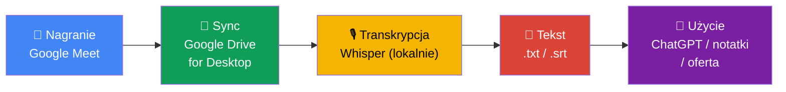
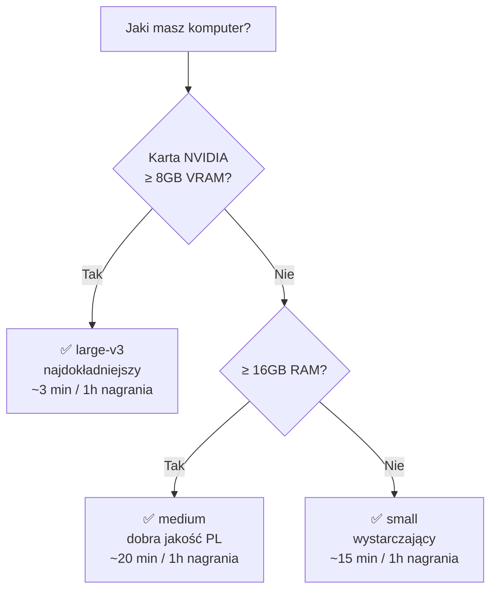

chyba---
type: newsletter-draft
status: draft
platform: linkedin-newsletter
series: "AI w pracy"
owner: kacper
created: 2026-04-16
tags: [whisper, transkrypcja, google-meet, tutorial, ai-w-pracy]
---

# Jak transkrybować spotkania lokalnie, za darmo, bez wysyłania nagrań w chmurę

W zeszłym tygodniu napisałem na LinkedIn, że zbudowałem sobie system do transkrybowania spotkań. Kilka osób odpisało to samo: "Fajnie, ale jak to zrobić u siebie?"

Więc dziś Ci to pokażę. Krok po kroku. Bez kodowania, bez abonamentów, bez wysyłania nagrań do żadnego zewnętrznego serwisu.

Jedyne czego potrzebujesz to komputer i trochę cierpliwości na pierwszy raz. Cały proces wygląda tak:



Pięć kroków. Żaden z nich nie jest trudny. Przejdźmy przez nie.

## Ale najpierw — dlaczego nie Fireflies / Otter / Fathom?

Są serwisy, które robią to za Ciebie. Podłączasz je do spotkania, dostajesz transkrypcję. Wygodne. Ale:

| | Fireflies / Otter | Whisper (lokalnie) |
|---|---|---|
| Koszt | ~500-1500 PLN/rok | 0 PLN |
| Twoje dane | ich serwery (USA) | Twój komputer |
| Polski | średnia jakość | dobra (model large-v3) |
| Wymaga internetu | tak, zawsze | tylko przy instalacji |
| Konfiguracja | 5 min | 15-30 min (raz) |

Uczciwie — konfiguracją przegrywamy. Ale jeśli na Twoich spotkaniach padają budżety klientów, warunki umów albo dane osobowe, to pytanie "gdzie lecą te nagrania?" przestaje być akademickie.

## Czym jest Whisper?

Whisper to model od OpenAI (tak, tych od ChatGPT), który zamienia mowę na tekst. Rozumie polski. Jest darmowy i open source. Po instalacji działa offline — nagranie nigdzie nie wylatuje z Twojego komputera.

## Krok 1: Google Drive — synchronizacja nagrań na dysk

Jeśli nagrywasz spotkania w Google Meet, nagrania lądują automatycznie na Twoim Google Drive, w folderze "Meet Recordings".

Żeby nie ściągać ich ręcznie za każdym razem, zainstaluj **Google Drive na komputer** (Google Drive for Desktop). To oficjalna aplikacja Google — po instalacji Twoje pliki z Drive pojawiają się jako zwykły folder na dysku.

Po instalacji: ustawienia Google Drive → wybierasz foldery do synchronizacji → zaznaczasz "Meet Recordings". Od tego momentu po każdym spotkaniu nagranie pojawi Ci się lokalnie.

> **Używasz Zoom lub Teams?** Ten sam schemat. Zoom zapisuje nagrania lokalnie domyślnie. Teams — po włączeniu opcji "Record to this computer". Wynik ten sam: plik wideo na Twoim dysku.

## Krok 2: Instalacja Whispera

Tutaj potrzebujesz terminala. Jeśli nigdy go nie używałeś — terminal to konsola, w którą wpisujesz komendy tekstem zamiast klikać w ikonki. Na Windowsie szukasz "PowerShell" w menu Start. Na Macu — "Terminal" w Spotlight.

Nie musisz go rozumieć w całości. Wystarczy że umiesz wkleić komendę i wcisnąć Enter.

**Najpierw Python.** Wejdź na python.org, pobierz najnowszą wersję, zainstaluj.

> **Windows tip:** Przy instalacji Pythona zaznacz "Add Python to PATH". Bez tego terminal nie znajdzie Pythona i będziesz się zastanawiać co poszło nie tak. Wiem, bo sam to przeoczyłem za pierwszym razem.

**Potem Whisper.** Otwierasz terminal i wklejasz:

```
pip install openai-whisper
```

Enter. Czekasz. To tyle — Whisper się zainstaluje.

## Krok 3: Transkrypcja

Masz nagranie na dysku. Masz Whispera. Teraz jedna komenda:

```
whisper "ścieżka/do/nagrania.mp4" --model large-v3 --language pl
```

Co tu się dzieje:
- `whisper` — wywołujesz program
- `"ścieżka/do/nagrania.mp4"` — wskazujesz plik z nagraniem
- `--model large-v3` — największy model, najdokładniejszy dla polskiego
- `--language pl` — mówisz Whisperowi, że to polski

> **Pierwsza transkrypcja?** Model large-v3 waży ok. 3 GB. Pobierze się raz, przy pierwszym uruchomieniu. Potem Whisper działa offline.

Ale nie każdy komputer udźwignie największy model. Sprawdź co wybrać:



Zmiana modelu to zamiana jednego słowa w komendzie: `--model medium` zamiast `--model large-v3`. Reszta bez zmian.

Na wyjściu dostajesz kilka plików. Najważniejsze dwa:
- **.txt** — pełny tekst rozmowy
- **.srt** — tekst z timestampami (kto co mówił o której minucie)

Jakość jest zaskakująco dobra — odmiana polska, liczby, nazwy własne. Dużo lepsza niż wbudowane napisy w Google Meet.

> **Nie masz karty NVIDIA?** Spokojnie. Whisper działa na procesorze. Wolniej, ale działa. Model `small` poradzi sobie z godzinnym spotkaniem w kilkanaście minut.

## Co dalej z surowym tekstem?

Masz transkrypcję. Surowy tekst ze spotkania. Co z nim zrobić — zależy od Ciebie.

Najprostsze: otwórz ChatGPT, wklej tekst i napisz:

*"Wyciągnij z tej rozmowy: kluczowe ustalenia, otwarte pytania, i kto za co odpowiada."*

Możesz też:
- Przygotować podsumowanie dla klienta
- Wrócić do rozmowy sprzed miesiąca i sprawdzić co ustaliliście
- Wyciągnąć wymagania projektowe na podstawie tego, co naprawdę padło — nie tego, co zapamiętałeś

Ja poszedłem krok dalej i zintegrowałem to ze swoim systemem notatek — ale to temat na osobny numer. Dziś chodziło o fundamenty: nagranie → tekst, lokalnie, za darmo.

## Jedno zastrzeżenie

Nagrywanie spotkań wymaga zgody uczestników. To nie jest opcjonalne — to wymóg prawny. Upewnij się, że masz na to zgodę zanim naciśniesz "Nagraj".

---

Najcenniejsze dane w firmie powstają w rozmowach. Jeśli ich nie zapisujesz, to jakbyś je wyrzucał.

Napisz mi — masz spotkania, które chciałbyś zacząć transkrybować? A może już próbowałeś i coś Cię zatrzymało? Chętnie usłyszę.

Pozdrawiam,
Kacper
