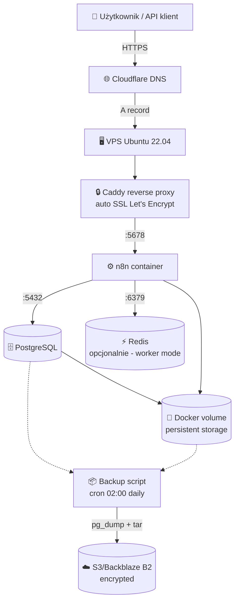

# RESEARCH POOL: n8n self-hosted (do wykorzystania w refreshie)

> ⚠️ **STATUS: WYCOFANY JAKO NOWY PILLAR**
>
> Pierwotny plan stworzenia nowego artykułu `/blog/n8n/self-hosted` został wycofany 2026-04-25
> po wykryciu że istniejący `/blog/n8n/docker-instalacja-konfiguracja` (16 282 słów, rankuje #3
> na "n8n docker") pokrywa większość planowanych sekcji. Duplikat = kanibalizacja autorytetu.
>
> **Nowa strategia:** REFRESH istniejącego URL (zachowuje #3 ranking, dodaje targetowanie
> "n8n self-hosted" 780 vol).
>
> Treść poniżej (sekcje Caddy, AI Act compliance, KACPER10 box, mermaid diagram, code blocks)
> zostaje jako **research pool** — przy pisaniu refreshu kopiuj fragmenty stąd.
>
> Akcjonowalny brief: **BRIEF_REFRESH_n8n-docker-instalacja_2026-04-25.md**

---

# Pierwotny brief (do wykorzystania jako pool):

---

## SEO Meta

| Element | Wartość |
|---------|---------|
| **SEO Title** | Jak postawić n8n self-hosted na VPS — tutorial 2026 |
| **Slug** | `/blog/n8n/self-hosted` |
| **Meta Description** | Pełny przewodnik instalacji n8n self-hosted na VPS — Docker, Caddy, SSL, PostgreSQL, backup. Krok po kroku w 30 minut. Z kodem KACPER10 -10%. |
| **Główna fraza** | n8n self-hosted (780 vol/mc — 390 + 390 dla wariantów) |
| **Frazy poboczne** | n8n docker, n8n vps, własny n8n, n8n hosting, instalacja n8n |
| **Search Intent** | commercial (firmy szukające wdrożenia) |
| **Szacowana długość** | 2 500 – 3 500 słów |
| **Pillar** | n8n Automatyzacja |
| **Konkurencja PL** | **0 artykułów PL w top 10** (first-mover window) |
| **Konkurencja EN** | DigitalOcean, Contabo, MassiveGRID, Hostinger (sponsored), effloow |

---

## Dla Kogo

**Persona główna:** DevOps / inżynier automatyzacji / CTO w polskiej firmie 50-500 osób, który rozważa n8n self-hosted zamiast n8n Cloud z powodu:
- Compliance (RODO, AI Act 2024/1689 — dane nie wychodzą poza organizację)
- Kosztów (n8n Cloud przy skali wykonań > 10k/mc robi się drogi)
- Pełnej kontroli nad infrastrukturą i workflow

**Persona poboczna:** Solo-founder / freelancer techniczny budujący własne narzędzia automatyzacji (B2B SaaS, agencja AI), który chce hostować n8n na własnym VPS-ie za <50 zł/mies.

---

## Hook (pierwsze 2-3 zdania artykułu)

> n8n Cloud kosztuje od $20/mies. i ma limit wykonań. Self-hosted na VPS-ie za <30 zł/mies. daje Ci **nielimitowane** wykonania, pełną kontrolę nad danymi i compliance z AI Act bez kompromisów. W 30 minut postawisz produkcyjną instancję — pokażę dokładnie jak.

---

## Struktura

### H1
Jak postawić n8n self-hosted na VPS — kompletny tutorial 2026

### Intro (180-220 słów)
- Problem: n8n Cloud vendor lock-in, limity wykonań, drogie przy skali, dane poza firmą = problem dla compliance
- Co czytelnik dostanie: gotowy setup Docker Compose + Caddy + SSL + PostgreSQL + backup w 30 min
- Authority: "Tak postawiłem n8n.dokodu.it — używam tego do szkoleń AI dla firm i wdrożeń klientów"
- Anty-clickbait: "Jeśli nie znasz Linuxa — i tak ogarniesz, każda komenda jest skopiowalna"
- Mini-spis treści (TOC) jako lista linków do H2

---

### H2: Dlaczego self-hosted? n8n Cloud vs self-hosted — kiedy co (300 słów)

**Tabela porównawcza** (8 wierszy):
| Kryterium | n8n Cloud | n8n Self-hosted |
|-----------|-----------|-----------------|
| Cena (start) | $20/mies. | <30 zł/mies. (VPS) + 0 zł license |
| Limit wykonań | 5k–unlimited (zależy od planu) | **Nielimitowany** |
| Compliance RODO | Hosting w UE wybór | Pełna kontrola — Twoje serwery |
| AI Act compliance | Audit ich infrastruktury | Twój audit, Twoje logi |
| Czas setup | 5 min | 30 min |
| Maintenance | Zero | Backupy, aktualizacje, monitoring |
| Custom nodes | Ograniczone | Pełna swoboda |
| Skalowanie | Plany | Worker mode, Redis queue |

**Kto powinien iść self-hosted:**
1. Firmy 50+ osób z compliance (RODO/AI Act)
2. Use case > 10k wykonań/mc
3. Custom integracje z lokalnymi systemami (ERP, CRM on-prem)

**Kto powinien zostać przy Cloud:**
1. Solo / mała ekipa bez DevOps
2. Use case < 1k wykonań/mc bez compliance konstrain

**Link wewn.:** [cennik n8n — Cloud vs Enterprise vs Self-hosted](/blog/n8n/licencja-cennik)

---

### H2: Co Ci jest potrzebne — wymagania techniczne (250 słów)

**VPS minimum:** 2 vCPU, 4 GB RAM, 40 GB SSD, Ubuntu 22.04+ LTS
**Domena:** subdomena DNS pointing na IP VPS-a (np. `n8n.twojafirma.pl`)
**Software:** Docker + Docker Compose (instalujemy w Kroku 2)
**Wiedza:** podstawy Linux (cd, ls, sudo), Git, edytor (nano/vim)

**Wybór hostingu — co używam:**
Postawiłem `n8n.dokodu.it` na **Hostinger VPS** — używam tego do prowadzenia szkoleń AI i jako scratchpad dla agentów. Plan KVM 2 (4 GB RAM, 2 vCPU, 80 GB NVMe) wystarczy do przejęcia kilku tysięcy wykonań/dzień.

> 🔥 **Z kodem KACPER10 dostajesz -10% na Hostinger VPS** → [hostinger.com/kacper10](https://www.hostinger.com/kacper10)
>
> *Disclosure: To link afiliacyjny. Używam Hostingera produkcyjnie i polecam z autopsji — klikając wspierasz Dokodu prowizją (a Ty masz -10%).*

**Alternatywy** (porównanie cen w PLN, listopad 2026):
| Hosting | Plan | RAM | vCPU | Cena/mies. (PLN) |
|---------|------|-----|------|------------------|
| **Hostinger VPS KVM 2** | KVM 2 | 4 GB | 2 | ~30 zł (z KACPER10) |
| Hetzner Cloud CX22 | CX22 | 4 GB | 2 | ~20 zł (€4,35) |
| DigitalOcean | Basic | 4 GB | 2 | ~100 zł ($24) |
| OVH VPS Value | Value | 4 GB | 2 | ~50 zł |

**Sekcja AD (kursywa, mała):** *Każdy z tych hostingów postawi n8n. Hostinger ma najlepszy support PL, Hetzner najtańszy w EUR, DigitalOcean najlepszą dokumentację. Ja używam Hostingera — link wyżej.*

---

### H2: Architektura — jak to się składa (200 słów)

**Mermaid diagram:**



**Wyjaśnienie komponentów (4-5 zdań na każdy):**
- **Cloudflare DNS** — proxy + DDoS protection (free tier wystarczy)
- **Caddy** — reverse proxy z **automatycznym SSL** (Let's Encrypt out of the box, zero config vs Nginx)
- **n8n container** — sam orchestrator workflow (image `n8nio/n8n:latest`)
- **PostgreSQL** — baza danych zamiast SQLite (production-grade)
- **Redis** (opcjonalnie) — kolejka dla worker mode (potrzebne dopiero przy >100 wykonań/min)
- **Docker volumes** — persistent storage (workflow data, credentials)

**Dlaczego Caddy a nie Nginx:** Caddy automatycznie generuje i odnawia certyfikaty SSL Let's Encrypt — zero linii konfiguracji. Nginx wymaga osobnego Certbot + cron + restart. Dla setup'u jednoosobowego Caddy = 20 minut zaoszczędzone.

---

### H2: Krok 1 — przygotuj VPS (security baseline) (300 słów)

```bash
# Login SSH (z root w pierwszym kroku)
ssh root@TWOJE.VPS.IP

# Update system
apt update && apt upgrade -y

# Stwórz non-root usera
adduser deploy
usermod -aG sudo deploy

# Skopiuj SSH key z laptopa (na Twojej maszynie):
ssh-copy-id deploy@TWOJE.VPS.IP

# Zaloguj się jako deploy
ssh deploy@TWOJE.VPS.IP

# Zablokuj root login
sudo nano /etc/ssh/sshd_config
# Zmień:
#   PermitRootLogin no
#   PasswordAuthentication no
sudo systemctl restart sshd

# UFW firewall — tylko 22/80/443
sudo ufw allow OpenSSH
sudo ufw allow 80/tcp
sudo ufw allow 443/tcp
sudo ufw enable

# Fail2ban (anti-brute-force SSH)
sudo apt install -y fail2ban
sudo systemctl enable --now fail2ban
```

**Pułapka:** zanim wyłączysz `PasswordAuthentication`, **upewnij się** że SSH key działa — w przeciwnym razie wylądujesz zablokowany na własnym VPS-ie.

---

### H2: Krok 2 — zainstaluj Docker + Docker Compose (150 słów)

```bash
# Oficjalny installer Docker
curl -fsSL https://get.docker.com | sh

# Dodaj usera do grupy docker
sudo usermod -aG docker deploy
# Wyloguj i zaloguj ponownie żeby grupa się zaaplikowała

# Test
docker run hello-world
docker compose version
```

**Link wewn.:** [pełny tutorial Docker dla n8n](/blog/n8n/docker-instalacja-konfiguracja) — jeśli widzisz Docker pierwszy raz, zacznij od tego.

---

### H2: Krok 3 — DNS i domena (150 słów)

W panelu rejestratora (Hostinger / OVH / Cloudflare):
- **Typ:** A
- **Nazwa:** `n8n` (subdomena)
- **Wartość:** IP Twojego VPS-a
- **TTL:** Auto / 300

**Verify (5 min czekania na propagację):**
```bash
dig +short n8n.twojafirma.pl
# Powinno zwrócić IP VPS-a
```

**Dlaczego subdomena a nie root domain:** Caddy konfiguruje SSL per host — łatwiej zarządzać oddzielnie. Plus cookie scoping między aplikacjami.

---

### H2: Krok 4 — `docker-compose.yml` dla n8n (400 słów)

```yaml
version: '3.8'

services:
  postgres:
    image: postgres:16-alpine
    restart: unless-stopped
    environment:
      POSTGRES_DB: n8n
      POSTGRES_USER: n8n
      POSTGRES_PASSWORD: ${POSTGRES_PASSWORD}
    volumes:
      - postgres_data:/var/lib/postgresql/data
    healthcheck:
      test: ["CMD-SHELL", "pg_isready -U n8n"]
      interval: 5s
      timeout: 5s
      retries: 10

  n8n:
    image: n8nio/n8n:latest
    restart: unless-stopped
    depends_on:
      postgres:
        condition: service_healthy
    environment:
      - DB_TYPE=postgresdb
      - DB_POSTGRESDB_HOST=postgres
      - DB_POSTGRESDB_DATABASE=n8n
      - DB_POSTGRESDB_USER=n8n
      - DB_POSTGRESDB_PASSWORD=${POSTGRES_PASSWORD}
      - N8N_HOST=n8n.twojafirma.pl
      - N8N_PORT=5678
      - N8N_PROTOCOL=https
      - WEBHOOK_URL=https://n8n.twojafirma.pl/
      - GENERIC_TIMEZONE=Europe/Warsaw
      - N8N_ENCRYPTION_KEY=${N8N_ENCRYPTION_KEY}
    volumes:
      - n8n_data:/home/node/.n8n

  caddy:
    image: caddy:2-alpine
    restart: unless-stopped
    ports:
      - "80:80"
      - "443:443"
    volumes:
      - ./Caddyfile:/etc/caddy/Caddyfile:ro
      - caddy_data:/data
      - caddy_config:/config
    depends_on:
      - n8n

volumes:
  postgres_data:
  n8n_data:
  caddy_data:
  caddy_config:
```

**Plik `.env`** (NIGDY nie commituj):
```bash
POSTGRES_PASSWORD=<wygeneruj: openssl rand -base64 32>
N8N_ENCRYPTION_KEY=<wygeneruj: openssl rand -base64 32>
```

**Wyjaśnienie kluczowych env vars:**
- `N8N_HOST` — domena pod którą n8n jest dostępny (musi się zgadzać z Caddyfile)
- `WEBHOOK_URL` — URL pod którym n8n generuje webhooki (musi być pełny HTTPS)
- `N8N_ENCRYPTION_KEY` — klucz szyfrujący credentiale w bazie (jeśli zgubisz, stracisz zapisane integracje)
- `DB_POSTGRESDB_*` — connection do PostgreSQL container

---

### H2: Krok 5 — Caddy + automatyczne SSL (150 słów)

`Caddyfile` (na poziomie `docker-compose.yml`):
```
n8n.twojafirma.pl {
    reverse_proxy n8n:5678

    # Headers bezpieczeństwa
    header {
        X-Frame-Options "SAMEORIGIN"
        X-Content-Type-Options "nosniff"
        Referrer-Policy "strict-origin-when-cross-origin"
        Strict-Transport-Security "max-age=31536000; includeSubDomains"
    }
}
```

To **wszystko**. Caddy automatycznie:
1. Wyciąga certyfikat z Let's Encrypt
2. Odnawia co 60 dni
3. Forward'uje cały ruch z 443 na n8n:5678

---

### H2: Krok 6 — pierwsze uruchomienie (150 słów)

```bash
# Stwórz katalog
mkdir -p /home/deploy/n8n && cd /home/deploy/n8n

# Skopiuj docker-compose.yml + Caddyfile + .env (z lokalu lub przez nano)

# Uruchom
docker compose up -d

# Sprawdź logi
docker compose logs -f n8n

# Test HTTP
curl -I https://n8n.twojafirma.pl
# Spodziewaj się: HTTP/2 200
```

W przeglądarce: `https://n8n.twojafirma.pl` → setup admin account.

**Po pierwszym logowaniu:**
1. **Strong password** (1Password / Bitwarden — minimum 20 znaków)
2. Settings → Users → Włącz **2FA** (TOTP, np. Authy)

---

### H2: Krok 7 — backup i monitoring (kluczowe!) (300 słów)

**Cron job — backup PostgreSQL + n8n volume codziennie o 02:00:**

```bash
# /home/deploy/n8n/backup.sh
#!/bin/bash
set -e

BACKUP_DIR=/home/deploy/n8n/backups
DATE=$(date +%Y-%m-%d)
RETENTION_DAYS=30

mkdir -p $BACKUP_DIR

# Backup PostgreSQL
docker compose exec -T postgres pg_dump -U n8n n8n | gzip > $BACKUP_DIR/postgres-$DATE.sql.gz

# Backup wolumenu n8n
docker run --rm -v n8n_n8n_data:/data -v $BACKUP_DIR:/backup alpine tar czf /backup/n8n-data-$DATE.tar.gz -C /data .

# Cleanup starsze niż 30 dni
find $BACKUP_DIR -name "*.gz" -mtime +$RETENTION_DAYS -delete

echo "Backup $DATE done."
```

```bash
chmod +x /home/deploy/n8n/backup.sh

# Crontab
crontab -e
# Dodaj:
0 2 * * * /home/deploy/n8n/backup.sh >> /home/deploy/n8n/backup.log 2>&1
```

**Upload do chmury (S3 / Backblaze B2):**
- Użyj `rclone` lub `aws s3 cp` w ostatnim kroku skryptu
- **Encrypt** before upload (AES256 z `gpg`)

**Monitoring:**
- Healthcheck endpoint: `https://n8n.twojafirma.pl/healthz` (zwraca 200 jeśli żyje)
- Uptime monitoring: Better Uptime, UptimeRobot (free tier)
- Alert email + Telegram bot przy downtime

**Link wewn.:** [n8n self-host — pełny audit bezpieczeństwa, kopie zapasowe, aktualizacje](/blog/n8n/self-host-bezpieczenstwo) → 4 990 słów detalu po instalacji.

---

### H2: Krok 8 — produkcja: scaling i AI Act compliance (250 słów)

**Worker mode** (kiedy potrzebne: > 100 wykonań/min):
- Dodaj `EXECUTIONS_MODE=queue` w env
- Dodaj Redis do `docker-compose.yml`
- Stwórz osobne kontenery `n8n-worker` (skalowalne `docker compose up -d --scale n8n-worker=3`)

**Resource limits w `docker-compose.yml`:**
```yaml
n8n:
  # ...
  deploy:
    resources:
      limits:
        cpus: '2'
        memory: 4G
      reservations:
        memory: 1G
```

**AI Act 2024/1689 compliance — kluczowe dla firm:**
- **Audit log** — `N8N_AUDIT_LOGS=true` w env (od n8n 1.45+)
- **Execution history retention** — `EXECUTIONS_DATA_PRUNE=true`, `EXECUTIONS_DATA_MAX_AGE=336` (14 dni)
- **PII masking** w logach (Code Node z reduktorami)
- **Egress whitelisting** — UFW rules + Cloudflare WAF reguły dla webhooks

**Link wewn.:** [Webhooki w n8n — bezpieczeństwo, throttling, najlepsze praktyki](/blog/n8n/webhook-bezpieczenstwo-throttling)

---

### H2: Najczęstsze błędy i jak je rozwiązać (200 słów)

| Błąd | Diagnoza | Fix |
|------|----------|-----|
| "Webhook URL not accessible" | env `WEBHOOK_URL` nie pasuje do domeny | Sprawdź `N8N_HOST` + `WEBHOOK_URL` + DNS |
| "Database connection refused" | n8n startuje przed PostgreSQL | Dodaj `depends_on.condition: service_healthy` |
| "Container restart loop" | OOM albo missing env | `docker compose logs n8n` → szukaj fatal |
| "Certificate request failed" | DNS nie wskazuje na VPS / port 80 zablokowany | `dig +short` + `ufw status` |
| Webhook reaguje 502 Bad Gateway | Caddy nie widzi n8n container | Sprawdź czy są w tej samej Docker network |

---

### H2: Co dalej? (150 słów)

1. **Buduj swój pierwszy workflow** — [25+ przykładów workflow w n8n](/blog/n8n/przyklady-workflow-automatyzacji)
2. **Dodaj agenta AI** — [n8n vs OpenClaw — agent AI czy automatyzacja](/blog/n8n/openclaw-vs-n8n)
3. **Zabezpiecz produkcję** — [pełny audit bezpieczeństwa n8n self-host](/blog/n8n/self-host-bezpieczenstwo)
4. **Skaluj** — worker mode, queue, Redis (tutorial wkrótce)

---

### H2: Podsumowanie (180 słów)

5 takeaways:
1. **n8n self-hosted = 30 zł/mies. + 30 min setup** vs $20/mies. n8n Cloud z limitami
2. **Docker Compose + Caddy = production-grade** w 5 plikach (compose, Caddyfile, .env, backup.sh, crontab)
3. **PostgreSQL > SQLite** dla każdego use case'u poza testowym
4. **Caddy zamiast Nginx** = oszczędność 20 min + zero certbot pain
5. **Backup codzienny + retention 30 dni** to nie opcja — to wymóg

**Kiedy ten setup się sprawdza:** firmy 50+ os. z compliance, use case >10k wykonań/mc, custom integracje z on-prem ERP/CRM.
**Kiedy lepiej iść w Cloud:** solo bez DevOps, <1k wykonań/mc, brak wymogów compliance.

**Czas:** 30-45 min instalacja + 1h pierwsza konfiguracja + 30 min backup setup = **~2h od zera do produkcji**.
**Koszt:** ~30 zł/mies. VPS Hostinger (z KACPER10) + 0 zł n8n license.

---

## CTA — 2 AD bannery

### AD Banner 1 (po H2 "Co dalej") — Konsultacja

> 🎯 **Chcesz mieć n8n self-hosted wdrożone profesjonalnie?**
>
> Wdrażamy n8n self-hosted **z compliance AI Act 2024/1689**, monitoringiem 24/7 i automatycznym backupem dla firm 50-500 osób. Przez 5 lat postawiliśmy 40+ instancji produkcyjnych dla klientów z logistyki, produkcji i e-commerce.
>
> [📞 Umów bezpłatną konsultację →](/kontakt)

### AD Banner 2 (przed Podsumowaniem) — Lead magnet

> 📋 **Pobierz darmową checklistę: AI Act 2024/1689 — co musisz mieć w n8n**
>
> 15 punktów compliance dla self-hosted, gotowe do druku, przygotowane przez prawników i inżynierów Dokodu. Używamy tego z każdym klientem przy wdrożeniu.
>
> [⬇ Pobierz PDF →](/lead-magnet/ai-act-checklist)

### Box afiliacyjny (na samym końcu, po Podsumowaniu)

> 🔥 **Potrzebujesz VPS-a żeby zacząć?**
>
> Z kodem **KACPER10** dostajesz -10% na **Hostinger VPS** (KVM 2 = 4 GB RAM, 2 vCPU, 80 GB NVMe za ~30 zł/mies.).
>
> [👉 hostinger.com/kacper10](https://www.hostinger.com/kacper10)
>
> *Disclosure: To link afiliacyjny. Używam Hostingera produkcyjnie do n8n.dokodu.it — polecam z autopsji. Klikając wesprzesz Dokodu prowizją (a Ty masz -10%).*

---

## Linki Wewnętrzne (6)

| # | Anchor Text | URL | Kontekst (gdzie) |
|---|-------------|-----|------------------|
| 1 | n8n — co to i jak go używać w firmie | `/blog/n8n` | Intro, drugie zdanie |
| 2 | cennik n8n — Cloud vs Enterprise vs Self-hosted | `/blog/n8n/licencja-cennik` | H2 Cloud vs self-hosted |
| 3 | tutorial Docker dla n8n (instalacja + config) | `/blog/n8n/docker-instalacja-konfiguracja` | Krok 2 (Docker) |
| 4 | n8n self-host — bezpieczeństwo, kopie zapasowe, aktualizacje | `/blog/n8n/self-host-bezpieczenstwo` | Krok 7 (backup) |
| 5 | webhooki w n8n — bezpieczeństwo i throttling | `/blog/n8n/webhook-bezpieczenstwo-throttling` | Krok 8 (production) |
| 6 | 25+ przykładów workflow automatyzacji w n8n | `/blog/n8n/przyklady-workflow-automatyzacji` | "Co dalej?" |

✅ 6 linków wewnętrznych (cel: 4-6)

---

## Linki Zewnętrzne (autorytety)

- [docs.n8n.io/hosting/](https://docs.n8n.io/hosting/) — oficjalna dokumentacja
- [caddyserver.com](https://caddyserver.com) — Caddy reverse proxy
- [letsencrypt.org](https://letsencrypt.org) — automatyczne SSL
- [hostinger.com/kacper10](https://www.hostinger.com/kacper10) — **rel="sponsored nofollow"** (afiliacja)

---

## Multimedia

| # | Element | Szczegóły |
|---|---------|-----------|
| 1 | **Featured image** | Nano Banana prompt: *"Server room dark navy + orange Dokodu accent, n8n logo on glowing screen, abstract tech background, minimalist editorial style, 16:9, no text"*. Generuj: `python3 scripts/generate_image.py --prompt "..." --variant pro` |
| 2 | **Mermaid diagram** | Architektura (już jest w briefie powyżej, sekcja H2 "Architektura") |
| 3 | **Tabela 1** | Cloud vs Self-hosted (8 wierszy x 3 kolumny) |
| 4 | **Tabela 2** | Porównanie hostingów (4 hosty x 5 kolumn) |
| 5 | **Tabela 3** | Najczęstsze błędy (5 wierszy x 3 kolumny) |
| 6 | **Code blocks** | docker-compose.yml, Caddyfile, .env, backup.sh, crontab — 5 bloków |
| 7 | **Screenshot 1** | n8n admin panel pierwszy login (z mojej instancji `n8n.dokodu.it`) |
| 8 | **AD Banner 1** | Konsultacja Dokodu |
| 9 | **AD Banner 2** | AI Act Checklist |
| 10 | **Box afiliacyjny** | Hostinger KACPER10 (1 szt., na końcu) |

---

## Uwagi dla Autora (i AI piszącego draft)

**Tone:**
- Konkretny, ekspercki ale przystępny — pisz jakbyś tłumaczył kumplowi-developerowi przez piwo
- Pierwsza osoba liczby pojedynczej w sekcjach gdzie odnosisz się do własnego doświadczenia ("postawiłem", "używam")
- **NIE pisz** "automatyzacja AI" — używaj "agent AI" / "wdrożenie n8n" (lepsze SEO PL — `automatyzacja ai` ma śladowe volume)

**Code blocks:**
- Każdy code block PRZETESTOWANY lokalnie przed publikacją (nie wklejaj z głowy AI — ja serio testowałem na hostingu)
- Komentarze w komendach po polsku
- Placeholders w `<UPPERCASE>` lub `${VAR}` żeby było jasne co podmienić

**Compliance:**
- AI Act / RODO wzmianki **zawsze z prawnego standpointu** — nie marketing
- Audit logs + execution data retention to nie opcja — to wymóg dla firm > 50 os.

**Synergia YT:**
- Z tego samego researchu nagram odcinek na kanale (15 min, jeden take, OBS)
- Lokowanie Hostingera 2 500 PLN + reflink afiliacyjny w opisie
- Plan filmu: skróć tutorial do 5 najważniejszych komend + wytłumacz dlaczego self-hosted > Cloud (10 min) + 5 min Q&A typowych pytań

**Disclosure afiliacji:**
- Wymagane przez Google E-E-A-T 2025+
- Każdy link Hostinger ma `rel="sponsored"` w HTML (blog API powinno to ogarnąć — jeśli nie, dodać manualnie)
- Disclosure tekst w sekcji "Wybór hostingu" + na końcu w boxie

**Long-tail:**
- W H2/H3 wpinaj naturalne warianty: "n8n self hosted", "n8n na własnym serwerze", "własny n8n", "n8n vps", "n8n docker self-hosted"
- People Also Ask (z research):
  - "Ile kosztuje n8n self-hosted?" → H3 w sekcji wymagania
  - "Jak zabezpieczyć n8n self-hosted?" → link do `/self-host-bezpieczenstwo`
  - "n8n self-hosted vs Cloud — co wybrać?" → tabela H2

---

## Komenda do dodania do SEO_Ideas_Bank

```bash
python3 _apps/scripts/seo_ideas.py add "Jak postawić n8n self-hosted na VPS — tutorial 2026" \
  --keyword "n8n self-hosted" \
  --slug "n8n/self-hosted" \
  --intent commercial \
  --pillar "n8n Automatyzacja" \
  --priority high \
  --source seo-plan-post \
  --status BRIEF
```

## Komendy do Link Graph

```bash
# Dodaj nowy artykuł
python3 _apps/scripts/link_graph.py --add-article \
  --slug "n8n/self-hosted" \
  --title "Jak postawić n8n self-hosted na VPS — tutorial 2026" \
  --keyword "n8n self-hosted" \
  --pillar "n8n Automatyzacja" \
  --url "/blog/n8n/self-hosted" \
  --status brief

# Dodaj 6 linków wewnętrznych
python3 _apps/scripts/link_graph.py --add-link --from-slug "n8n/self-hosted" --to-slug "n8n" --anchor "n8n — co to i jak go używać w firmie"
python3 _apps/scripts/link_graph.py --add-link --from-slug "n8n/self-hosted" --to-slug "n8n/licencja-cennik" --anchor "cennik n8n — Cloud vs Enterprise vs Self-hosted"
python3 _apps/scripts/link_graph.py --add-link --from-slug "n8n/self-hosted" --to-slug "n8n/docker-instalacja-konfiguracja" --anchor "tutorial Docker dla n8n"
python3 _apps/scripts/link_graph.py --add-link --from-slug "n8n/self-hosted" --to-slug "n8n/self-host-bezpieczenstwo" --anchor "n8n self-host — bezpieczeństwo, kopie zapasowe, aktualizacje"
python3 _apps/scripts/link_graph.py --add-link --from-slug "n8n/self-hosted" --to-slug "n8n/webhook-bezpieczenstwo-throttling" --anchor "webhooki w n8n — bezpieczeństwo i throttling"
python3 _apps/scripts/link_graph.py --add-link --from-slug "n8n/self-hosted" --to-slug "n8n/przyklady-workflow-automatyzacji" --anchor "25+ przykładów workflow automatyzacji w n8n"
```

---

**Status:** BRIEF gotowy. Następny krok: `/blog-draft` → wygeneruje kompletny markdown na podstawie tego briefu i wyśle jako draft do CMS bloga.
