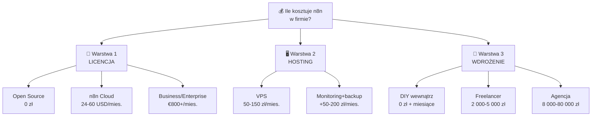
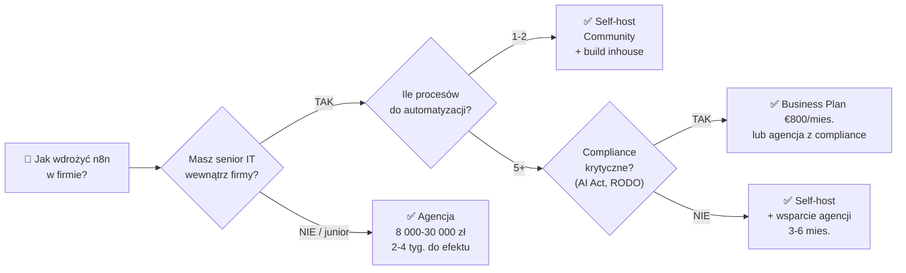

# Refactor: /blog/n8n/licencja-cennik (v2)

## Dlaczego ten refactor

**Obecny stan (GSC 2026-04-04 → 2026-04-11):**
- Impressions: 790/tydz
- Klików: 10
- CTR: **1.3%** (dla pozycji #3.3 średnia CTR to 5–8% → na stole zostaje 30–50 klików/tydz)
- Pozycja: #3.3

**Diagnoza**: tytuł „Czy n8n jest darmowy?" łapie informational intent. Ludzie szukający `n8n cena`, `ile kosztuje n8n`, `n8n cennik` widzą wynik, ale klikają gdzie indziej.

**Cel refactoru:**
1. Tytuł + meta pod commercial intent
2. Nowa sekcja „Ile kosztuje wdrożenie n8n u agencji" z widełkami PLN
3. 2 diagramy mermaid (warstwy kosztów + matryca decyzji) zgodnie z brand theme
4. Rozbudowa link graph (6+ linków wewnętrznych)
5. URL **BEZ zmian** (`/blog/n8n/licencja-cennik`) — nie tracimy backlinków

Wszystkie zmiany zgodne z `TOV_Artykuly_Dokodu.md` (persona decydent B2B 50-500 os., ton ekspercki bez wywyższania, sentence case, liczby + konkrety).

---

## Zmiana 1: Frontmatter — title, metatitle, excerpt

### BEFORE:
```yaml
title: "Czy n8n jest darmowy? Licencja, cennik i modele wdrożenia"
metatitle: "Czy n8n jest darmowy? Licencja, cennik i modele wdrożenia"
excerpt: "Czy n8n jest darmowy? Poznaj różnice między wersją open-source, chmurową i Enterprise, sprawdź cennik i ukryte koszty wdrożenia."
```

### AFTER:
```yaml
title: "Ile kosztuje n8n w firmie? Licencja, wdrożenie i utrzymanie (cennik 2026)"
metatitle: "n8n cennik 2026 — licencja, koszt wdrożenia w firmie"
excerpt: "Ile kosztuje n8n w firmie — licencja (od 0 zł), hosting (50–150 zł/mies.), wdrożenie przez agencję (od 6 999 PLN). Pełny breakdown PLN 2026, bez ściemy."
```

**Frazy docelowe złapane teraz:** `n8n cena` (już macie), `ile kosztuje n8n`, `ile kosztuje wdrożenie n8n`, `n8n koszt`, `n8n cennik`, `wdrożenie n8n cena`, `n8n w firmie cena`.

---

## Zmiana 2: Featured image + alt

Obecny featured image: `/images/posts/n8n-cennik.png` ✅ nazwa pasuje do slug-a.

**Rekomendacja**:
- Zostaw istniejącą grafikę na start (nie blokuje deploy-u)
- **Do-do**: regenerowana grafika z 3 warstwami kosztów (licencja / hosting / wdrożenie) — wizualny spoiler dla excerptu. Nazwa: `n8n-cennik-2026.png` (keep versioning)
- Dodaj `alt` w YAML (jeśli schema supports): `"3 warstwy kosztów n8n w firmie — licencja, hosting, wdrożenie"`

---

## Zmiana 3: Wstęp (linia 75 w `licencja-cennik.md`)

### BEFORE:
> **n8n** to popularne narzędzie do automatyzacji workflowów, które przyciąga uwagę zarówno programistów, jak i nietechnicznych użytkowników. Wiele osób zadaje sobie pytanie: *czy n8n jest darmowy?* Odpowiedź brzmi: **tak, ale...** — wszystko zależy od wybranego modelu korzystania. Poniżej przedstawiamy kompleksowy przegląd dostępnych opcji (wersja open-source vs. chmura vs. Enterprise) (...)

### AFTER:
> **Ile kosztuje n8n w firmie?** Krótka odpowiedź: **od 0 zł do kilkudziesięciu tysięcy złotych rocznie** — zależy od tego, jak daleko wchodzisz. Sama licencja to jedno, hosting drugie, wdrożenie przez agencję trzecie. Większość poradników mówi tylko o tej pierwszej warstwie — my pokażemy wszystkie trzy, w PLN, z konkretnymi widełkami.
>
> Poniżej pełny breakdown (stan 2026): wersje narzędzia, **ukryte koszty self-hostingu**, widełki wdrożenia u agencji w Polsce, **matryca wyboru w zależności od skali** oraz odpowiedzi na pytania, które większość agencji zbywa „to zależy".

**Zachować:** link do `/blog/n8n` (pillar) i `<AD:get-ebook>` bez zmian.

---

## Zmiana 4: NOWY MERMAID po wstępie (przed H2 „Wersje n8n")

Wizualne podsumowanie całego artykułu przed wejściem w szczegóły. Czytelnik skanuje — od razu widzi o czym post będzie.

**Wkleić tuż po `<AD:get-ebook>` (linia ~80) i przed `## Wersje n8n`:**

````markdown
Poniższy diagram pokazuje wszystkie trzy warstwy kosztów — ten artykuł je omawia kolejno.


````

---

## Zmiana 5: NOWA SEKCJA H2 — „Ile kosztuje wdrożenie n8n u agencji / wdrożeniowca?"

**Dokładne miejsce**: wstawić między obecne H2 „Ukryte koszty self-hostingu" (linia 94-108) a „Limity i wydajność" (linia 114) — czyli po `<AD:ai-automation-offer>`, linia ~113.

**Pełna treść, gotowa do wklejenia** (markdown, wraz z mermaid i linkami):

````markdown
## Ile kosztuje wdrożenie n8n u agencji / wdrożeniowca?

Do tej pory rozmawialiśmy o kosztach **samego narzędzia** (licencja) i **infrastruktury** (hosting, utrzymanie). Trzecia kategoria — pomijana w większości poradników — to **koszt wdrożenia w firmie**: analiza procesu, budowa workflowów, integracja z istniejącymi systemami (CRM, ERP, e-commerce), testy, dokumentacja, przeszkolenie zespołu.

Dlaczego firmy zlecają wdrożenie, skoro n8n jest darmowy? Bo **licencja nie wdraża się sama**. Wewnętrzny IT zwykle nie ma czasu, a opóźnienie na linii „fajne narzędzie" → „działający proces" to miesiące, nie tygodnie. Wdrożeniowiec skraca to do 2–4 tygodni.

### Widełki rynkowe w Polsce (2026)

| Typ wdrożenia | Cena netto | Realizator | Co dostajesz |
|---|---|---|---|
| **Pojedyncza automatyzacja** | 2 000 – 5 000 PLN | Freelancer / junior | 1 workflow, podstawowa integracja, krótkie testy |
| **Kompleksowy system** | 8 000 – 30 000 PLN | Agencja mid / senior | 3–10 workflowów, integracje CRM/ERP, monitoring, dokumentacja |
| **Wdrożenie + szkolenie zespołu** | 13 999 – 30 000 PLN | Agencja z kompetencją szkoleniową | Workflow produkcyjny + 2-dniowy warsztat dla zespołu (do 15 os) |
| **Dedykowany agent AI / system** | 30 000 – 80 000+ PLN | Senior / specjalizowana | System wielowarstwowy z AI, integracje enterprise, compliance (AI Act / RODO), wsparcie 3–6 mies. |

*Źródło: stawki rynku PL (Sages, Altkom, agencje automatyzacji), cennik Dokodu 2026.*

Realne przykłady wdrożeń opisujemy w artykule [Przykłady workflow n8n dla biznesu](/blog/n8n/przyklady-workflow-automatyzacji) oraz w pogłębionym studium [Biznesowe zastosowania n8n](/blog/n8n/przyklady-biznesowe). Jeśli proces wymaga integracji z AI, sprawdź [n8n i integracja z AI](/blog/n8n/integracja-z-ai).

### Co realnie wpływa na cenę wdrożenia

1. **Liczba integracji** — każdy dodatkowy system (SAP, HubSpot, Salesforce, własne API) to 4–16h pracy developera
2. **Złożoność procesu** — workflow z 5 krokami vs. agent AI z rozgałęzieniami decyzyjnymi to inne półki cenowe
3. **Compliance** — AI Act, RODO, branżowe wymogi (finanse, medycyna) dodają 20–40% do budżetu
4. **Szkolenie zespołu** — czy chcesz, żeby ktoś u Ciebie dalej to utrzymywał, czy zostawić „czarną skrzynkę"?
5. **Vendor lock-in vs. własny kod** — niektóre agencje trzymają dostęp u siebie. To ważne przy budżetowaniu długoterminowym — po zakończeniu współpracy nie chcesz być zakładnikiem
6. **Bezpieczeństwo** — webhooki, uwierzytelnianie, throttling nie są „opcją" — patrz [Webhooki w n8n: bezpieczeństwo i throttling](/blog/n8n/webhook-bezpieczenstwo-throttling) i [Self-host n8n — bezpieczeństwo](/blog/n8n/self-host-bezpieczenstwo)

### Matryca decyzji: co wybrać w zależności od skali

Diagram pokazuje, którą ścieżkę wybrać na podstawie dwóch głównych zmiennych: **dostępność kompetencji technicznej** i **liczba procesów do automatyzacji**.



### Kiedy wdrożenie się opłaca — szybka matematyka ROI

Jeśli automatyzacja oszczędza **5 godzin tygodniowo** w zespole, a godzina pracy fully-loaded (pensja + ZUS + narzut) to **80–150 PLN**, to oszczędność roczna = **20 000 – 37 500 PLN**. Wdrożenie za 15 000 PLN zwraca się w **4–9 miesiącach**. W praktyce widzimy pełny ROI w 3–6 mies.

To, o czym nikt nie mówi w ofertach: największą wartością nie jest sam odzyskany czas, tylko **błędy redukowane do zera**. Ludzie źle wpisują dane, mylą statusy, zapominają o mailach. Dobrze zbudowany agent AI — nie. Przy procesach finansowych czy compliance to może być różnica między „wygodniej" a „nie dostaniemy kary".

Jeśli chcesz zobaczyć, jak takie wdrożenie wygląda w pełnym procesie (od audytu po go-live), sprawdź nasz [Plan wdrożenia AI w firmie — krok po kroku](/blog/wdrozenie-ai-w-firmie/plan-wdrozenia).
````

---

## Zmiana 6: Rozbudowa link graph w całym artykule

Obecnie post ma 2 linki wewnętrzne (`/blog/n8n`, `/blog/n8n/docker-instalacja-konfiguracja`). Docelowo powinno być **6+**. Do wplecenia w istniejące sekcje:

| Gdzie (obecna sekcja) | Link do | Kontekst |
|---|---|---|
| H2 „Ukryte koszty self-hostingu" → pkt. „Bezpieczeństwo" | `/blog/n8n/self-host-bezpieczenstwo` | „Pełen checklist zabezpieczeń w artykule X" |
| H2 „Wersje n8n" → opis Cloud | `/blog/n8n/make-com-vs-n8n` | „Jeśli rozważasz alternatywy — porównanie Make vs n8n" |
| H2 „Jaką wersję wybrać" → małe zespoły | `/blog/n8n/node-code.md` (Node Code) | „Techniczne detale niestandardowych node'ów" |
| FAQ → „Czy potrzebuję Dockera" | `/blog/n8n/docker-instalacja-konfiguracja` (już jest) | ✅ |
| **NOWA sekcja (Zmiana 5)** | `/blog/n8n/przyklady-workflow-automatyzacji`, `/blog/n8n/przyklady-biznesowe`, `/blog/n8n/integracja-z-ai`, `/blog/n8n/webhook-bezpieczenstwo-throttling`, `/blog/n8n/self-host-bezpieczenstwo`, `/blog/wdrozenie-ai-w-firmie/plan-wdrozenia` | już wplecione w treść powyżej |

---

## Zmiana 7: Reklamy / bannery — rekomendacja

Obecne bannery ✅ (są OK, zostają):
- `<AD:get-ebook>` — po wstępie
- `<AD:n8n-hostinger-banner>` — po sekcji „Wersje n8n"
- `<AD:ai-automation-offer>` — po „Ukryte koszty" (świetnie położone — tuż przed nową sekcją o wdrożeniu)
- `<AD:n8n-kurs-waitlist>` — przed FAQ

**Propozycja nowego bannera** (po nowej sekcji, opcjonalnie):

```yaml
# Do dodania w frontmatter `ads:`
warsztat-zamkniety:
  type: "banner"
  data:
    title: "Wdrażamy n8n w Twojej firmie — z warsztatem dla zespołu"
    description: "2-dniowe szkolenie dla zespołu do 15 osób + wdrożenie produkcyjne. Od 13 999 PLN netto. Zespół wychodzi z działającymi automatyzacjami, nie ze slajdów."
    link: "/szkolenia"  # lub /dla-firm/szkolenia-zamkniete gdy gotowe
    buttonText: "Zamów warsztat firmowy"
  style:
    backgroundFrom: "from-red-950"
    backgroundTo: "to-slate-900"
    borderColor: "border-red-700"
    # (ton kolorystyczny Dokodu red #e92d49)
```

Wklej `<AD:warsztat-zamkniety>` po tabeli widełek wdrożenia w nowej sekcji (przed matrycą decyzji mermaid).

**Alternatywa (jeśli nie chcesz teraz dodawać nowego bannera, bo strona szkoleń w pracach):** zostaw 4 istniejące — i tak `<AD:ai-automation-offer>` linkuje do `/automatyzacja-ai` i konwertuje.

---

## Checklist wdrożenia (dla Kacpra)

- [ ] Zatwierdź nowy **tytuł / metatitle / excerpt** (Zmiana 1)
- [ ] Zatwierdź nowy **wstęp** (Zmiana 3)
- [ ] Zatwierdź **mermaid diagram #1** (3 warstwy kosztów, po wstępie) — Zmiana 4
- [ ] Zatwierdź pełną **treść nowej sekcji** z tabelą, listą „co wpływa na cenę", matrycą mermaid, ROI (Zmiana 5)
- [ ] Zatwierdź **linki wewnętrzne** (Zmiana 6) — 6 siostrzanych postów + 1 cross-pillar
- [ ] Zdecyduj nt. **nowego bannera `warsztat-zamkniety`** (Zmiana 7) — dodajemy teraz czy czekamy na stronę `/szkolenia`?
- [ ] (opcjonalnie) Zleć regenerację `n8n-cennik.png` pod nowy tytuł (3 warstwy kosztów)
- [ ] Wybór kanału wdrożenia:
  - **A. API** → `python3 scripts/blog_publish.py update <post_id> ...` (nie dotyka repo strony, bezpieczne podczas prac na `feat/branze-restructure`)
  - **B. PR** → bezpośrednia edycja `website-nextjs/data/blog/n8n/licencja-cennik.md` po zamknięciu WIP
- [ ] Po wdrożeniu: reminder za 2 tyg. — sprawdź CTR w GSC (delta vs. baseline 1.3%)

---

## Kontekst: dlaczego ta zmiana otwiera klaster cenowy

Krok 1 z 4 ustalonego planu:

1. ✅ **Refactor `licencja-cennik`** (ten dokument) — quick win, test hipotezy
2. Nowy post `/blog/n8n/ile-kosztuje-wdrozenie` — pillar klastra (angle: WDROŻENIE, nie LICENCJA)
3. Optymalizacja frazy `automatyzacja procesów` (GSC: 167 imp, pos #9.8)
4. Nowy post w `/blog/wdrozenie-ai-w-firmie/` — ogólny cennik AI, linkuje w dół do n8n

Test po 2 tyg:
- CTR < 3% → pillar nowego postu (krok 2) trafi precyzyjniej w commercial intent
- CTR 4–6% → refactor wystarczył, przechodzimy na krok 3–4
