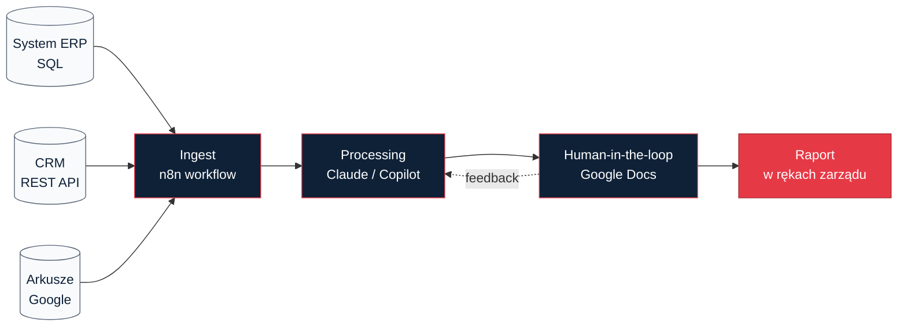

<!-- template: chapter -->
# Tydzień 5–8: Pierwszy pilot

**Abstrakt:** Cztery tygodnie, cztery kamienie milowe. Koniec każdego tygodnia = działający przyrost, który można pokazać. Jeśli w piątek nie ma czego pokazać — pilot się psuje.

---

<!-- template: standard -->
## 4.1 Rytm czterech tygodni

- **Tydzień 5 — Szkielet.** Najprostsza wersja workflow, ręcznie odpalana, z hardkodowanym inputem. Cel: zobaczyć, że "to w ogóle się da".
- **Tydzień 6 — Automat.** Input pobierany automatycznie, output idzie do właściwego miejsca. Cel: człowiek uruchamia jednym kliknięciem.
- **Tydzień 7 — Człowiek w pętli.** Dodanie miejsca, gdzie właściciel procesu potwierdza / koryguje output. Cel: jakość nie spada pod presją czasu.
- **Tydzień 8 — Produkcja cieni.** Workflow działa równolegle z ręcznym procesem przez 2 tygodnie. Cel: udowodnić, że zgadzają się wyniki.

To nie jest sugestia — to jest struktura. Każde odstępstwo (pomińmy tydzień 7, zróbmy "cichy launch" w 6) wymaga świadomej decyzji, nie cichego driftu.

---

<!-- template: code -->
## 4.2 Szkielet workflow — przykład Python

Dla pilota "raport miesięczny z wielu źródeł" (najczęstszy use case) typowy szkielet wygląda poniżej. Jest to pseudokod — w realu kończy w n8n albo prostym skrypcie uruchamianym przez cron, ale logika jest taka sama.

```python
# report_pilot.py — szkielet z tygodnia 5
from anthropic import Anthropic
from pathlib import Path

client = Anthropic()

PROMPT_TEMPLATE = """
Jesteś analitykiem finansowym firmy logistycznej.
Przygotuj raport miesięczny za okres [OKRES].

Dane sprzedażowe:
[DANE_SALES]

Dane operacyjne:
[DANE_OPS]

Dane finansowe:
[DANE_FINANCE]

Format wyjściowy: markdown, 4 sekcje, tabele gdzie sensowne.
""".strip()


def gather_inputs(period):
    """Ściąga surowe dane z 3 źródeł. W tygodniu 5 — hardkod."""
    base = Path("data") / period
    return {
        "sales":   (base / "sales.csv").read_text(),
        "ops":     (base / "ops.csv").read_text(),
        "finance": (base / "finance.csv").read_text(),
    }


def generate_report(period):
    data = gather_inputs(period)
    prompt = (PROMPT_TEMPLATE
        .replace("[OKRES]", period)
        .replace("[DANE_SALES]",   data["sales"])
        .replace("[DANE_OPS]",     data["ops"])
        .replace("[DANE_FINANCE]", data["finance"]))

    msg = client.messages.create(
        model="claude-sonnet-4-6",
        max_tokens=4000,
        messages=[{"role": "user", "content": prompt}],
    )
    return msg.content[0].text


if __name__ == "__main__":
    report = generate_report("2026-04")
    Path("output/report_2026-04.md").write_text(report)
```

**Komentarz do kodu:**

- **L.12–17** — w tygodniu 5 inputy są ściągane ręcznie z udziałów sieciowych. W tygodniu 6 to zamieniamy na automatyczne pobranie z systemu ERP przez API lub SQL.
- **L.19–32** — cały prompt hardkodowany. W tygodniu 7, po feedbacku właściciela procesu, prompt przenosimy do osobnego pliku YAML i dodajemy pole "uwagi od człowieka" przed generacją.
- **L.34–43** — Claude w wariancie Sonnet — bo to raport wewnętrzny, nie trzeba Opusa. Koszt: około 0.12 PLN za uruchomienie.

---

<!-- template: standard -->
## 4.3 Człowiek w pętli — jak go zaprojektować

Najczęstszy błąd w tygodniu 7: dodajecie Państwo "review step" jako dłuższy formularz w narzędziu, którego nikt nie używa. Efekt: właściciel procesu klika "akceptuj" bez czytania, bo nie ma na to czasu.

**Co działa zamiast tego:** output wpada do dokumentu Google albo Notion, z którym właściciel już pracuje codziennie. Dwa komentarze / zmiany = system uczy się z tego następnym razem (do promptu trafia "poprzednio poprawiałeś X na Y"). Zero nowych narzędzi dla człowieka.

---

<!-- template: info -->
## 4.4 Architektura typowego pilota

Cała architektura sprowadza się do trzech warstw połączonych jednokierunkowym przepływem. Nie warto komplikować, póki pilot nie zostanie zaakceptowany w produkcji.



**Trzy warstwy:**

1. **Ingest** — skrypt / n8n workflow, który co X dni pobiera dane z systemów źródłowych.
2. **Processing** — wywołanie modelu (Claude / Copilot / OpenAI — wybór zależy od stacku klienta), z promptem w osobnym pliku.
3. **Human-in-the-loop** — output w narzędziu, którego zespół już używa.

**Wymiary typowego pilota:**

| Element | Wartość |
|---|---|
| Linii kodu | 80–300 |
| Godzin pracy (dev) | 40–80 |
| Koszt infrastruktury miesięcznie | 50–400 PLN |
| Osób zaangażowanych | 2 (dev + właściciel) |
| Ludzi dotkniętych zmianą | 1–5 |

Pilot z 20 osobami w zespole i 1500 linii kodu to nie pilot — to projekt wdrożeniowy. Wracamy do rozdziału 3, odchudzamy.

---

<!-- template: standard -->
## 4.5 Kiedy pilot jest "gotowy"

Pilot kończy się, gdy przez **2 tygodnie z rzędu** wszystkie trzy warunki są spełnione jednocześnie:

- Output jest akceptowany bez dużych korekt (>70% akceptacji bez zmian merytorycznych).
- Metryka z rozdziału 3 poprawia się o co najmniej 30% wobec baseline'u.
- Właściciel procesu mówi "tak" na pytanie: *"Czy oddalibyście to jutro na produkcję, gdyby trzeba było?"*.

Nie wcześniej. Naciskanie w tygodniu 8, gdy właściciel jeszcze nie ma pewności, to najszybsza droga do wycofania w miesiącu trzecim. Poczekajcie Państwo tydzień. Zwykle wystarczy.

W następnym rozdziale — rozmowa z CFO NovaLogistics, która przeszła dokładnie ten proces w 6 tygodni zamiast 8. Co zrobili inaczej?
