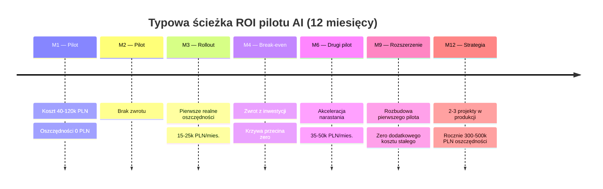

<!-- template: chapter -->
# Tydzień 11–12: Mierzenie ROI

**Abstrakt:** Po 10 tygodniach macie Państwo działający pilot, używany przez zespół. Teraz liczby, które trzeba dowieźć do zarządu — i te, których lepiej nie pokazywać.

---

<!-- template: standard -->
## 7.1 Trzy liczby, które muszą być

**Liczba pierwsza — czas odzyskany (godziny/miesiąc × koszt godziny).** Najprostsza do obrony. Logi workflow + ankieta dwóch osób (*"ile zajmowało Państwu to wcześniej / teraz"*). Wartość = zaoszczędzone godziny × koszt pełny osoby (pensja + ZUS + narzuty = zwykle ~1.8× pensji brutto).

**Liczba druga — koszt działania rozwiązania.** Licencje AI + infrastruktura + godziny utrzymania (realne, nie szacunkowe). Policzcie Państwo 12 miesięcy, nie pojedynczy. Pierwsze 3 miesiące są droższe (adjusting), kolejne 9 tańsze.

**Liczba trzecia — czas zwrotu.** Liczba pierwsza / (liczba druga / 12). Wyrażona w miesiącach. Jeśli wychodzi więcej niż 9 miesięcy — pilot jest słaby i nie warto go skalować (cofnijcie Państwo do rozdziału 3, wybierzcie inny use case).

---

<!-- template: data -->
## 7.2 Benchmark ROI z polskich wdrożeń

| Use case | Średni czas zwrotu | Średnia oszczędność / rok | Udział udanych pilotów |
|---|---|---|---|
| Raport miesięczny z wielu źródeł | 3.2 miesiąca | 180 000 PLN | 88% |
| Onboarding nowego pracownika | 4.5 miesiąca | 95 000 PLN | 79% |
| Przegląd umów | 5.1 miesiąca | 210 000 PLN | 71% |
| Obsługa RFP / ofert | 4.0 miesiąca | 240 000 PLN | 65% |
| Notatki ze spotkań | 6.8 miesiąca | 85 000 PLN | 82% |

Interpretacja: "udany pilot" = taki, który po 90 dniach jest nadal używany. Raport miesięczny wygrywa na dwóch wymiarach jednocześnie — szybki zwrot i wysoki współczynnik sukcesu. Dlatego tak często to jest pierwszy use case.

---

<!-- template: info -->
## 7.3 Wykres: kumulatywny ROI w pierwszym roku

Pierwsze 3 miesiące — strata (koszt wdrożenia > oszczędności). Break-even zwykle w 4. miesiącu. Od 6. miesiąca akceleracja, bo efekt wchodzi w następne procesy bez ponownego rozruchu.

**Kluczowe punkty na krzywej:**

- **Miesiąc 0–2:** Inwestycja w pilot. Koszt: 40–120 tys. PLN. Oszczędności: zero.
- **Miesiąc 3:** Pierwsze pełne oszczędności. Około 15–25 tys. PLN miesięcznie.
- **Miesiąc 4:** Break-even przy średnim wdrożeniu.
- **Miesiąc 6–12:** Linia prosta w górę, nachylenie zależy od tego, czy uruchomiono drugi pilot.

Jeśli nie uruchomiliście Państwo drugiego pilota do miesiąca 6., krzywa się spłaszcza. Dokładnie to omawia rozdział 8.

---

<!-- template: standard -->
## 7.4 Liczba, której lepiej nie pokazywać

**Nie liczcie Państwo "oszczędności z potencjalnej redukcji etatów".** Z dwóch powodów.

Po pierwsze — to jest niepewna liczba. Zespół, który odzyskał 4h tygodniowo na 5 osobach, to 20h razem, czyli "połowa etatu". Ale w rzeczywistości nikt nie pracuje idealnie jednolicie, ten czas rozsypuje się po innych zadaniach. "Połowa etatu" nie istnieje jako realna oszczędność — chyba, że *faktycznie* zwolnicie Państwo pracownika. A to jest inny rozdział, z innymi ryzykami (motywacja, reputacja, morale).

Po drugie — to jest liczba, która zamyka drugi pilot. Zarząd, który usłyszał *"możemy zwolnić 3 osoby"*, zacznie oczekiwać tego od każdego kolejnego wdrożenia. A większość pilotów oszczędza czas, nie ludzi. To są różne kategorie wartości.

Pokazujcie Państwo liczbę pierwszą ("czas odzyskany"), nie liczbę pochodną ("połowa etatu"). Pierwsza jest uczciwa. Druga psuje ekosystem przyszłych wdrożeń.

> [!warning]
> Jeden wyjątek: jeśli zarząd **wprost i bezpośrednio** pyta o redukcję etatów, podajcie Państwo konserwatywną liczbę ("ta poprawa to równowartość 0.3 etatu, nie proponujemy jednak na tej podstawie żadnych decyzji kadrowych"). Dodajcie wyraźne zastrzeżenie. Nie kłamcie — ale nie otwierajcie tematu sami.
