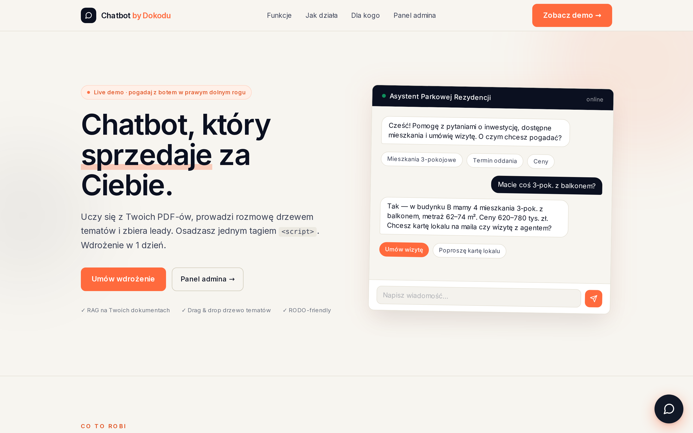
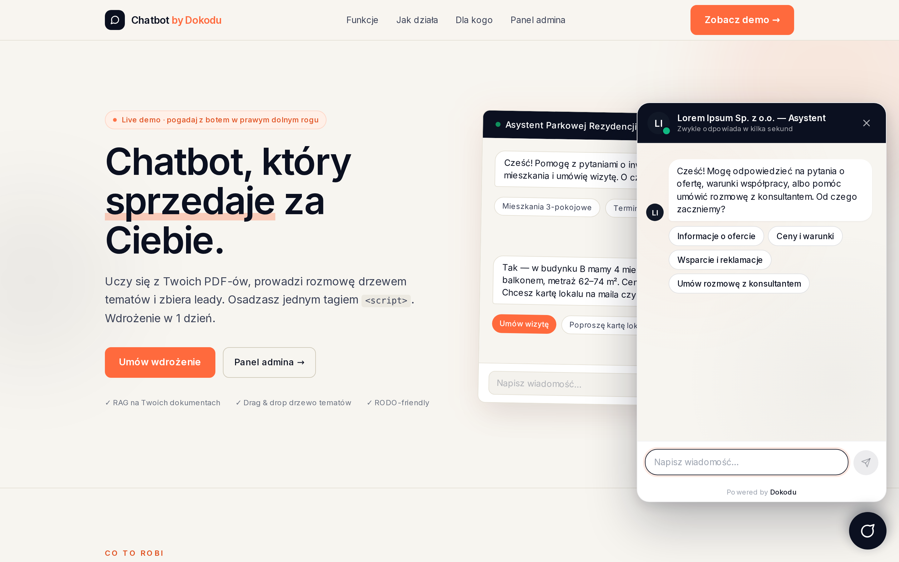
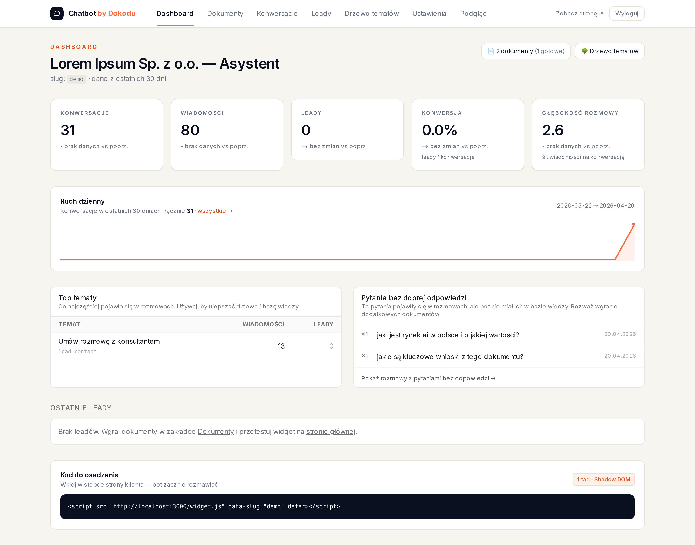
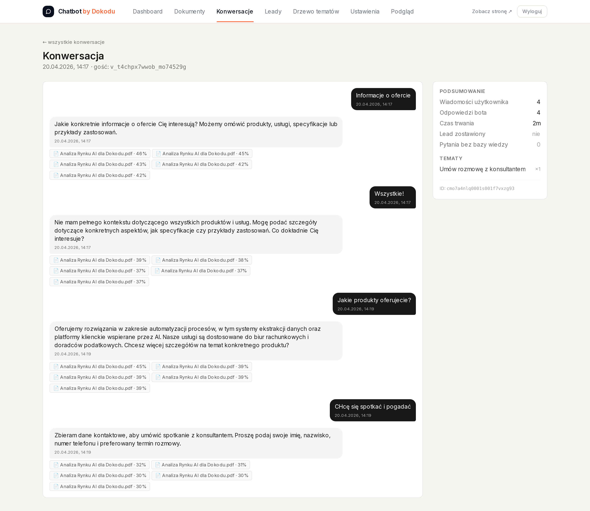
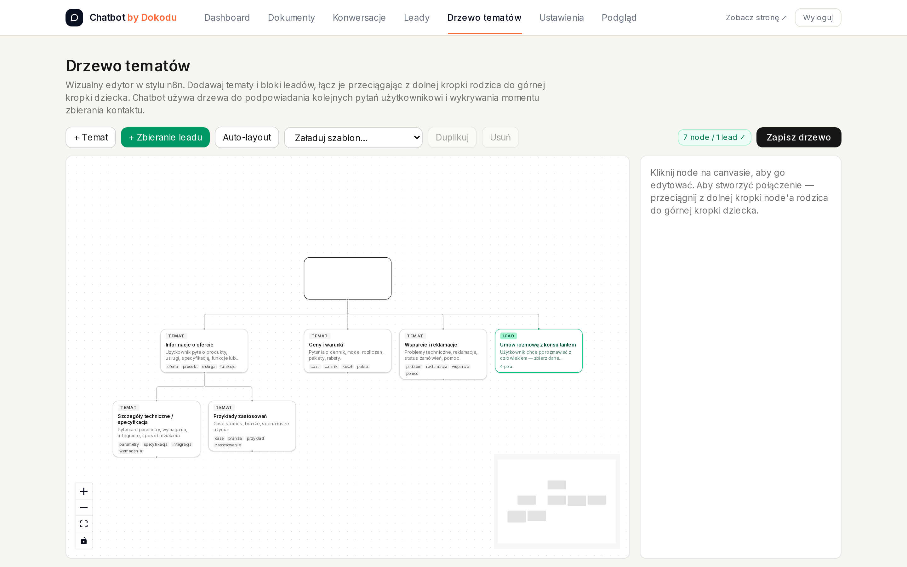

# Chatbot by Dokodu — pakiet sprzedażowy

**Chatbot** — asystent AI z RAG (baza wiedzy z PDF-ów), drzewem tematów, zbieraniem leadów i panelem analitycznym. Osadzany jednym tagiem `<script>` na stronie klienta.

---

## Co jest w tym katalogu

| Plik | Co zawiera | Dla kogo |
| :--- | :--- | :--- |
| [Oferta_Produktowa_Chatbot.md](./Oferta_Produktowa_Chatbot.md) | Pełna propozycja sprzedażowa (Starter vs Pro) w Markdown | Wewnętrzne (źródło prawdy) |
| [Oferta_Chatbot_by_Dokodu.pdf](./Oferta_Chatbot_by_Dokodu.pdf) | 5-stronnicowa oferta w PDF — do wysłania klientowi | Klient (po discovery) |
| [Dokumentacja.md](./Dokumentacja.md) | Pełna dokumentacja techniczna i user-facing | Klient (po podpisaniu umowy) + zespół Dokodu |
| [AI_Policy_Template.md](./AI_Policy_Template.md) | Template polityki AI do adaptacji przez prawnika klienta | Kancelaria klienta |
| [offer_data.json](./offer_data.json) | Source dla generatora PDF (można regenerować) | Tylko edycja ręczna |
| [sample_conversations/](./sample_conversations/) | 3 przykładowe rozmowy (deweloper / SaaS / pytanie bez odpowiedzi) | Klient (do oferty) + onboarding |
| [screenshots/](./screenshots/) | 17 PNG: landing, widget otwarty, admin panel, oferta PDF | Do oferty, prezentacji, LinkedIn |

---

## Jak używać tego pakietu

### 1. Po discovery call z nowym klientem

1. Zrób kopię `Oferta_Produktowa_Chatbot.md` do katalogu klienta (`AREA_Customers/<Klient>/`)
2. Dopisz specyfikę klienta: branża, konkretny problem, liczby (ruch, leady, koszt obsługi)
3. Regeneruj PDF ze zmodyfikowanym `offer_data.json`:
   ```bash
   cd ~/DOKODU_BRAIN/30_RESOURCES/RES_Templates/offer-generator
   node generate.js <klient>/offer_data.json <klient>/Oferta_<Klient>.pdf
   ```
4. Wyślij PDF + link do demo (`http://dokodu.it/chatbot-demo` po wdrożeniu na produkcji)

### 2. Po podpisaniu umowy

1. Wyślij klientowi `Dokumentacja.md` (converted to PDF lub jako link w SharePoint)
2. Wyślij `AI_Policy_Template.md` z instrukcją: *„Proszę, aby Państwa kancelaria dostosowała do Państwa działalności"*
3. Kickoff call: pokazujesz panel admina na bazie screenshots (na żywo lub slajdach)

### 3. Na LinkedIn / stronie

- Screenshots 01–03 (landing + widget) → post LinkedIn „Nowy produkt w Dokodu"
- Screenshot 05 (dashboard) → post „Jak analytics w chatbotcie pomaga czytać myśli klientów"
- Przykład 3 (pytanie bez odpowiedzi) → blog post „Chatbot, który uczy Cię czego brakuje w ofercie"

---

## Kluczowe screeny

### Landing — strona sprzedażowa produktu



### Landing z otwartym widgetem (mock rozmowy w stylu komunikatora)



### Dashboard admina — KPI, trendy, top tematy, pytania bez odpowiedzi



### Detal konwersacji — transkrypt z źródłami pod każdą odpowiedzią bota



### Edytor drzewa tematów (drag & drop)



---

## Cennik — skrót

| | Starter | Pro |
| :--- | ---: | ---: |
| Wdrożenie jednorazowe | **19 900 PLN** | **39 900 PLN** |
| Retainer miesięczny (opcja) | 890 PLN/mies | 1 990 PLN/mies |
| Czas wdrożenia | 4 tyg | 6–8 tyg |
| Dokumenty PDF | do 10 | bez limitu |
| Drzewo tematów | szablon + dostosowanie | custom |
| Integracje z CRM | — | webhook |
| Szkolenie | 2h online | 1 dzień |

*Ceny netto + 23% VAT. Infra (serwer + OpenAI) klient rozlicza bezpośrednio.*

**ROI:** przy 20 dodatkowych leadach/mies. i wartości leada 500 PLN — Starter zwraca się w 2 miesiącach.

---

## Wymagania wdrożeniowe (Starter / Pro)

### Po stronie Dokodu
- Wdrożenie: Kacper (+ Alina przy warsztacie prawnym w Pro)
- Czas: 4 / 6–8 tyg
- Narzędzia: gotowy kod z `~/DOKODU/chatbot-demo`, Docker Compose, Playwright do testów

### Po stronie klienta
- Serwer VPS (Hetzner CX22 lub równoważny) — **Pro** wymaga dedykowanego; **Starter** może korzystać z shared
- Domena lub subdomena (np. `chat.klient.pl`)
- Klucz API OpenAI (lub Azure OpenAI dla EU residency)
- Dokumenty PDF do wgrania (oferty, cenniki, FAQ)
- Osoba kontaktowa po stronie klienta do drzewa tematów i testów
- (Pro) zespół IT do integracji webhooków

---

## Status produktu

| Element | Stan |
| :--- | :--- |
| Kod chatbota | ✅ Gotowy, uruchomiony lokalnie, testy przeszłe |
| Widget (shadow DOM) | ✅ 25 KB, mobile-friendly, komunikatorowy styl |
| Panel admina | ✅ 7 widoków, analytics real-time |
| Drzewo tematów drag&drop | ✅ React Flow, 3 gotowe szablony |
| RAG + guardrails | ✅ Prompt injection przetestowany |
| Dokumentacja | ✅ Wersja 1.0 |
| Template polityki AI | ✅ Wersja 1.0 |
| Oferta PDF | ✅ 5 stron, wygenerowana |
| Screenshots | ✅ 17 plików |
| Landing produktu dokodu.it/chatbot | ❌ Do wdrożenia (na bazie obecnego `/`) |
| Pierwszy klient | ❌ Do zamknięcia (deweloper z poprzedniej konwersacji) |

---

## Następne kroki (sprzedażowe)

1. **Wrzucić na stronę Dokodu** — landing `/produkty/chatbot` albo `/chatbot` na bazie obecnego `/` w repo
2. **Skontaktować klienta-dewelopera** który wyraził zainteresowanie — wysłać PDF oferty i link do demo
3. **Case study** — po 2–3 wdrożeniach spisać konkretne liczby (konwersja przed/po, ROI)
4. **Post LinkedIn** — premiera produktu z screenami
5. **Dodać do cennika Dokodu** (`.claude/skills/brain-new-offer/references/cennik.md`) jako nowy Tier 2

---

*Dokumentacja i oferta wygenerowane 2026-04-20. Aktualizuj przy każdej zmianie scope'u / cennika.*
